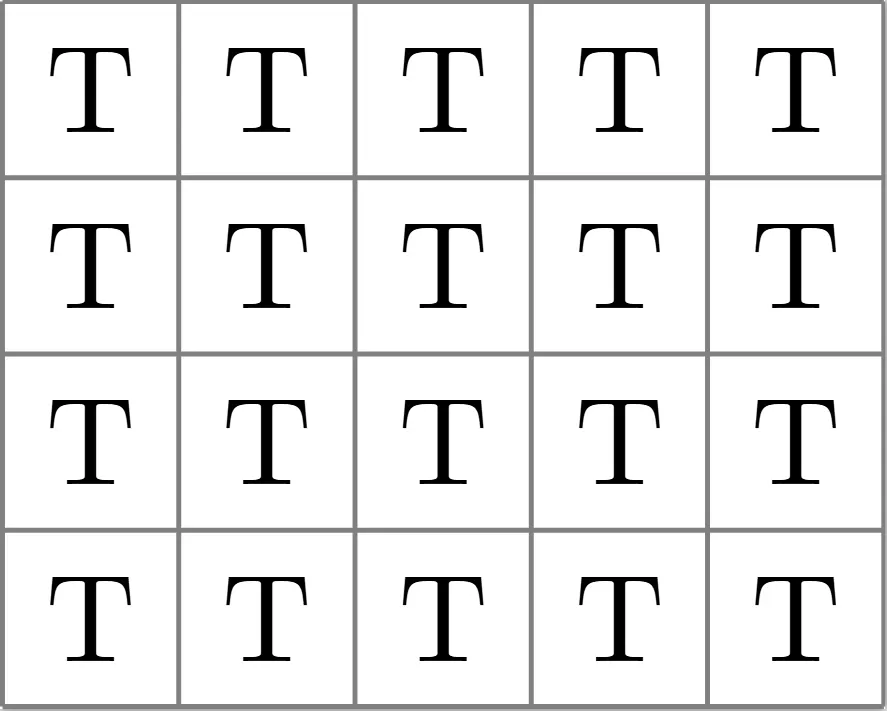
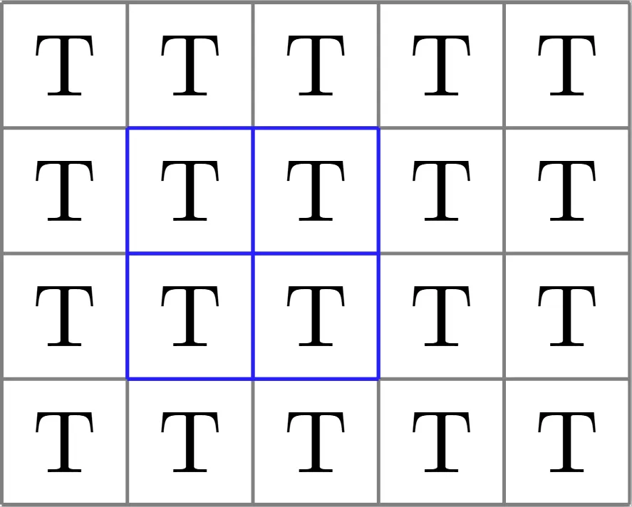
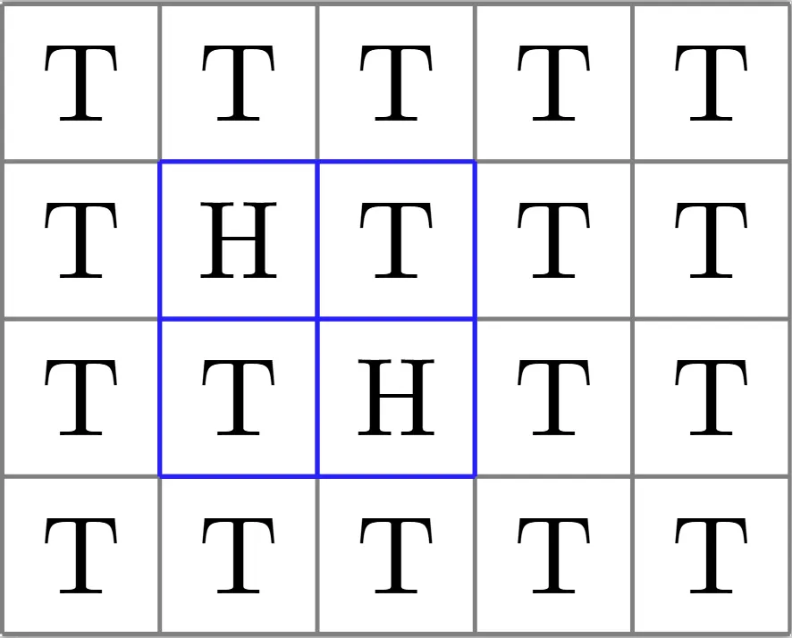
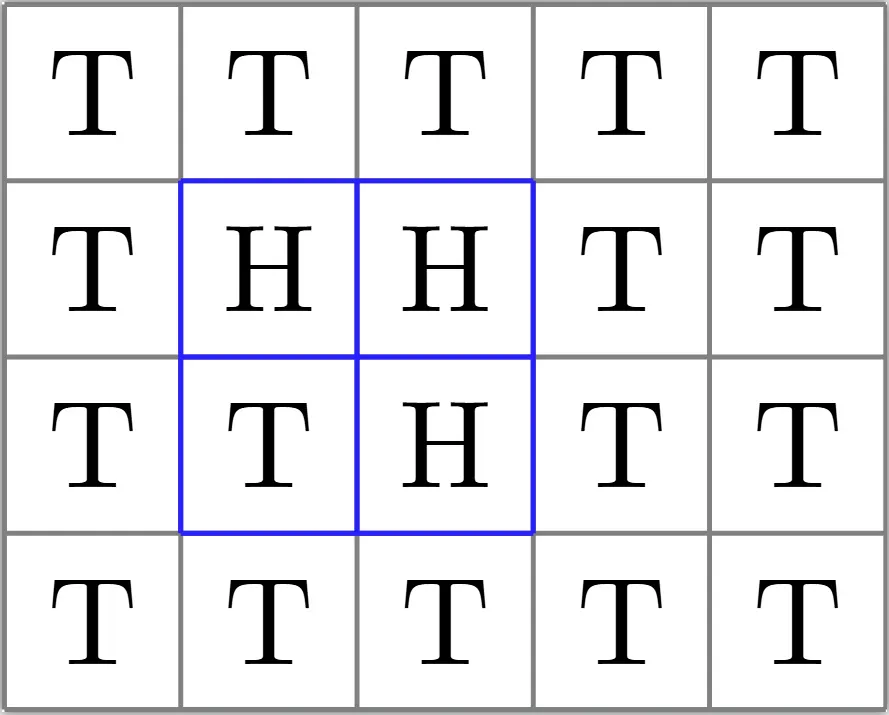
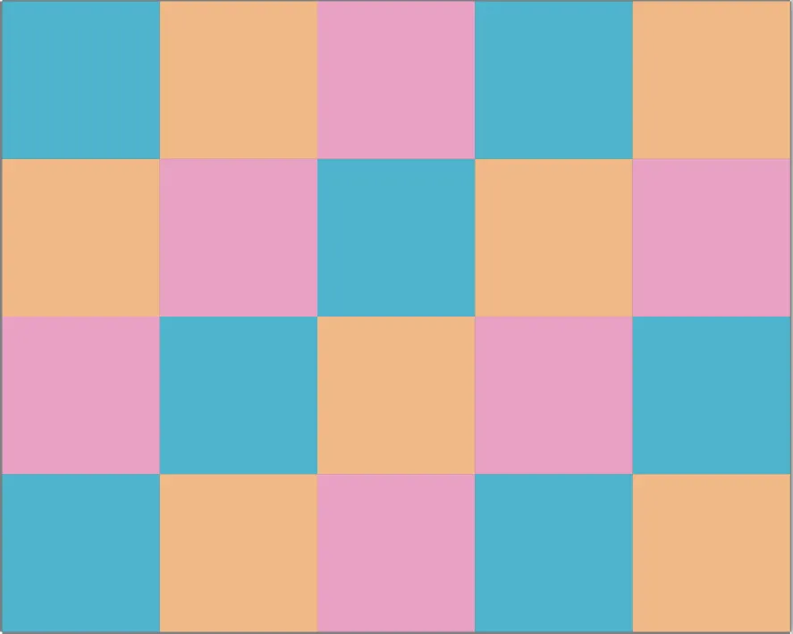
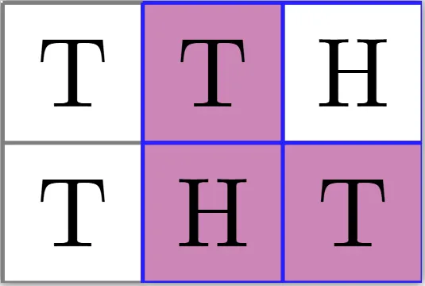
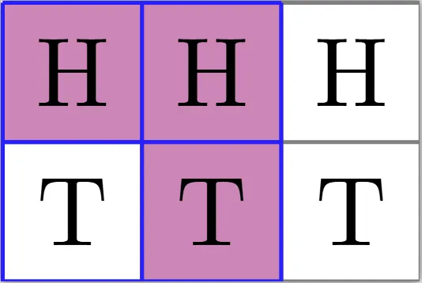

I like this problem even though I think it's pretty hard for a C1.

## Problem

Let $m$ and $n$ be positive integers greater than 1. In each unit square of an $m \times n$ grid lies a coin with tails up. *For visual purposes, here is a $4 \times 5$ grid, $m = 4$, $n = 5$.*

A move consists of the following steps:

1. select a $2 \times 2$ square in the grid.

2. flip the coins in the top-left and bottom-right unit squares.

3. flip a coin in either the top-right or bottom-left unit square. Here we flip the top-right, keep the bottom-left

Determine all pairs $(m, n)$ for which it is possible that every coin shows head-side up after a finite number of moves.

## Solution

First note $(2, 2)$ fails by parity as you would need an odd number of moves for the top-left and bottom-right squares to both show heads, yet an even number of moves to convert the top-right and bottom-left squares to both show heads. This isn't a relevant step to the solution, but I do believe it helps you get a feel of what's going on here.

Now there is a way to construct a successful $(2, 3)$, but I did not realize its elegance until later.

Instead, this was when I was starting to get bothered by the variability of step 3. We know for certain that we are going to flip two specific coins on the $2 \times 2$'s **anti-diagonal** (*the diagonal path going from the bottom-right corner to top-left corner*) prescribed from step 2, but the inconsistent issue here is the fact that on step 3, we have a choice on the $2 \times 2$'s **main diagonal** which gives us different cases. So, my aim was to create a scenario such that my "choice" on step 3 would be irrelevant and still make the same change.

Hence, coloring! In a similar fashion to a lot of checkerboard-related puzzles ([mutilated chessboard problem](https://en.wikipedia.org/wiki/Mathematical_chessboard_problem#Mutilated_chessboard_problem)), a particular coloring on this grid is the key. Instinctively, since we are dealing with diagonals, one thought might be to try the checkerboard-type coloring here. After all, we know that step 2 will flip two squares on the anti-diagonal of one color, and step 3 will always flip exactly one square on the main diagonal of the other color. However, what should set some alarm bells off here is that this is *still inconsistent* in the sense that we are not making equal progress on colors. Since we are always flipping three squares' coins on a move, it's far more reasonable to pick a coloring involving three colors! The question is now *how do we color our grid*?

Perhaps you have figured it out by now, but we wish to have a coloring with three colors such that no matter what $2 \times 2$ square we pick, the two squares on the main diagonal will have the same color, and the other two squares will be the other two colors.

This means that each move will always flip over exactly one blue, one orange, and one pink square, implying if we end up with all heads in the end, we must have had an equal number of blue, orange, and pink squares. Therefore, we have $3 \mid mn$ ($a \mid b$ means $a$ divides $b$, so you could say $23 \mid 69$), which is our necessary condition.

All we have left to show is the sufficient direction, or a construction which works. You could totally take the time to show that $(2, 3)$ and $(3, 3)$ are both attainable, and therefore any $m \times 3$ grid for $m \ge 2$ can always be created from $2 \times 3$'s and $3 \times 3$'s, which would finish the proof (and was how I initially solved the problem).

Or, as I referred to earlier, there is an elegant way to go about this sufficient direction. Say we start off with a $2 \times 3$ grid. We can construct a series of moves which will always flip a $1 \times 3$ section and leave the rest of the grid unaltered.

This construction successfully shows us that we are always able to flip a $1 \times 3$ section, which is sufficient to conclude with our necessary $3 \mid mn$ condition. Note that we always have enough space to flip a $1 \times 3$ section due to the problem's given constraints.
