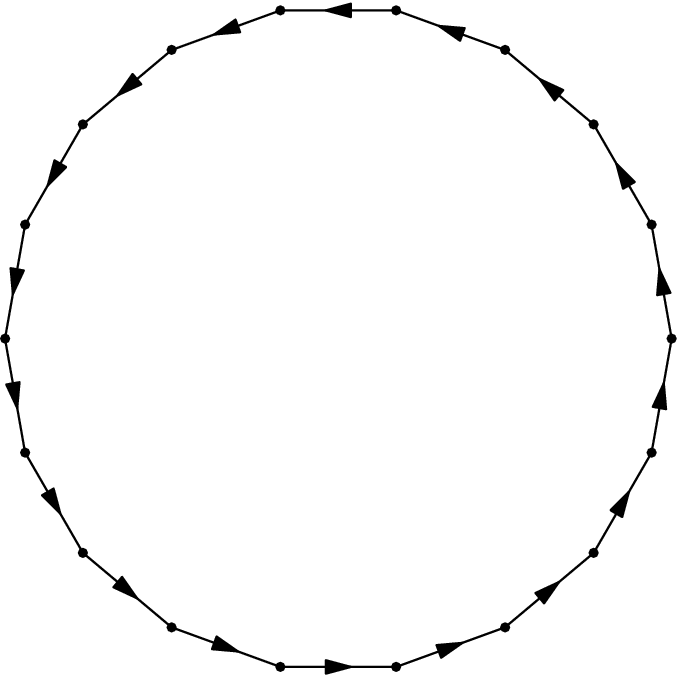
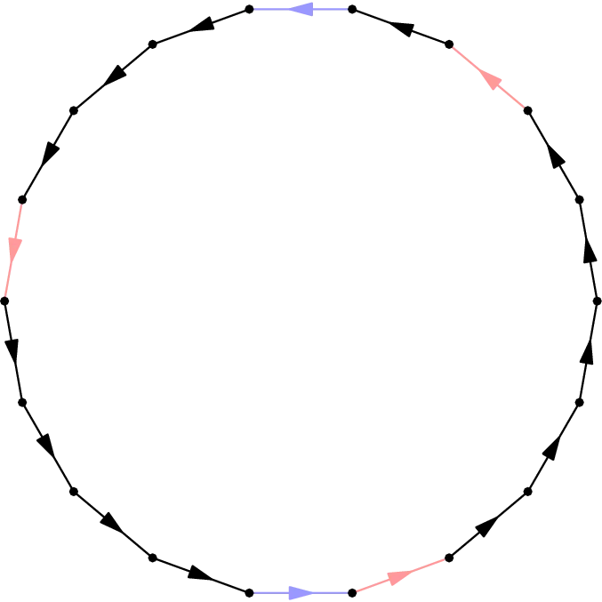
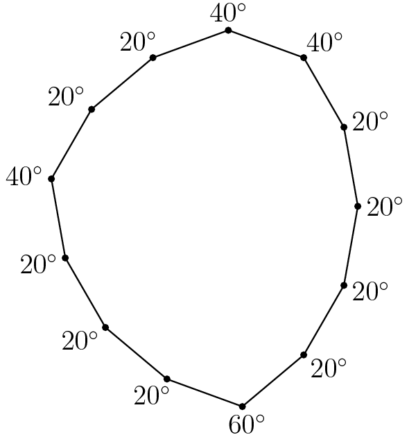

[Math Prize for Girls](https://mathprize.atfoundation.org/) is an annual math competition for the brightest young female mathematicians! Here are some of their [past problems](https://mathprize.atfoundation.org/resources), and this problem is one of my favorites. There is of course a solution for this problem posted on their website, but I'd like to think I not only have a more intuitively explained solution, but also went an extra step further :)

## Problem

Find the unique convex equilateral 13-gon whose angles are all multiples of 20 degrees. (*the competition intended for participants to only show existence*)

Show solution

## Solution 1 (Visual/Intuitive)

We will only construct the 13-gon in this solution, as intended by the problem proposers. **Solution 2** will prove uniqueness as well.

This problem is a good test of how well you understand complex numbers/vectors. With good intuition, the construction can be obtained in a matter of seconds.

We are motivated to first consider the regular 18-gon below, since each exterior angle of it is $20^\circ$.

It is comprised of 18 vectors. We wish to delete five of its vectors so that the remaining 13 vectors still form a polygon, i.e. have zero sum. To do that, the five vectors we delete must have zero sum as well.

A nice way to ensure that occurs is to delete two opposite vectors, and three vectors forming an equilateral triangle:

This gives the following polygon, which indeed is unique up to similarity:

## Solution 2 (Number Theory)

We will not only find the 13-gon in this solution but also prove its uniqueness.

Let's think about going on a walk around the sides of the polygon, in which we are walking along 13 vectors which sum to 0. In similar vein to **Solution 1**, to ensure that the angles of our polygon are multiples of 20 degrees, we only look at vectors which are 18th roots of unity.

For convexity, the order in which we write out the roots of unity to form the 13-gon must be by increasing or decreasing argument. Furthermore, we cannot use a root of unity multiple times, otherwise this scheme would create a single long side rather than two different sides.

Thus, the problem has been reduced to finding 13 distinct roots of unity which sum to 0, which further reduces to finding 5 distinct roots of unity which sum to 0.

::: claim
If we can find 5 such roots of unity, then it must be that two of them sum to 0 and the other three also sum to 0 (like the construction we chose for **Solution 1**). By inspection, this would indeed imply that our desired 13-gon is unique up to similarity.

(*if necessary, go back to the Solution 1 diagram to convince yourself that this must be true!*)
:::

::: proof
Let $\xi$ be a primitive 18th root of unity, and suppose

$$\xi^{e_1} + \xi^{e_2} + \xi^{e_3} + \xi^{e_4} + \xi^{e_5} = 0$$

for distinct integer powers $0 \le e_i < 18$. If we assume that $e_5 = 0$, then it suffices to prove that either $9 \in \{e_1, e_2, e_3, e_4\}$ or $6, 12 \in \{e_1, e_2, e_3, e_4\}$. (why?)

Let

$$P(x) = \xi^{e_1} + \xi^{e_2} + \xi^{e_3} + \xi^{e_4} + 1$$

Then $P \in \Q[x]$ and $\xi$ is a root of $P$, so the cyclotomic polynomial

$$\Phi(x) = x^6 - x^3 + 1 \text{ divides } P$$

Let $P / \Phi_{18} = Q$.

Now we let $Q = Q_0 + Q_1 + Q_2$ where $Q_i$ is the polynomial formed by the terms of $Q$ whose powers are congruent to $i$ mod 3. We similarly let $P = P_0 + P_1 + P_2$. Then

$$\Phi_{18}Q_0 + \Phi_{18}Q_1 + \Phi_{18}Q_2 = P_0 + P_1 + P_2$$

The terms on the LHS whose exponents are multiples of 3 are precisely those terms in the polynomial $\Phi_{18}Q_0$ because all of $\Phi_{18}$'s terms have degrees which are multiples of 3. Thus, $\Phi_{18}Q_0 = P_0$ and similarly it follows that $\Phi_{18}Q_1 = P_1$ and $\Phi_{18}Q_2 = P_2$

Therefore, we know that $P_0(\xi) = P_1(\xi) = P_2(\xi) = 0$. If we remember what this means in the first place, it means that out of the 5 roots of unity we have chosen to sum to 0,

- the ones that are of the form $\xi^{3k}$ sum to 0
- the ones that are of the form $\xi^{3k+1}$ sum to 0
- the ones that are of the form $\xi^{3k+2}$ sum to 0

Essentially, the five roots of unity are distributed among these three "collections" of roots.

To finish, note that if any class contained all five of the roots, then these roots are five vertices of a regular hexagon, and cannot sum to 0. And, trivially, none of the classes may have exactly one of the roots. It follows that the only possible distribution for the roots is "0, 2, 3", in some order.
:::

And this is exactly what we wanted to show.

## Remark

Let's say you want to show that $x^6 - x^3 + 1$ is irreducible for the sake of lessening the amount of "tech" used.

The key observation is that over the field $\F_3$, we actually have $x^6 - x^3 + 1 = (x+1)^6$. From here it is reasonable to motivate analyzing the shifted polynomial $(x - 1)^6 - (x - 1)^3 + 1$. If this is irreducible, then $x^6 - x^3 + 1$ is too.

Note that all coefficients of this new polynomial are divisible by 3 (sans the leading coefficient). It is not hard to see that the constant term is not divisible by 9. Thus, the polynomial is irreducible by Eisenstein's Criterion.

