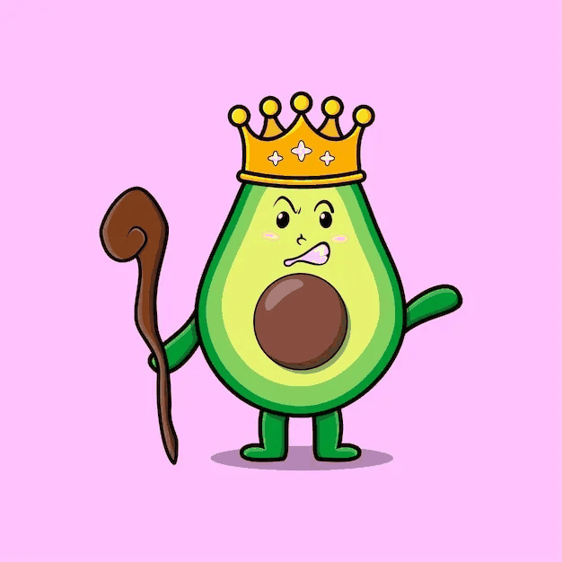

## Problem

64 kings are placed on an 8x8 chessboard, all initially in different squares. Avocado and Bavocado play alternately, with Avocado starting. On each move, one of the two players chooses a king and can move it one square to the right, one square up, or one square up and to the right. In the event that a king is moved to an occupied square, both kings are removed from the game. The player who can remove two of the last kings or leave one last king in the upper right corner wins the game. Which of the two players can ensure victory?

Show solution

## Solution

Think of each king as an independent impartial game (a token on a directed acyclic graph of squares). A token at square $(i, j)$ may move to $(i+1, j)$, $(i, j+1)$ or $(i+1, j+1)$ (if those squares exist).

Since the parity of the number of kings is invariant, the game must end with removing two final kings, thus "leave one last king in the upper right corner" seems somewhat meaningless? But I suppose it makes sense if I want to determine the winner at any position.

I will alter the rule such that no king is removed, and multiple kings can be in one square. In this scenario, the player who moves all kings to the upper right corner wins, and so the winning player does not change. This is because if a player wins in the original rule, in the new rule, if his opponent moves a king that would have been removed in the original rule, he can move the king that would have been removed together with that king to the same square.

As such, the board can be split into multiple boards, with each board holding one king. Since the moves of the kings are irreversible, it's not hard to motivate the Sprague-Grundy theorem.

> **Sprague-Grundy theorem**: *the whole position is the XOR (nim-sum) of the SG values of all tokens. The SG value of each square is the mex (minimal excluded nonnegative integer) of the SG values of the squares that can be reached from it.*

Because each position has at most three options, every SG value is $\le 3$. If you run the recursion across the $8\times 8$ board by starting with a 0 in the top-right corner, you obtain the following SG table.

$$\begin{matrix}
1 & 0 & 1 & 0 & 1 & 0 & 1 & 0\\
2 & 3 & 2 & 3 & 2 & 3 & 2 & 1\\
1 & 0 & 1 & 0 & 1 & 0 & 3 & 0\\
2 & 3 & 2 & 3 & 2 & 1 & 2 & 1\\
1 & 0 & 1 & 0 & 3 & 0 & 3 & 0\\
2 & 3 & 2 & 1 & 2 & 1 & 2 & 1\\
1 & 0 & 3 & 0 & 3 & 0 & 3 & 0\\
2 & 1 & 2 & 1 & 2 & 1 & 2 & 1
\end{matrix}$$

A position is a second player win if and only if the XOR of the SG values of the kings equals 0. Since the SG values are at most 3, the second player wins if and only if the amount of kings in the squares with SG value 1, 2 and 3 have the same parity.

$\mathrm{SG}(0) = 16$

$\mathrm{SG}(1) = 20$

$\mathrm{SG}(2) = 16$

$\mathrm{SG}(3) = 12$

The XOR (nim-sum) of all 64 SG-values is 0 --- hence the initial full-board position is SG-zero, a guaranteed win for Bavocado.

