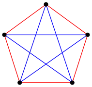
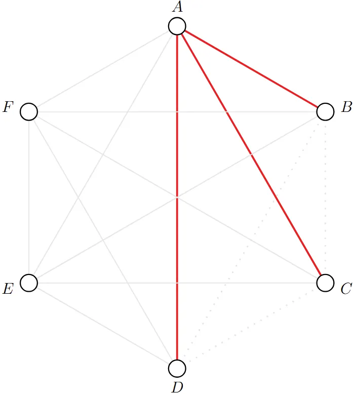

> *Imagine an alien force, vastly more powerful than us, landing on Earth and demanding the value of $R(5, 5)$ or they will destroy our planet. In that case, we should marshal all our computers and all our mathematicians and attempt to find the value. But suppose, instead, that they asked for $R(6, 6)$, we should attempt to destroy the aliens.*
>
> *- Paul Erdős*

This post is more so for me to practice explaining some math I have been looking into for about a month. There is an epsilon chance I will write further about Ramsey Theory.

The **Ramsey Number $R(s, t)$**, introduced by mathematician Frank Ramsey, is the minimum integer $n$ for which every red-blue coloring of the *edges* of $K_n$ contains a completely red $K_s$ or a completely blue $K_t$. Note that $R(s, t) = R(t, s)$ by virtue of swapping edge colors.

The interesting question in this field is to obtain bounds for these numbers (lower and upper), as well as for quantities defined in a similar spirit. Let's start with a few well-known and more trivial examples, where the aim is to get a flavor of how these proofs are structured.

::: theorem trivial
$R(n, 2) = n$ (It is helpful to remember $K_2$ is just a single edge)
:::

::: proof
Start with noting that a graph of $K_{n-1}$ where all of our edges are red has neither a complete red $n$-gon nor a blue edge, so definitely $R(n, 2) > n-1$.

Next, we consider any graph with $n$ vertices. If we have a single blue edge, then we have found the blue $K_2$. Otherwise, all edges are red, and our graph is the red $n$-gon. This means that in any graph of $n$ vertices there is either a red $K_n$ or a blue $K_2$, so $R(n, 2) = n$.
:::

A more famous result, which is the simplest nontrivial Ramsey Theory problem, is that $R(3, 3) = 6$, which is more often phrased as the problem "Prove in a party of 6 people there must exist a subset of 3 people who have all met one another or are mutual strangers with one another" (the colloquial version is a less strict version of the Ramsey Theory problem, as there is no necessity to prove the minimality of 6).

::: theorem classic
$R(3, 3) = 6$
:::

::: proof
We first show the following construction that undoubtedly $R(3, 3) > 5$. Note that we may view the graph of $K_5$ as the union of a "pentagon perimeter" and an "interior pentagram" (also known as the 5-point star, but I refuse to abuse the definition of star in graph theory here). If we color the edges of the "pentagon perimeter" red and the edges of the "interior pentagram" blue, this construction has no red or blue $K_3$.

To establish that $R(3, 3) \le 6$, imagine 6 vertices, and fixing one vertex $A$. 5 edges emanate from $A$, so we are guaranteed to have at least 3 of them be the same color, WLOG say they are red.

Note that if either of the edges $BC$, $CD$, or $BD$ are red, we have a red $K_3$ with the help of $A$'s red edges. The alternative scenario is all three of those edges are blue, in which we have a blue $K_3$.
:::

Ramsey's Theorem states that $R(s, t)$ is always finite, and we will prove this below with a famous and very useful bound.

::: theorem Erdős–Szekeres
$$R(s, t) \le \binom{s+t-2}{s-1}$$
:::

::: proof
We will prove this by induction.

Note that Theorem 1 provides us with our base case,

$$R(2, t) = t = \binom{2 + t - 2}{2 - 1}$$

$$R(s, 2) = s = \binom{s + 2 - 2}{2 - 1}$$

Observe that $R(s, t) \le R(s-1, t) + R(s, t-1)$. This is because if we have this many vertices and we were to select a particular vertex, then it cannot simultaneously have less than $R(s-1, t)$ red neighbors and less than $R(s, t-1)$ blue neighbors. Therefore, we can inductively build either a red $K_s$ or a blue $K_t$.

\begin{align}
R(s, t) &\le R(s - 1, t) + R(s, t - 1) \\
&= \binom{(s - 1) + t - 2}{s - 2} + \binom{s + (t - 1) - 2}{s - 1} \\
&= \binom{s + t - 3}{s - 2} + \binom{s + t - 3}{s - 1} \\
&= \binom{s + t - 2}{s - 1}
\end{align}

The last step holds by Pascal's Identity (any number except for the 1's in Pascal's triangle can be written as the sum of the two numbers directly above it), which proves our theorem.
:::

::: remark
A cheap way to intuit that the Ramsey number is finite, without using Erdos-Szekeres, is to denote $R(s_1, s_2, \ldots, s_k)$ as the $k$-color analogue of the Ramsey number and prove $R(s, \ldots, s)$ is always finite. We may split the $k$ colors into two equal groups and by 2-color Ramsey, there exists a sufficiently large complete graph in one of the groups, but the number of colors has decreased by half, thus we can recurse.
:::

By this point, we might be curious to ask ourselves the question "so how big is $R(s, t)$?" If you can figure this out, you should probably get off Substack and publish your results as this is an open problem. That being said, you would be onto something if your first instinct was to consider the **diagonal Ramsey numbers**, which investigate the case where $t = s$ i.e. numbers of the form $R(t, t)$.

::: theorem Erdős and Corollary of Erdős–Szekeres
$$2^{\frac{t}{2}} \le R(t, t) \le 4^t$$
:::

::: proof
*Upper bound:* This is a direct corollary of the Erdős–Szekeres bound. (The second inequality shown below comes from identifying the central term of the Binomial Expansion for $(1+1)^{2n}$ with $n = t-1$ being clearly less than the sum of the terms.)

$$R(t, t) \le \binom{2t-2}{t-1} \le 4^t$$

*Lower bound:* There is no known construction of the lower bound, and we're honestly not particularly close to achieving it. Instead, this is quite cleverly proved via **the probabilistic method** (i.e. *taking a random coloring*), hence the exponential bound instead of explicit construction.
:::

::: lemma
$R(t, t) > (t - 1)^2$
:::

::: proof
- Let us first note that trivially a graph on $t-1$ vertices may never contain a $t$-clique of any color.
- Our construction here will be to split up our points into $t-1$ clusters of $t-1$ vertices each. We may connect all vertices contained in the same cluster with red edges and vertices in different clusters with blue edges. We have no red clique of size $t$ by our initial note above. We also may notice that we have no blue clique of size $t$ as the vertices must all be in different clusters, yet we only have $t-1$ clusters.
:::

::: proof
Using our lemma, we may show for $t \le 4$ that $2^{t/2} \le (t - 1)^2 \le R(t, t)$.

Let $n$ denote the floor of $2^{t/2}$. Consider a random coloring of the edges of $K_n$ — each edge independently receives its color with equal probabilities. For each set of $t$ vertices, define the event $E_S$ to be when all $t$ choose 2 edges in $S$ are the same color (or in other words, the expected number of monochromatic cliques). It suffices to show $P(E_S) < 1$. We can calculate that for any chosen $t$ vertices the probability that they form a monochromatic $t$-clique is

$$\frac{1}{2^{\binom{t}{2}}} \cdot 2$$

as all of the $t$ choose 2 edges need to be the same color, but we have two options for this color (all red or all blue). Thus, our form for $E_S$ is

$$\binom{n}{t}\left(2 \cdot 2^{-\binom{t}{2}}\right)$$

Using some bounding tricks,

\begin{align}
\binom{n}{t}\left(2 \cdot 2^{-\binom{t}{2}}\right) &\le \frac{n^t}{t!}\left(2 \cdot 2^{-\binom{t}{2}}\right) \\
&\le \frac{\left(2^{\frac{t}{2}}\right)^t}{t!}\left(2^{-\frac{t^2}{2} + \frac{t}{2} + 1}\right) \\
&= \frac{2^{\frac{t^2}{2} - \frac{t^2}{2} + \frac{t}{2} + 1}}{t!} \\
&= \frac{2^{\frac{t}{2} + 1}}{t!}
\end{align}

For sufficiently large $t$ (we can easily see for $t \ge 4$), this quantity is less than 1.
:::

Another important theorem in Ramsey Theory is Schur's Theorem, which I will leave as an exercise the key lemma for one of the problems.

::: theorem Schur's Theorem
For any $k \ge 2$, there exists $n > 3$ such that for any $k$-coloring of $\{1, \ldots, n\}$, there are three integers $x, y, z$ of the same color such that $x + y = z$.
:::

## Problems

**1. (South Africa 1997/5)** Six points are joined pairwise by red or blue segments. Must there exist a monochromatic cycle (closed path consisting of four of the segments, all of the same color)?

**2. (IMO 1964/4)** Seventeen people correspond by mail with each other — each one with all the rest. In their letters, only 3 topics are discussed. Each pair of correspondents only deals with one of these topics. Prove that there are at least 3 people who write to each other about the same topic.

**3. (IMO 1978/6)** Prove that in any coloring of the integers $\{1, \ldots, 1978\}$ with 6 colors there are integers $x, y, z$, all of the same color, satisfying $x + y = z$.

**4. (Fermat's Last Theorem is false in $\Z_p$)** For every $m \ge 1$, there is a $p_0$ such that for any prime $p \ge p_0$, the congruence $x^m + y^m \equiv z^m \pmod p$ has a solution.

## Solutions

**1. (South Africa 1997/5)**

We prove by contradiction. Assume not.

Denote the vertices $a, b, c, d, e, f$. By Ramsey (Theorem 2), we are guaranteed to have a monochromatic triangle. WLOG say our monochromatic triangle is on vertices $a, b, c$, and is blue.

$d$ must not have two blue edges going into either of $a$, $b$, or $c$, or else we have obtained a blue $C_4$. We may apply the same logic to vertices $e$ and $f$. Additionally, two of the three vertices of $\{a, b, c\}$ must not both have red edges to two of the three vertices of $\{d, e, f\}$.

Thus, the only possible configuration left is to have a blue **matching** (*set of edges in a graph where no two edges share a common vertex*) between $\{a, b, c\}$ and $\{d, e, f\}$ and all other edges between those sets must be red.

WLOG let $ad$, $be$, $cf$ be our blue matching. In order to avoid a blue $C_4$, for example let's say $abed$, we must have both red edges $de$ and $ef$. But after all of these efforts, we inevitably end up with the red $C_4$: $bfed$.

**2. (IMO 1964/4)**

In other words, we're being tasked with the proof of the 3-color Ramsey number $R(3, 3, 3)$ to be at most 17.

By using the same observation as used in Erdős-Szekeres, we may claim the following

$$R(a, b, c) \le R(a - 1, b, c) + R(a, b - 1, c) + R(a, b, c - 1) - 1$$

Plugging in $a = b = c = 3$ and using symmetry,

\begin{align}
R(3, 3, 3) &\le R(2, 3, 3) + R(3, 2, 3) + R(3, 3, 2) - 1 \\
R(3, 3, 3) &\le 3R(3, 3, 2) - 1
\end{align}

Instead of now showing $R(3, 3, 3) \le 17$, it merely suffices to show $3R(3, 3, 2) - 1 \le 17$, i.e. $R(3, 3, 2) \le 6$.

Note that in a graph of 6 vertices, if we have a single edge which uses the third color, this guarantees the existence of a $K_2$. But of course if we only had two colors, we have proved already $R(3, 3) \le 6$, thus we are done.

**3. (IMO 1978/6)**

We start by proving Schur's Theorem.

::: theorem Schur's Theorem
For any $k \ge 2$, there is $n > 3$ such that for any $k$-coloring of $\{1, \ldots, n\}$, there are three integers $x, y, z$ of the same color such that $x + y = z$.
:::

::: proof
- Denote $n$ as the $k$-color Ramsey number $R(3, \ldots, 3)$.
- Consider the complete graph with vertex set $\{0, \ldots, n\}$ and color the edge $ij$ with the color of $|i - j|$ according to the coloring of the integers.
- By Ramsey, there must exist a monochromatic triangle, meaning there exist three vertices $i, j, k$ such that all the edges connecting them: $|i - j|$, $|j - k|$, $|k - i|$ are all the same color. But obviously two of these will sum to the third! (e.g. if $i$ is between $j$ and $k$, then $|j - k| = |i - j| + |k - i|$)
:::

By Schur, it suffices to show that 1978 is better than the 6-color Ramsey number for triangles.

Denote $r_k$ as the $k$-color Ramsey number for triangles.

Using the argument from the proof of Erdős-Szekeres once again, we obtain

$$r_k \le 2 + k \cdot (r_{k-1} - 1)$$

where we used the fact from last problem that $R(3, \ldots, 3, 2) = R(3, \ldots, 3)$ (*for the same number of 3's*).

Denoting $s_k = r_k - 1$, we now have the following recursion

\begin{align}
s_k + 1 &\le 2 + k \cdot s_{k-1} \\
s_k &< k \cdot s_{k-1}
\end{align}

Thus we have a bound for $s_6$

$$s_6 < 6 \cdot 5 \cdot 4 \cdot 3 \cdot s_2$$

and we know $s_2 = r_2 - 1 = R(3, 3) - 1 = 5$.

Thus, $s_6 < 6 \cdot 5 \cdot 4 \cdot 3 \cdot 5 = 1800$, which suffices.

**4. (Fermat's Last Theorem is false in $\Z_p$)**

Denote the primitive root (a.k.a. generator) of the cyclic group $\Z_p^\times$ as $g$. We may color the elements of $\Z_p^\times$ in the following manner with $m$ colors where $g^{km+j}$ receives the color $j$. We may assume $p$ is sufficiently large such that Schur's Theorem will hold and thusly imply that there exist $x + y = z$ of the same color.

We can set $x = g^{am+j}$, $y = g^{bm+j}$, $z = g^{cm+j}$. Therefore,

\begin{align}
x^m + y^m &= z^m \\
g^{am+j} + g^{bm+j} &= g^{cm+j} \\
g^{am}g^j + g^{bm}g^j &= g^{cm}g^j \\
g^{am} + g^{bm} &= g^{cm} \\
(g^a)^m + (g^b)^m &= (g^c)^m
\end{align}
