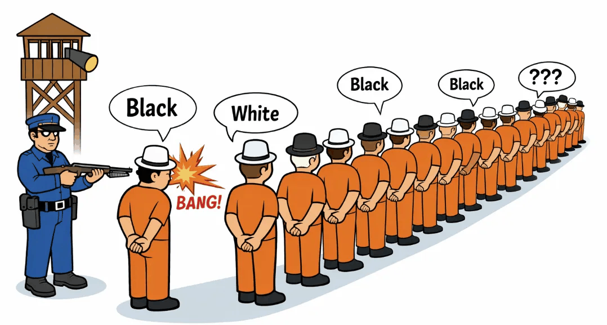

In consideration of those who wish to not be spoiled, I will list the three problems, then their hints, and finally, their solutions, in that order. For those of you who wish to rack your brains over these, I encourage you to use the provided hints or message me as needed!

Many of you have probably heard of this classical puzzle, which will be presented as the first problem.

## Problem 1 (Classical)

A bored warden decides to play a game. He puts 100 prisoners in a single-file line and then places either a white or black hat on every prisoner's head, but the prisoners do not know the number of white and black hats beforehand. Each prisoner is only able to see the colors of the hats in front of them. Starting from the back of the line, the warden asks each prisoner to guess the color of their hat. If a prisoner guesses incorrectly, they are shot. The prisoners can hear the guesses and the shots. What is the maximum number of prisoners that can be guaranteed to survive the game? The prisoners may formulate a plan beforehand.

## Problem 2

A bored warden decides to play a game. He puts 100 prisoners in a single-file line and then places one of his **101 different-colored hats** on each of their heads. The prisoners know what the 101 different colors are, and they know that **every prisoner gets a different hat color**. Each prisoner is only able to see the colors of the hats in front of them.

Starting from the back of the line, the warden asks each prisoner to guess the color of their hat. **They may not guess a hat color that has been previously guessed.** If a prisoner guesses incorrectly, they are shot. The prisoners can hear the guesses and shots.

What is the maximum number of prisoners that can be guaranteed to survive the game? The prisoners may formulate a plan beforehand.

## Problem 3

A bored warden decides to play a game. He puts a **countably infinite** number of prisoners in a single-file line, in such a way that there exists a back-most prisoner. (*Imagine putting the prisoners on the natural numbers of the real line, with all of them facing in the positive direction*) The warden then places a hat on each prisoner's head. Each hat has a **real number** written on it. Each prisoner is only able to see the numbers on the hats in front of them. Each prisoner knows where they stand in line.

Starting from the back of the line, the warden asks each prisoner to guess the real number written on their hat. If a prisoner guesses incorrectly, they are shot. By formulating a plan beforehand, can the prisoners ensure that **only finitely many of them die**?

Oh, and one last thing: **The prisoners are deaf.**

### Hint 1.1

The prisoner that guesses first is essentially doomed as they cannot guarantee their survival. But perhaps their answer could communicate some property about the distribution of black and white hats.

### Hint 2.1

The answer is that all prisoners can be saved except one. There is nothing special about 100 and the problem works even if there are, say, 101 prisoners.

### Hint 2.2

The key idea, similar to Problem 1, has something to do with whether something is "odd" or "even".

### Hint 2.3

The goal is to create a scenario where each prisoner will end up with two reasonable guesses. If the plan is executed properly, then every prisoner will be guessing from two possible hat configurations that differ ever so slightly.

### Hint 2.4

Say the warden has the unused hat. Assign a numbering of the prisoners and the warden from 1 to 101 as well as number their hats from 1 to 101. What can you then say about the function which maps the prisoner number to their hat number? It's a bijection, but more importantly, a *permutation*!

### Hint 3.1

Realistically, this is impossible since the prisoners would require infinite memory. In their strategy, the prisoners MUST require the axiom of choice.

### Hint 3.2

Construct a scheme such that when the guessing game starts, the prisoners will be able to all agree on a sequence to guess. Of course, the way in which each prisoner comes to this agreement must somehow be based only on the hats that the prisoner can see. Moreover, the agreed-upon sequence needs to match the correct sequence in all but finitely many numbers. That is, the guessed sequence and the correct sequence will eventually agree forever. The prisoners will not need any property of the real numbers; this should work for any set of things that the warden can draw on the hats.

### Hint 3.3

Define an appropriate equivalence relation on the set of all possible hat sequences as suggested by Hint 3.2 and use the fact that equivalence relations induce equivalence classes which partition the set of all possible hat sequences.

## Solution 1

We can guarantee saving 99 prisoners.

Since there is no way for the first prisoner to guarantee guessing their hat color accurately, 99 must be the maximum number of prisoners we can guarantee saving. To save everyone else, the system is: the first prisoner says "black" if they see an odd number of black hats, and "white" otherwise.

Here is the second prisoner's perspective: if they see an odd number of black hats, then they must be wearing white; otherwise, they must be wearing black. (*Why? Convince yourself!*) Thus, they can always correctly guess their hat color.

We can now think about any prisoner P afterwards. By listening to the correct guesses of the prisoners behind them and counting the hats in from of them, prisoner P will be able to compute the number B of black hats excluding P's and the first prisoner's hat. Thus, the number of black hats excluding just the first prisoner is either B or B+1, depending on whether P has a white or black hat, and this can be disambiguated by the first prisoner's information on whether this number is even or odd.

## Solution 2

To my friends taking abstract algebra, this problem is for you!

A permutation can be either even or odd. Permutations are even if they can be created through an even number of *transpositions* ("swaps") and odd otherwise. It is a known theorem from introductory abstract algebra that no permutation can be both even and odd, so this characterization is well-defined.

A key consequence is that performing one swap on an even permutation results in an odd permutation and vice versa.

Starting from the back of the line, number the prisoners from 1 to 100. In some order, number the hats from 1 to 101. Mark the warden as Prisoner 101 and give him the missing hat.

By using this idea of even and odd permutations, here is the plan: by viewing the 101 hats as a permutation of the integers 1 to 101, Prisoner 1 will assume that the permutation is even and guess their hat according to this assumption. That's it.

Note that Prisoner 1 sees all hats except their own and the warden's hat, so from their perspective, there are exactly two possible sequences for the hats, and they differ by exactly one swap. Thus, of the two possibilities that Prisoner 1 sees, one represents an even permutation and the other is odd. Hence their assumption that the permutation is even corresponds to a well-defined guess for their hat.

::: example
**Let's work with an example.** If there are 6 prisoners, and Prisoner 1 (represented by "?") sees hats in front of them in this order (Prisoner 2 → Prisoner 6):

$$? \quad 5 \quad 3 \quad 4 \quad 2 \quad 6$$

This means that hats 1 and 7 are left, and Prisoner 1 needs to decide between the two possibilities:

- Prisoner 1: Hat 1, Warden ("Prisoner 7"): Hat 7
- Prisoner 1: Hat 7, Warden ("Prisoner 7"): Hat 1

Note that the first possibility involves 1 swap (between Prisoners 2 and 5) and the second possibility involves 2 swaps (between Prisoners 2 and 5, between Prisoners 1 and 7). Therefore, the first possibility is an odd permutation, and the second possibility is an even permutation. Since Prisoner 1 is expected to assume the even permutation, the second possibility, Prisoner 1 guesses they have Hat 7.
:::

Now of course, Prisoner 1 may or may not get shot. If they are not shot, then everyone knows that the permutation is indeed even. Otherwise, it must be odd.

Let's move on to Prisoner 2. The claim is that Prisoner 2 must know Prisoner 1's hat and the warden's hat.

- If Prisoner 1 was not shot, then due to hearing their correct guess, Prisoner 2 obviously knows Prisoner 1's hat.
- Otherwise, if Prisoner 1 was shot, then denote the hat they guessed as A and denote the hat they were actually wearing as B. The two possibilities were that either Prisoner 1 was wearing A and the warden was wearing B, or the other way around. By hearing the shot, we know that the former was not the case, so it must be the latter, which implies that the warden is wearing A. That is, Prisoner 2 knows the warden is wearing the hat guessed by Prisoner 1.

Thus, there are only two hat colors that Prisoner 2 does not know: That of their own and that of one other person. So, Prisoner 2 is also guessing between two possible sequences, and they differ by a single swap. Since they know the parity of the permutation, they may disambiguate between the two possibilities and guess correctly.

And so inductively, Prisoner $k$ can guess correctly. This is because Prisoners $2, 3, \ldots, k-1$ all guess correctly, and by the same logic, we can argue that prisoner $k$ can either deduce Prisoner 1's hat or the warden's hat. So again, Prisoner $k$ needs to decide between two possible sequences of hats that differ by a single swap, which can be disambiguated because Prisoner $k$ knows the parity of the permutation.

Therefore, we see that all prisoners after Prisoner 1 are guaranteed to survive. This is clearly the best possible outcome because Prisoner 1 has no such guarantee regardless of strategy.

Hence, we can guarantee saving 99 prisoners.

## Solution 3

For my real analysis friends, this problem is for you!

Let $X$ be the set of all possible hat sequences. Define an equivalence relation $\sim$ on $X$ as follows: $A \sim B$ if and only if $A$ and $B$ are eventually the same. That is, they only differ in finitely many places.

The relation $\sim$ partitions $X$ into equivalence classes. The prisoners, in the planning phase, will apply the axiom of choice to agree on a representative of each class.

When the game starts, the hats form some sequence $S \in X$. Every prisoner, by virtue of being able to see the tail of the sequence $S$, knows the equivalence class of $S$ under $\sim$ and can therefore obtain the agreed-upon representative $T$ of the class $[S]_\sim$. Every prisoner will then guess their hat in accordance with the sequence $T$.

Since $S \sim T$, we have that $S$ and $T$ will eventually be the same. That is, $S$ and $T$ will differ only in finitely many spots, so only finitely many prisoners will die under this scheme.

### Sidenote

The answer to Problem 3 should feel…wrong. This is sorcery. It is important to note that carrying over finite-level intuition to infinities is often problematic, but even still, this is ridiculous to wrap your mind around. I mean, think about it.

Yes, it is true that each prisoner can see all hats in front of them, but surely it is impossible to form any conclusion about the hat on their head from that information as there is literally no correlation. And since the prisoners are all deaf, they don't even have the previous prisoners' information at their disposal! How can it be that they will only have a finite number of deaths?

But suddenly, simply by accepting that the axiom of choice exists[^1], we can guarantee a finite number of deaths.

Often times, people cite the [Banach–Tarski paradox](https://en.wikipedia.org/wiki/Banach%E2%80%93Tarski_paradox) as the go-to reason for not readily accepting the axiom of choice, but for me, this solution destroys my intuition far more.

[^1]: more specifically for the advanced reader, the axiom of choice allows us to play with [non-measurable sets](https://en.wikipedia.org/wiki/Non-measurable_set) (such as the set of representative sequences for this problem)
