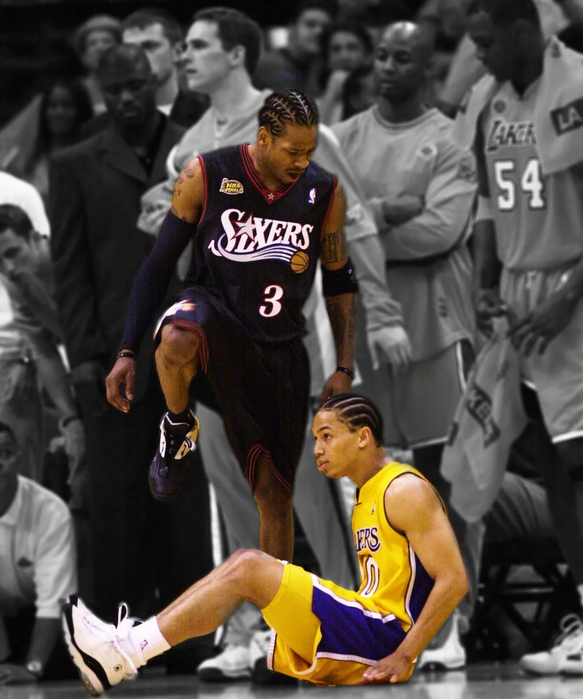

The year is 2001. Allen Iverson, fondly known as “The Answer” or “AI”, has led his Philadelphia 76ers to a 56-26 record which was good enough for the best record in the Eastern Conference, earning them the #1 seed. The 2000-2001 76ers were one of the best defensive teams in the league, spearheaded by 4x Defensive Player Of the Year (DPOY) winner Dikembe Mutombo. As for the offensive side of the basketball, not a single 76er player outside of Allen Iverson averaged more than 13 points per game that season. Iverson put the team on his shoulders as he led the NBA in scoring at 31.1 points per game and in minutes per game at 42 (out of 48 total). Iverson himself was the entire 76ers offense. His impressive season was recognized, and Iverson was awarded the league MVP. Allen Iverson became the shortest (6’0”) and lightest (165 lbs.) player to ever win the award.

This was part of the appeal and legend of Allen Iverson. In many ways he was just like one of “us”. He most certainly had his off-the-court issues growing up, but he struggled and fought through those until he achieved something great. He wasn't the strongest or most imposing player out there, yet he still went to battle every single night and each time he became aggressive and got knocked down, he would simply get up, shake it off, and go do it again. It didn't matter that Iverson was the size of a normal human just like us. Despite being surrounded by players towering over him, he showed basketball fans that if you fought and persevered no matter your stature, you could stand out among the crowd.

Heading into the playoffs, the 76ers started their playoff run against the Indiana Pacers, who had made it all the way to the finals last year in 2000 against the Los Angeles Lakers. Iverson continued his offensive onslaught averaging 31.5 points per game over the series and the 76ers defeated the Pacers 3 games to 1 (back then, the first round of the playoffs was a best-of-five instead of a best-of-seven). The semifinal was a matchup against Vince Carter and the Toronto Raptors. It was an epic seven-game series with the two stars giving sensational performances, as Iverson averaged 33.7 points per game. In game 2, Iverson scored 54 points to give his 76ers a win, with Carter responding with 50 points in a game 3 win for his Raptors. Iverson answered right back with 52 points in game 5 to carry his 76ers to another win. In game 7, the score was 88-87 in favor of the 76ers with two seconds left. Vince Carter missed the potential game-winning two-point shot, and so Iverson and the 76ers advanced to the next round. (fun/not-so-fun fact: Vince Carter attended his college graduation ceremony right before this game, and he received a lot of unjust criticism for not being as focused and idiots alleging that his graduation contributed to him missing this season-ending shot)

<iframe src="https://www.youtube-nocookie.com/embed/3emK-oy0LyQ" title="Vince Carter at the Buzzer... (vs. Philly) in 2001 playoffs" loading="lazy" allow="accelerometer; autoplay; clipboard-write; encrypted-media; gyroscope; picture-in-picture; web-share" allowfullscreen></iframe>

The next round was the Eastern Conference Finals (essentially the semifinals) where Iverson’s 76ers would match up against the Milwaukee Bucks, who had a big three of stars: Ray Allen, Glenn Robinson, and Sam Cassell. Just like last series, this series also went to seven games. In game 6, Iverson scored a furious 46 points in a near improbable comeback where they were losing by 30 points at one time, yet they lost 110-100. A determined Iverson showed up again in game 7, scoring 44 points, giving his team a 108-91 victory, sending his 76ers to the NBA Finals.

It took all the scrapping and battling that Iverson could muster just to earn his 76ers' spot on the NBA's biggest stage to emerge from the Eastern Conference, but over in the Western Conference, the defending champion Los Angeles Lakers were on one of the greatest playoff runs in NBA history, led by the greatest duo of all time (Shaquille O’Neal and Kobe Bryant).

The Lakers beat the Sacramento Kings 3 games to 0 in the first round.

The Lakers beat the Portland Trail Blazers 4 games to 0 in the second round.

The Lakers beat the San Antonio Spurs 4 games to 0 in the conference finals.

This set up an NBA Finals matchup between the juggernaut Los Angeles Lakers against the Philadelphia 76ers. The context for this series is extremely important here. Understand the Lakers were seemingly unstoppable at this point. Shaq and Kobe were each averaging roughly 30 points per game over the course of the playoffs. They were entering these NBA Finals as the defending champion and currently at an undefeated 11-0 record. The Lakers were not only set on repeating as the champions but also becoming the first team ever in NBA playoff history to go undefeated for the entire playoffs. Similar to today’s NBA, the Western Conference was far tougher than the Eastern Conference. The scary part? The Lakers had steamrolled through the much tougher conference, whereas the 76ers had barely clawed by their weaker conference to make it to the NBA Finals.

Almost no one in the basketball world gave the 76ers a shot at even winning a game against these overpowered Lakers as the Lakers were considered one of the most highly favored teams in NBA Finals history, and they had home court advantage, meaning they would be hosting games 1, 2, 6, and 7. Essentially this was David versus Goliath on a basketball court. All of that led into June 6, 2001 in Los Angeles for game 1 of the NBA Finals. Fans at the stadium and those watching from the TV could feel excitement and energy as the Laker crowd was eagerly anticipating their team making history. It was supposed to be a breeze for LA, but Iverson had other plans. Shaq had picked up where he left off from last year's NBA Finals, dominating every player Philadelphia threw to defend him, especially the defensive Dikembe Mutombo. Shaq had an incredible performance of 44 points and 20 rebounds on the night. But it was going to take more than that against Allen Iverson as he continued his incredible year, scoring in a multitude of ways, with a different mesmerizing flurry of moves each time he scored, even while being guarded by an elite defender in Kobe Bryant and having to finish close to the basket over the towering Shaq. Iverson had 30 points in the first half alone, striking fear and anxiety in the all-too-confident Lakers fans.

Throughout game 1, the Lakers had been desperately rotating between defenders on Iverson to try to find a way to stop him. A role player by the name of Tyronn Lue (and currently the coach of the Los Angeles Clippers) was actually doing a decent job on him near the end of the game. While Iverson was still scoring an avalanche of points, he was also taking a ton of shots to do so in the second half. Lue was playing an in-your-face style of defense, which was clearly causing some level of frustration for Iverson. The game went back and forth throughout with no team grabbing a convincing lead. With the teams tied on the final possession of the fourth quarter, Lue actually denied Iverson from even getting the ball for a chance to win the game, fittingly sending this intense game into overtime. With a little over three minutes left in the overtime period, the Lakers were up by 4 points and iconic NBA announcer Marv Albert had this to say:

> ***Iverson will be dreaming about Tyronn Lue tonight***

With less than two minutes to go in overtime, the Lakers are up 99-96 and Iverson takes over. He first drives to the basket to get fouled, and makes both free throws to pull within one point, 99-98. He then plays great defense on Ty Lue, forcing him to miss an off-balance layup and fall out of bounds. The 76ers grab the rebound and run a fastbreak in transition, having the advantage of players on the court. The ball finds Iverson open on the left **wing** (*45 degree angle from the basket*) and he makes the Lakers pay by knocking down a clutch three-pointer to give Philadelphia the lead, 101-99.

With under a minute left in overtime, Iverson then made one of the most iconic plays in NBA history. He caught the ball on the right wing and drove to his right towards the **baseline** (the boundary line under each basketball hoop), did a between-the-legs stepback, creating the space he needed for a dagger jumpshot to put his 76ers up by 4 points, and then proceeded to step over his defender, Tyronn Lue. This image has been immortalized in NBA history, and if anything, it’s probably Ty Lue who’s having nightmares about Iverson for the rest of his life.

The game was sealed. Fans were stunned. An eerie silence of uneasiness rang all around Staples Center in Los Angeles once the buzzer sounded. The 76ers had pulled off a monumental upset, winning 107-101, on the back of Allen Iverson who had scored 48 points, 6 assists, and had 5 steals. Of the grueling 53 minutes of game time, Allen Iverson played for 52 minutes and 57 seconds of them. His iconic jumper and step-over was an awesome play, but it's famous for so much more than that. No single play better symbolizes overcoming adversity and having incredible heart than this Allen Iverson moment, including its deep contextual rewind. He showed the world that while others couldn't stand up to the all-time great 2001 Lakers, even they didn't have an answer for Allen Iverson on that night.

The 76ers had done the impossible — beat the 2001 Lakers in the playoffs. In fact, the game would be the only game the Lakers would lose that year in the playoffs, as they confidently won the next four straight games to win their second straight finals in dominant fashion. But for one night, Allen Iverson had slayed the seemingly unbeatable team. Just for a glimpse, the dominant 2001 Lakers were vulnerably brought down to Earth and seemed very beatable. The fact this image is immortalized despite Iverson and the 76ers not winning a single other game in the Finals, let alone the championship that year, should tell you how historic this performance was. This 2001 season alone cemented Allen Iverson among the all-time greats and made him a Philadelphia hero.

<iframe src="https://www.youtube-nocookie.com/embed/aAIfwvhw2Mw" title="Allen Iverson vs Los Angeles Lakers: 2001 NBA Finals Game 1 Full Highlights (NBA)" loading="lazy" allow="accelerometer; autoplay; clipboard-write; encrypted-media; gyroscope; picture-in-picture; web-share" allowfullscreen></iframe>

Analytics alone would tell you a story that Iverson was an inefficient player who could potentially shoot his team out of games, as he took a ridiculously high volume of shots, almost to the point where you would question if he was a selfish player. After all, he never won a championship in his entire NBA career. You could look at his 2001 playoff run and see that he took 30 shots a game, making less than 39% of them. But the truth was he really had no offensive help in terms of a player who could create a shot (for himself or for others), so the entire offense was him. And every team he played against knew it. They just couldn’t stop him.
