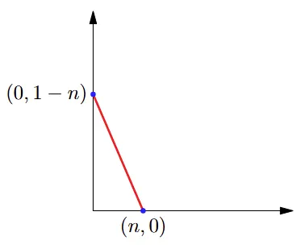
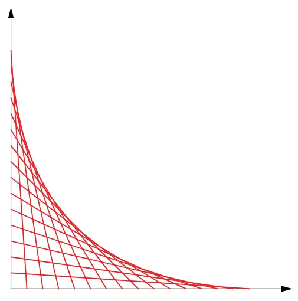

When I was in 6th grade, I would be bored in my math classes quite often. I was nowhere near as artistic as channels such as Vi Hart, but I would try my hand at various math figures, fractals, and try to come up with my own patterns. I was pretty unsuccessful for the most part, but I did manage to make one observation which turned into a pretty cool math problem, which I ended up submitting many years later for a high school math contest.

## Problem

We first begin by picking a random real number $n$ that lies within the interval $[0, 1]$. Next, we connect the points $(n, 0)$ to $(0, 1-n)$.

After repeating this process several times, we see that a "curve" emerges from our repeated drawings which acts as a bound to a region of where all of these line segments may be drawn. This curve will be displayed as my "filler".

The question is, what is the equation of this curve?

## Solution

Show solution

A natural place to start is to find the equation of a line from $(n, 0)$ to $(0, 1-n)$. Fortunately, it is not difficult to retrieve the slope and $y$-intercept from these two points to obtain our equation.

$$
\begin{aligned}
y &= \frac{1-n}{-n}x + (1-n) \\
y &= \frac{n-1}{n}x + (1-n) \\
y &= x - \frac{1}{n}x + (1-n) \\
y &= x + 1 - \left(n + \frac{x}{n}\right)
\end{aligned}
$$

Now that we have this equation, we are saying, if we were to fix a value of $x$ in the interval $[0, 1]$, what would be the line (i.e. the value of $n$) which would provide the maximum possible value of $y$ while staying under the curve?

We can't really do much in terms of optimizing the $x+1$ expression, but we can definitely find a bound for the expression within the parentheses. By the AM-GM inequality,

$$n + \frac{x}{n} \ge 2\sqrt{n \cdot \frac{x}{n}} = 2\sqrt{x}$$

where equality is obtained at $n = \sqrt{x}$.

Thus, we have found an upper bound for our equation.

$$
\begin{aligned}
y = x + 1 - \left(n + \frac{x}{n}\right) &\le x + 1 - 2\sqrt{x} = (1 - \sqrt{x})^2 \\
y &\le (1 - \sqrt{x})^2
\end{aligned}
$$

But all we care about is our equality upper bound case, so our inequality becomes an equality. Taking the square root of both sides and rearranging terms, we end up with a simple, beautiful equation of this curve:

$$\sqrt{x} + \sqrt{y} = 1$$

