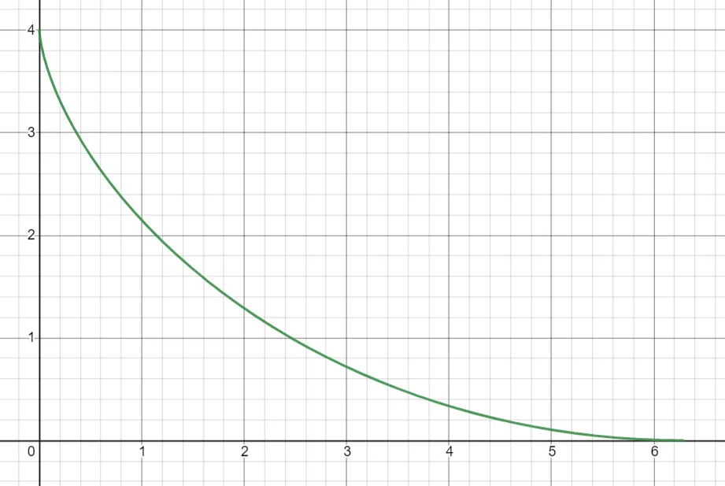

I took Optimization and Real Analysis at the same time and one of the running jokes in Real Analysis was about the (lack of) rigor in proving the techniques we used in Optimization while also admitting how useful they are! One such concept is known as the "Calculus of Variations".

I laughed in those moments, but in retrospect, who am I to laugh unless I genuinely understand it? And after finally understanding the math for myself, this has truly become one of my favorite applications of analysis!

*Reading Prerequisites: Understand vector spaces, norm, limits, integration*  
*Extremely useful, almost prerequisites: Integration by parts, directional derivatives, gradients, multidimensional chain rule, differential equations, second-order ODEs*

***Notation "issue":*** *I will sometimes write this:*

$$\int f\,dx$$

*as a blatant abuse of notation instead of this:*

$$\int f(x)\,dx$$

## Part 0: Directional Derivatives

Let $X$ be a normed space (like $\R^N$). Suppose $f : E \to \R$ where $E \subseteq X$ and $x_0 \in E$ is an interior point (i.e. $f$ is not just defined at $x_0$, but also "around" $x_0$). Then we can try to find the "derivative" of $f$ at $x_0$.

Specifically, we can take a "directional derivative", but that means that a "direction" this derivative must be specified. Especially, it is the "rate of change moving along some line through $x_0$". To wit, let $v \in X$ with $\|v\| = 1$ be a "direction". Imagine this as an arrow that points in the direction of the derivative.

**Definition (Directional Derivative):** The directional derivative of $f$ at $x_0$ along the direction $v$ is:

$$\frac{\partial f}{\partial v}(x_0) := \lim_{t \to 0} \frac{f(x_0 + tv) - f(x_0)}{t}$$

For example, let $X = \R^3$, and let $f(x, y, z) = x^2 + y^2 + z^2$, defined on all of $\R^3$. We can take the directional derivative along $i := (1, 0, 0)$ at $(1, 1, 1)$:

$$\begin{aligned}
\frac{\partial f}{\partial i}(1, 1, 1) &:= \lim_{t \to 0} \frac{f((1, 1, 1) + t(1, 0, 0)) - f(1, 1, 1)}{t} \\
&= \lim_{t \to 0} \frac{f(1 + t, 1, 1) - f(1, 1, 1)}{t} \\
&= \lim_{t \to 0} \frac{(1 + t)^2 + 1^2 + 1^2 - 1^2 - 1^2 - 1^2}{t} = 2
\end{aligned}$$

For fun, you can try and see what happens when you take other examples of $v$.

## Part 1: Differentiating in Infinite Dimensions

This might sound scary, but keep in mind that absolutely nothing changes from the previous example. It's the same exact definition. We're just going to have fun with it. Let's mess around.

We can start with a spicier vector space. Let $X = C_b(\R)$, the normed vector space of *bounded continuous functions* over $\R$. Of course, if I say it's a normed space, then I have to give you a norm. We're going to take the **supremum norm**, i.e. for a continuous function $f$:

$$\|f\|_\infty := \sup_{\R} |f|$$

If you don't know what **sup** means, you can instead replace it with **max** (not *technically* correct, but good enough for intuition). Convince yourself that it is a norm. That is, we should have these properties:

- $\|f\|_\infty = 0$ if and only if $f = 0$
- For a real number $t$, we have that $\|tf\|_\infty = |t| \cdot \|f\|_\infty$
- $\|f\|_\infty + \|g\|_\infty \ge \|f + g\|_\infty$ (this might be the trickiest one to prove)

Cool! We have a vector space. **Note that this vector space is of infinite dimension**, so what do *functions* on this vector space look like? These "functions" take in other functions, and output real numbers. Wow! So, these are like, "higher-order functions", eh?

**Example 1 (Evaluation Map):** Let's try the function

$$F(f) := f(0)$$

For example, $\sin \in C_b(\R)$, and so we can compute $F(\sin) = 0$ since $\sin(0) = 0$.

Try a few exercises to test your understanding!

- Compute $F(\cos)$. Answer: 1
- Compute:

    $$F(t \mapsto e^{-t^2}) \qquad \text{Answer: } 1$$

    - Why did I write

        $$F(t \mapsto e^{-t^2}) \text{ instead of } F(e^{-t^2})$$

        Writing the latter might be fine, but pedantically one might interpret $\exp(-t^2)$ as a *number* rather than a *function*. $F$ doesn't take in numbers; it takes in functions! Writing $t \mapsto \exp(-t^2)$ makes it very explicit that we're talking about a function.

- Compute:

    $$F(t \mapsto t^2)$$

    Answer: Technically not defined, because $t \mapsto t^2 \notin C_b(\R)$. It's continuous for sure but it's certainly not bounded!

We have a function to differentiate, so now we want a direction $v$ to differentiate towards and a point $x_0$ to take the derivative at...For sake of generality, let's just let them be $v$ and $f_0$. (Motivation for the notation of $f_0$ is to remind ourselves it's a function.)

Let's see how wild this gets:

$$\begin{aligned}
\frac{\partial F}{\partial v}(f_0) &= \lim_{t \to 0} \frac{F(f_0 + tv) - F(f_0)}{t} \\
&= \lim_{t \to 0} \frac{f_0(0) + tv(0) - f_0(0)}{t} = \boxed{v(0)}
\end{aligned}$$

This is pretty interesting!

*Bonus Problem: Is $F$ differentiable? That is, does there exist a linear*

$$L : C_b(\R) \to \R$$

*such that*

$$\lim_{f \to f_0} \frac{F(f) - F(f_0) - L(f - f_0)}{\|f - f_0\|_\infty} = 0$$

- Hint: How can we use the directional derivatives to deduce what $L$ would *have* to be?
- Answer: For $h \in C_b(\R)$, the only possible candidate for the derivative is $L(h) = h(0)$.

**Example 2 (Integral Functionals):** This will be a nice warmup for what's coming up.

$$F(f) := \int_{-1}^{1} f(x)\,dx$$

For example, $F(\sin) = 0$ and $F(\cos) = 2\sin(1)$ or something like that. Let's try computing the directional derivative of $F$ at $f_0$ in the direction $v$:

$$\begin{aligned}
\frac{\partial F}{\partial v}(f_0) &= \lim_{t \to 0} \frac{F(f_0 + tv) - F(f_0)}{t} \\
&= \lim_{t \to 0} \frac{1}{t} \left[ \int_{-1}^{1} f_0(x) + tv(x)\,dx - \int_{-1}^{1} f_0(x)\,dx \right] \\
&= \lim_{t \to 0} \frac{1}{t} \left[ \int_{-1}^{1} f_0(x) + tv(x) - f_0(x)\,dx \right] \\
&= \lim_{t \to 0} \frac{1}{t} \int_{-1}^{1} tv(x)\,dx = \boxed{\int_{-1}^{1} v(x)\,dx}
\end{aligned}$$

**Example 3 (Spicy!):** The previous example was perhaps a bit lame since everything just happened to cancel *a little too well*. Here's

$$F(f) := \int_{-1}^{1} f(x)^2\,dx$$

What now?

$$\begin{aligned}
\frac{\partial F}{\partial v}(f_0) &= \lim_{t \to 0} \frac{F(f_0 + tv) - F(f_0)}{t} \\
&= \lim_{t \to 0} \frac{1}{t} \left[ \int_{-1}^{1} (f_0(x) + tv(x))^2\,dx - \int_{-1}^{1} f_0(x)^2\,dx \right] \\
&= \lim_{t \to 0} \frac{1}{t} \int_{-1}^{1} 2tf_0(x)v(x) + t^2 v(x)^2\,dx \\
&= \lim_{t \to 0} \int_{-1}^{1} 2f_0(x)v(x) + tv(x)^2\,dx = \int_{-1}^{1} 2f_0(x)v(x)\,dx + \lim_{t \to 0} \int_{-1}^{1} tv(x)^2\,dx
\end{aligned}$$

So close! How do we deal with the pesky latter term of

$$\lim_{t \to 0} \int_{-1}^{1} tv(x)^2\,dx$$

Intuitively, since $tv(x)^2$ should go to 0 as $t \to 0$, we would predict that this limit is 0. This is actually true! This is proven using **Lebesgue Dominated Convergence**. No worries if you're unfamiliar with this but just note that you can't always "shove the limit inside the integral". It's fine here, though! Therefore:

$$\frac{\partial F}{\partial v}(f_0) = \boxed{\int_{-1}^{1} 2f_0(x)v(x)\,dx}$$

Spicy!

*Bonus Exercise: Generalize the above argument to compute the directional derivative of functionals of the form*

$$F(f) = \int_a^b g(f(x))^2$$

*where $g : \R \to \R$ is a differentiable function with continuous derivative. If you don't know Lebesgue Dominated Convergence, go ahead and swap limits and integrals without proof.*

Fooling around in infinite dimensions was fun! Here's how we can practically apply this...it's about to get even more fun!

## Part 2: Calculus of Variations

Consider the following four problems:

1. What function $f : [0, 1] \to [0, 1]$ satisfying $f(0) = 0$, $f(1) = 1$ will minimize the quantity

    $$\int_0^1 (f(x) + f'(x))^2\,dx$$

2. What is the shortest path between two points in $\R^2$?
3. Suppose a cliff is $h$ meters high. What is the shape of the track that minimizes the time it would take for a roller coaster starting at the top of the cliff to reach the ground?
4. Consider two rings $\{x = a,\ y^2 + z^2 = r_0^2\}$ and $\{x = b,\ y^2 + z^2 = r_1^2\}$ positioned "coaxially" in $\R^3$, for constants $a, b, r_0, r_1$. What is the shape of minimal surface (covered in a previous blog post!) that connects the boundaries of the two rings?

These four problems are all *minimization problems*. If you're reading this, you've probably found minimums before. It was easy! To find the minimum of something like $f(x) = x^2 - x$, you'd just take the derivative and set it to zero. For those problems, you were finding the point that minimizes a function $f$. But for the above four problems, what we're trying to find a certain *function* that minimizes some quantity in terms of that function...like, a function of a function.

Perhaps it would be easier to see where we're headed if we considered the first problem first.

**Example 1:** Over all differentiable functions $f : [0, 1] \to [0, 1]$ satisfying $f(0) = 0$, $f(1) = 1$, what is the minimum possible value of

$$F(f) := \int_0^1 (f(x) + f'(x))^2\,dx$$

For what $f$ is this achieved?

> Well, taking inspiration from calculus, what if we just, like...took the derivative of $F$ and set it to zero...? Well, we're trying to minimize over a space of functions, which is like, an infinite-dimensional vector space, so the derivative would have to be like some kind of infinite-dimensional derivative, or something...

Oh wait...are we sufficiently equipped for this problem?

### Some Tools We Will Need

We need an analog for "if $f$ is minimized at $x_0$, then $f'(x_0) = 0$".

::: theorem
Let $f : E \to \R$ where $E \subseteq X$ for $X$ a normed vector space. Suppose $f$ has local minimum/maximum at $x_0 \in E$, where $x_0$ is an interior point and all the directional derivatives at $x_0$ exist. Then we MUST have:

$$\frac{\partial f}{\partial v}(x_0) = 0$$
:::

::: proof
If it's a local minimum, then surely $x_0$ is a local minimum of each function

$$g_v(t) := f(x_0 + tv)$$

Then

$$0 = g_v'(x_0) = \frac{\partial f}{\partial v}(x_0)$$
:::

Next up, a short blurb on integration by parts.

::: lemma
Let

$$\varphi \in C_0^1([a, b]; \R)$$

That is, $\varphi$ is continuously differentiable and *compactly supported*, (you can interpret this as $\varphi(a) = \varphi(b) = 0$). Then for any differentiable, integrable $f$, we have:

$$\int_a^b f\varphi'\,dx = -\int_a^b f'\varphi\,dx$$
:::

::: proof
Applying integration by parts:

$$\int_a^b f\varphi'\,dx = f(b)\varphi(b) - f(a)\varphi(a) - \int_a^b f'\varphi\,dx$$

Since $\varphi$ is compactly supported, the $f(b)\varphi(b) - f(a)\varphi(a)$ is just 0, thus proven.
:::

The next tool we will need is the chain rule in multiple dimensions.

::: theorem Chain Rule
Let $f : \R \to \R^N$ and $g : \R^N \to \R^N$. Then:

$$\frac{d}{dt} g(f(t)) = \nabla g(f(t)) \cdot f'(t)$$
:::

> I'll choose to omit the proof for this one, but here's an example:
>
> If we take $N = 3$, let $f(t) = (t, t^2, \sin t)$ and let $g(x, y, z) = x^2 y + z$. Then:
>
> $$\frac{d}{dt} g(f(t)) = \nabla g(f(t)) \cdot f'(t)$$
>
> $$= \begin{bmatrix} \frac{\partial g}{\partial x}(f(t)) \\ \frac{\partial g}{\partial y}(f(t)) \\ \frac{\partial g}{\partial z}(f(t)) \end{bmatrix} \cdot \begin{bmatrix} 1 \\ 2t \\ \cos t \end{bmatrix}$$
>
> $$= \begin{bmatrix} 2xy \big|_{x=t,\,y=t^2} \\ x^2 \big|_{x=t} \\ 1 \end{bmatrix} \cdot \begin{bmatrix} 1 \\ 2t \\ \cos t \end{bmatrix}$$
>
> $$= \begin{bmatrix} 2t^3 \\ t^2 \\ 1 \end{bmatrix} \cdot \begin{bmatrix} 1 \\ 2t \\ \cos t \end{bmatrix}$$
>
> $$= 2t^3 + 2t^3 + \cos t = \boxed{4t^3 + \cos t}$$

Finally, we will get to employ this very cool trick!

::: lemma Fundamental Lemma of the Calculus of Variations
Let $h : [a, b] \to \R$ be a continuous function, such that

$$\int_a^b h\varphi\,dx = 0$$

for all compactly supported and continuously differentiable $\varphi$ satisfying $\|\varphi\|_\infty = 1$. Then $h = 0$.
:::

::: proof
Suppose otherwise. Then there exists $x_0 \in [a, b]$ for which $h(x_0) \ne 0$. WLOG $h(x_0) > 0$, and for our own ease, we assume that $x_0 \ne a, b$ (the proof is more or less the same).

If we let $c := h(x_0)$, then by continuity, there exists sufficiently small $\delta > 0$ such that $h(x) > c/2 > 0$ for all $x$ within $\delta$ of $x_0$.

Now, it is not too hard to construct a smooth $\varphi$ that is nonzero only in $(x_0 - \delta, x_0 + \delta)$, such that

$$\int_a^b \varphi\,dx > 0$$

We then obtain:

$$\begin{aligned}
\int_a^b f\varphi\,dx &= \int_{(x_0 - \delta, x_0 + \delta)} f\varphi\,dx + \int_{[a,b] \setminus (x_0 - \delta, x_0 + \delta)} f\varphi\,dx \\
&= \int_{(x_0 - \delta, x_0 + \delta)} f\varphi\,dx + 0 \\
&\ge \int_{(x_0 - \delta, x_0 + \delta)} (c/2)\varphi\,dx \\
&= \frac{c}{2} \int_{(x_0 - \delta, x_0 + \delta)} \varphi > 0
\end{aligned}$$

Contradiction. We can easily scale up/down $\varphi$ to get $\|\varphi\|_\infty = 1$, so we still win.
:::

### Back to the First Example

First, we need to specify the vector space of functions we're using. We will pick

$$X = C^1([0, 1]; \R)$$

which is the normed space of functions $f : [0, 1] \to \R$ with continuous derivative. As before, the norm we take is the supremum/maximum norm.

Let's suppose that

$$F : C^1([a, b]; \R) \to \R$$

is minimized at some $f_0$. Then, by **Theorem 1**, we have for every direction $v \in X$ that

$$0 = \frac{\partial F}{\partial v}(f_0) = \lim_{t \to 0} \frac{F(f_0 + tv) - F(f_0)}{t}$$

$$\begin{aligned}
&= \lim_{t \to 0} \frac{1}{t} \int_0^1 (f_0(x) + tv(x) + f_0'(x) + tv'(x))^2 - (f_0(x) + f_0'(x))^2\,dx \\
&= \lim_{t \to 0} \frac{1}{t} \int_0^1 2(f_0(x) + f_0'(x))(tv(x) + tv'(x)) + (tv(x) + tv'(x))^2\,dx \\
&= \lim_{t \to 0} \int_0^1 2(f_0(x) + f_0'(x))(v(x) + v'(x)) + t(v(x) + v'(x))^2\,dx
\end{aligned}$$

Switch the limit and integral with a domination argument:

$$\begin{aligned}
&= \int_0^1 \lim_{t \to 0} 2(f_0(x) + f_0'(x))(v(x) + v'(x)) + t(v(x) + v'(x))^2\,dx \\
&= \int_0^1 2(f_0(x) + f_0'(x))(v(x) + v'(x))\,dx
\end{aligned}$$

Now we need to split this integral into two parts. The key idea is to remove the $v'(x)$ and turn it into a $v(x)$.

$$= \int_0^1 2(f_0(x) + f_0'(x))v(x)\,dx + \int_0^1 2(f_0(x) + f_0'(x))v'(x)\,dx$$

This equality holds for all directions $v$. We're allowed to apply more conditions to $v$ if we want (as long as it's still a direction, it works!), particularly we may assume that $v$ is compactly supported in $(0, 1)$. Then, magic happens when we apply integration by parts / **Theorem 2** on the second integral! This gives us:

$$= \int_0^1 2(f_0(x) + f_0'(x))v(x)\,dx - \int_0^1 2(f_0'(x) + f_0''(x))v(x)\,dx$$

We thus conclude that

$$\int_0^1 (f_0''(x) + 2f_0'(x) + f_0(x))v(x)\,dx = 0$$

for all

$$v \in C_0^1([0, 1]; \R)$$

By the **Fundamental Lemma of Calculus of Variations**, we find that actually,

$$f_0''(x) + 2f_0'(x) + f_0(x) = 0$$

Ta-da! This is now just a differential equation! We can solve this...

> Define $D$ to be the differentiation linear operator on the vector space of smooth solutions, so that $(D + I)(D + I)(f_0) = 0$. Let $u = (D + 1)f_0$ so $u \in \ker(T + I)$. Then $u' = -u$ so $u = c_1 e^{-x}$.
>
> Now $f_0' + f_0 = c_1 e^{-x}$. For fun, move the $e^x$ over, then magically we have
>
> $$\frac{d}{dx}(f_0(x)e^x) = c_1$$
>
> So,
>
> $$f_0(x)e^x = c_1 x + c_2,\quad f_0 = (c_1 x + c_2)e^{-x}$$

...to get $f_0 = (c_1 x + c_2)e^{-x}$. Plugging in the constraints $f_0(0) = 0$ and $f_1(1) = 1$, we find that $c_1 = e$ and $c_2 = 0$. Therefore, the minimizing function is:

$$\boxed{f_0(x) = xe^{1-x}}$$

By taking an "infinite-dimensional" derivative, we discovered the minimal value of a "infinite-dimensional" function! Wasn't that fun?

Welcome to the Calculus of Variations.

## Part 3: The Euler-Lagrange Equation

You can totally solve the other three problems that I have posed by using this method, but it can get a bit annoying. Instead, let's generalize in order to make a shortcut!

**General Problem:** Let $g(x, y, z)$ be a twice-differentiable function $\R^3 \to \R$. The $x$ component represents the...$x$, the $y$-component represents $f(x)$, and the $z$ component represents $f'(x)$. Here's an example to explain what that means: if I'm trying to represent the expression $xf(x) + f'(x)^2$ in the form $g(x, f(x), f'(x))$, then $g(x, y, z) = xy + z^2$.

Let

$$F(f) = \int_a^b g(x, f(x), f'(x))\,dx$$

What differential equation must be satisfied by an $f$ that minimizes $F(f)$?

Note that the first problem is equivalent to solving this general problem for $g(x, y, z) = (y + z)^2$.

### Step 1: Take the directional derivative

If $f_0$ is a local minimum, then the directional derivatives at $f_0$ must all be zero. For any direction $v$ compactly supported in $(a, b)$, we have that:

$$\begin{aligned}
0 = \frac{\partial F}{\partial v}(f_0) &= \lim_{t \to 0} \frac{1}{t} \int_a^b g(x, f_0(x) + tv(x), f_0'(x) + tv'(x)) - g(x, f_0(x), f_0'(x))\,dx \\
&= \lim_{t \to 0} \int_a^b \frac{g(x, f_0(x) + tv(x), f_0'(x) + tv'(x)) - g(x, f_0(x), f_0'(x))}{t}\,dx
\end{aligned}$$

### Step 1.5: Shove the limit in

*This isn't that fun of a step so feel free to not care much about this.*

By the Mean Value Theorem, we have that for each $t$ there exists $t_0$ between 0 and $t$ such that

$$\frac{g(x, f_0(x) + tv(x), f_0'(x) + tv'(x)) - g(x, f_0(x), f_0'(x))}{t} = \frac{d}{dt} g(x, f_0(x) + tv(x), f_0'(x) + tv'(x)) \Big|_{t = t_0}$$

Since $g$ is twice-differentiable,

$$\frac{d}{dt} g(x, f_0(x) + tv(x), f_0'(x) + tv'(x))$$

is continuous, so it obtains a maximum $M$ on $[a, b]$. We deduce that the integrand is bounded by $M$. By Arzela-Ascoli and/or Lebesgue domination, we may conclude that the limit may be passed through the integral.

### Step 2: Prepare the Chain Rule

$$= \int_a^b \lim_{t \to 0} \frac{g(x, f_0(x) + tv(x), f_0'(x) + tv'(x)) - g(x, f_0(x), f_0'(x))}{t}\,dx$$

The integrand looks like a derivative, and that's because it totally is. It's just:

$$\lim_{t \to 0} \frac{g(x, f_0(x) + tv(x), f_0'(x) + tv'(x)) - g(x, f_0(x), f_0'(x))}{t} = \frac{d}{dt} g(x, f_0(x) + tv(x), f_0'(x) + tv'(x)) \Big|_{t = 0}$$

Now with that being said, I personally do find it quite difficult to understand where exactly the chain rule is applied here. To help myself out, I like to define a "component accumulator" function. To wit, let

$$h(t) = (x, f_0(x) + tv(x), f_0'(x) + tv'(x))$$

Then, this is:

$$= \frac{d}{dt} g(h(t))$$

### Step 3: Apply the Chain Rule

$$\begin{aligned}
&= \nabla g(h(t)) \cdot h'(t) \\
&= \begin{bmatrix} \frac{\partial g}{\partial x}(h(t)) \\ \frac{\partial g}{\partial y}(h(t)) \\ \frac{\partial g}{\partial z}(h(t)) \end{bmatrix} \cdot \begin{bmatrix} 0 \\ v(x) \\ v'(x) \end{bmatrix} \\
&= \frac{\partial g}{\partial y}(x, f_0(x), f_0'(x))v(x) + \frac{\partial g}{\partial z}(x, f_0(x), f_0'(x))v'(x)
\end{aligned}$$

Putting back the integral, we have that for every $C^1$ and compactly supported $v$ that:

$$0 = \int_a^b \frac{\partial g}{\partial y}(x, f_0(x), f_0'(x))v(x) + \frac{\partial g}{\partial z}(x, f_0(x), f_0'(x))v'(x)\,dx$$

### Step 4: Integrate by Parts

We don't like $v'(x)$ and wish to replace with $v(x)$. So we split the integral:

$$= \int_a^b \frac{\partial g}{\partial y}(x, f_0(x), f_0'(x))v(x)\,dx + \int_a^b \frac{\partial g}{\partial z}(x, f_0(x), f_0'(x))v'(x)\,dx$$

And apply integration by parts, and the fact that $v$ is compactly supported, on the second term:

$$\begin{aligned}
&= \int_a^b \frac{\partial g}{\partial y}(x, f_0(x), f_0'(x))v(x)\,dx - \int_a^b \frac{d}{dx}\frac{\partial g}{\partial z}(x, f_0(x), f_0'(x))v(x)\,dx \\
&= \int_a^b \left( \frac{\partial g}{\partial y}(x, f_0(x), f_0'(x)) - \frac{d}{dx}\frac{\partial g}{\partial z}(x, f_0(x), f_0'(x)) \right) v(x)\,dx
\end{aligned}$$

### Step 5: The Fundamental Lemma

Since this holds for all compactly supported $C^1$ directions $v$, we may use the Fundamental Lemma of Calculus of Variations, and we finally obtain that:

$$\frac{\partial g}{\partial y}(x, f_0(x), f_0'(x)) - \frac{d}{dx}\frac{\partial g}{\partial z}(x, f_0(x), f_0'(x)) = 0$$

Ergo:

$$\boxed{\frac{\partial g}{\partial y}(x, f_0(x), f_0'(x)) = \frac{d}{dx}\frac{\partial g}{\partial z}(x, f_0(x), f_0'(x))}$$

This is the **Euler-Lagrange Equation**.

## Part 4: Euler-Lagrange Abuse

We've got a lot of variables flying around all over the place, so let's see how we're really supposed to use Euler-Lagrange:

1. First, look at your integrand and figure out what $g$ really is. This is done by replacing $f(x)$ with $y$ and $f'(x)$ with $z$.
2. To get the left side, differentiate $g$ with respect to the $y$ variable, then plug back in $y = f(x)$ and $z = f'(x)$. (You can think of this as treating $f(x)$ as a "variable" and differentiating with respect to it.)
3. To get the right side, differentiate $g$ with respect to the $z$ variable, then plug back in $y = f(x)$ and $z = f'(x)$. ("Differentiate with respect to the $f'(x)$ variable"). Now, take the derivative with respect to $x$.

Our first example will be the shortest distance between two points.

**Example 1 (Shortest Distance):** Let $(a, b)$ and $(c, d)$ be two points in $\R^2$, and let's assume that $a < c$. What is the shortest path between these two points?

(We expect this to be a line, but let's see if this is true.)

We can (sort of) model the shortest path as a continuous function $f : [a, c] \to \R$ that satisfies $f(a) = b$ and $f(c) = d$. So, we're trying to figure out what function $f$ satisfies these conditions such that its length (i.e. "arc length") is minimized.

The arc-length formula states that the "length" of this path is given by

$$\int_a^c \sqrt{1 + f'(x)^2}\,dx$$

> *Slight warning: we are assuming that $f$ is differentiable...*
>
> But we're actually fine! We don't need differentiable here, we just need "absolutely continuous", and then $f'(x)$ exists "almost everywhere" making this quantity well-defined. This actually makes sense because I'm moderately certain that we don't even define length for curves that aren't absolutely continuous.

Thus, here's the problem: Find the differentiable function $f$ satisfying $f(a) = b$ and $f(c) = d$ that minimizes the quantity

$$F(f) := \int_a^c \sqrt{1 + f'(x)^2}\,dx$$

Now let's follow the Euler-Lagrange formula...

1. Looks like our

    $$g(x, y, z) = \sqrt{1 + z^2}$$

2. Let's differentiate with respect to $y$ and uh...we get 0. This is the LHS.
3. Now let's differentiate with respect to $z$ to get

    $$\frac{z}{\sqrt{1 + z^2}}$$

    Plugging this stuff back in, this turns into

    $$\frac{f'(x)}{\sqrt{1 + f'(x)^2}}$$

    We're not done yet: We need to differentiate *this* with respect to $x$ to get

    $$\frac{d}{dx} \frac{f'(x)}{\sqrt{1 + f'(x)^2}}$$

    This is the RHS.

Hence the Euler-Lagrange equation for this minimization problem is given by

$$\boxed{\frac{d}{dx} \frac{f'(x)}{\sqrt{1 + f'(x)^2}} = 0}$$

Notice that I didn't bother evaluating this derivative. That's because if the derivative of something is zero <del>and that something is $C^1$</del> then the something MUST be a constant function! Thus:

$$\frac{f'(x)}{\sqrt{1 + f'(x)^2}} = k$$

for a constant $k$. Solving, we get:

$$f'(x) = \pm\frac{1}{\sqrt{1 - k^2}}$$

Therefore,

$$\boxed{f(x) = m \pm \frac{x}{1 - k^2}}$$

for constants $k$ and $m$, as well as a choice of sign. This is linear, and by applying the original conditions, this must interpolate to the line connecting the two points.

**Example 2 (Rollercoaster Brachistochrone):** You've been hired as an engineer to build a new rollercoaster at the Grand Canyon, which probably violates more than 6 laws. It's going to start really high up at $(0, h)$ and its ending point is going to be on the ground at $(k, 0)$. To maximize profits, your company wants the ride to take the least amount of time possible. Given that the only force acting on the system is gravity (i.e. gravity is the only source of speed), what shape should the track be?

First, we claim that the track can be modelled as a continuous function

$$f : [0, h] \to [0, k]$$

<del>unless you really, really want loops</del>. How do we compute the time the rollercoaster would take to get to the end given that $f$ is the function modelling the track? The unfortunate answer is physics.

> **Bad Physics**
>
> We need physics to compute the rollercoaster's speed when it reaches a certain point $(x, f(x))$ on the track. Fortunately, this is simple: The total energy at the top of the track is all gravitationally sourced and is given by $mgh$. Once it has descended to $(x, f(x))$, there has been a vertical displacement of $h - f(x)$, meaning $mg(h - f(x))$ of gravitational potential energy has been "lost". This must all be converted to kinetic energy, hence if $v(x)$ is the speed of $(x, f(x))$ then:
>
> $$mg(h - f(x)) = \tfrac{1}{2} m v(x)^2$$
>
> $$\boxed{v(x) = \sqrt{2g(h - f(x))}}$$

Which leads into some messy analysis...

> **Messy Analysis**
>
> To be honest, these manipulations don't come naturally to me, so don't fret if you can't follow (alternatively, Google some alternative approaches). Impose the condition that $f$ be absolutely continuous (so that the curve traced is rectifiable), hence $f$ is differentiable almost everywhere and we may define:
>
> $$z(t) := \int_0^{x(t)} \sqrt{1 + f'(x)^2}\,dx$$
>
> where $x(t)$ is the $x$-coordinate after $t$ seconds. That is, $z(t)$ is the length along the curve travelled after a time $t$. $z$ has an inverse and by the chain rule
>
> $$1 = \frac{d}{ds} z(z^{-1}(s)) = \frac{dz^{-1}}{ds}(s) \cdot z'(z^{-1}(s))$$
>
> thus if $L$ is the total length of the journey and $T$ is the total time taken (which we need to find), then:
>
> $$T = z^{-1}(L) - z^{-1}(0) = \int_0^L \frac{dz^{-1}}{ds}(s)\,ds = \int_0^L \frac{1}{z'(z^{-1}(s))}\,ds$$
>
> Now note that in fact,
>
> $$z'(t) = \sqrt{1 + f'(x(t))^2}\,x'(t) = \sqrt{x'(t)^2 + \left(\tfrac{d}{dt} f(x(t))\right)^2} = v(x(t))$$
>
> hence:
>
> $$T = \int_0^L \frac{1}{v(x(z^{-1}(s)))}\,ds = \int_0^L \frac{1}{\sqrt{2g(h - f(x(z^{-1}(s))))}}\,ds$$
>
> Now apply the substitution $u = x(z^{-1}(s))$. Then, write $s = z(x^{-1}(u))$ so that
>
> $$s'(u) = z'(x^{-1}(u))(x^{-1})'(u) = \sqrt{1 + f'(u)^2}\,x'(x^{-1}(u))(x^{-1})'(u) = \sqrt{1 + f'(u)^2}$$
>
> Therefore:
>
> $$T = \int_0^L \frac{\sqrt{1 + f'(u)^2}}{\sqrt{2g(h - f(u))}}\,du$$

And eventually we find that the time taken $f(F)$ given a track $f$ is given by:

$$F(f) = \int_0^L \frac{\sqrt{1 + f'(x)^2}}{\sqrt{2g(h - f(x))}}\,du$$

Er, looks like the letter $g$ has been stolen by physics. Oh well. But when has that ever stopped math? The left side of the Euler-Lagrange equation is:

$$\frac{g\sqrt{1 + f'(x)^2}}{2\sqrt{2}\,(g(h - f(x)))^{3/2}}$$

The right side is:

$$\frac{d}{dx} \frac{f'(x)}{\sqrt{2g(h - f(x))} \cdot \sqrt{1 + f'(x)^2}}$$

Now set them equal and solve, simple!!!

Right...

...if I go through the computations here then both my readers and I will go insane. Fortunately, Mathematica comes to the rescue! This reduces to:

$$1 + f'(x)^2 = 2(h - f(x))f''(x)$$

I'm not a big fan of this $h - f(x)$ term, so if we let $u = h - f(x)$, then this is

$$1 + u'(x)^2 = -2u(x)u''(x)$$

Now we get to use a really slick trick! We *multiply each side* by $u'(x)$ to get

$$u'(x) + u'(x)^3 + 2u(x)u'(x)u''(x) = 0$$

But why would I ever do such a thing here? Well, with some clever manipulation...

$$u'(x) + u'(x)u'(x)^2 + u(x)(2u'(x)u''(x)) = 0$$

...*we can apply the product rule for differentiation in reverse*!

$$u'(x) + \frac{d}{dx}\left(u(x)u'(x)^2\right) = 0$$

Or equivalently,

$$\frac{d}{dx}\left(u(x) + u(x)u'(x)^2\right) = 0$$

Thus, $u(x) + u(x)u'(x)^2 = c$ for a constant $c$. We've got one layer down, one to go! Solving for $u'(x)$:

$$u'(x) = \pm\sqrt{\frac{c - u(x)}{u(x)}}$$

Now let's think for a second: is $u$ going up or going down? It should be going up because $f$ is going down! So we must take the positive solution!

Let's toss some rigor aside and "separate and integrate":

$$\begin{aligned}
\frac{du}{dx} &= \sqrt{\frac{c - u}{u}} \\
\sqrt{\frac{u}{c - u}}\,du &= dx \\
x &= c_1 + \int \sqrt{\frac{u}{c - u}}\,du
\end{aligned}$$

(If you're concerned, it's not *too* hard to restore rigor.)

If integrating this lovely expression is your cup of tea, go ahead. A trig sub or two should do the trick. Unfortunately for you, I will politely decline such an experience, by stuffing this into Mathematica we get:

$$x = c_1 + c\sin^{-1}\left(\sqrt{u/c}\right) - \sqrt{u(c - u)}$$

Admittedly, this is not the prettiest solution, but it will certainly do.

If we restore $f(x) = h - u(x)$ then the curve looks something like this:

This curve is called the **Brachistochrone!**

The last problem, I leave to you as an exercise.

**Example 3 (The Containment Catenoid)**

Steely Dan has gotten his hands on the elusive Cocktail Monkey and wants to build a special enclosure for it. He insists that the room for the monkey consists of a circular floor of radius $r_2$ and a circular ceiling $r_1$, such that the centers of the circles lie directly above each other at a distance $h$.

Steely Dan is running out of material though, and has hired you (yes, you!) to finish the enclosure by building the walls out of super expensive flexible material. The mission is to figure out what shape the walls need to be in order to minimize the amount of flexible used (i.e. minimize the surface area of the walls).

His first thought was to just build the walls up "linearly" to make a truncated cone. But I suspect that he doesn't have the mathematical background to back up his claim. Fortunately, you do now! Is the truncated cone truly the most optimal shape? Or does it turn out to be a more surprising shape...? Perhaps, some mysterious surface called "catenoid"? Only one way to find out!

If you need it, here's a starting point:

> Tilt the room on its side. We'll make the walls by drawing a continuous function $f$ connecting $(0, r_1)$ and $(h, r_2)$, then rotating the function around the $x$-axis. Of course, this assumes that the best surface is rotationally symmetric. Don't ask me for a proof, though!
>
> For such a function $f$, I'll tell you that the surface area of the revolved surface is given by:
>
> $$F(f) = 2\pi \int_0^h f(x)\sqrt{1 + f'(x)^2}\,dx$$

Have at it!

## Takeaways

- Function spaces are valid vector spaces, and you can even do "Calculus" on them.
- Having a deep understanding of analysis, in its most general forms, leads to some remarkable results and methodologies.
- The "set the derivative to 0"-philosophy has an infinite-dimensional analogue, which leads to the Euler-Lagrange equation.

For that last point though...we all know that solving $f'(x) = 0$ does not *necessarily* give you a maximum/minimum...sometimes you can get tricked. Must the Euler-Lagrange equation give a minimum? Unfortunately, no! We need to ensure, somehow, that a minimum even exists in the first place. But how?...and other questions that we shall resolve in Part II!
