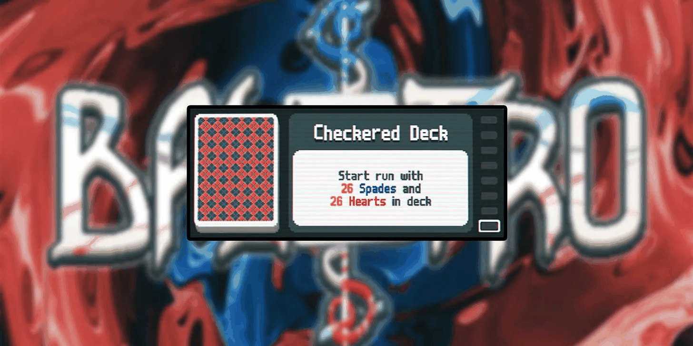

## Problem

A game is played with 10 cards laid out in a row. Each card has a black side and a red side, and initially the face-up sides of the cards alternate black, red, black, red, ... with the leftmost card being face-up black. A move consists of taking a consecutive sequence of cards (possibly size 1) such that the leftmost card of this sequence is black and the rest of the cards are red, and flipping all of those cards over. The game ends when a move can no longer be made. What is the maximum number of moves that can be made until the game ends?

Show solution

## Solution

I love this problem for obvious reasons and it's quite beautiful.

The trick is to view the configuration of cards as a binary number, where black represents 1, and red represents 0.

Our initial configuration/number is

$$\overline{1010101010}_2 = 2^9 + 2^7 + 2^5 + 2^3 + 2^1 = 512 + 128 + 32 + 8 + 1 = 682$$

The motivation to do this trick is because when we perform a move (flipping a subsequence that starts with a black card), we are **always decreasing** the value of our binary number.

To get to a state where we can not do any more moves, we must end up with all red cards, or 0000000000. This gives us an upper bound of at most 682 moves, for which we now need to find a construction.

Consider the following algorithm: *identify the rightmost black card, and flip that card as well as all of the cards to the right of it*. Performing this move will always decrease our binary number by exactly one. Thus, you can indeed perform the theoretical maximum of **682 moves**.

