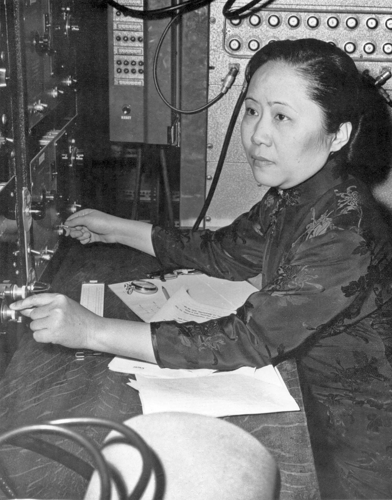
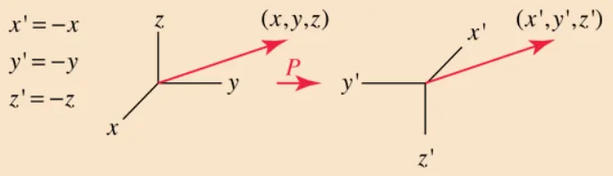

*(\* I will be referring to her as Chien-Shiung Wu as that is the primary way she is referenced in academic literature as well as how she referenced herself, as C. S. Wu, but most other Chinese people will be named surname first)*

The fact that she is not a household name and was not taught in my K-12 history or science is mind-blowing to me.

Chien-Shiung Wu was born on May 31, 1912 as the middle child and only daughter of her father and mother, Wu Zhong-Yi and Fan Fu-Hua respectively. Wu's father was an engineer and her mom was a teacher who strongly advocated for education for women. Wu's father founded Ming De School for Wu to attend, with himself as the principal, as it was uncommon for girls to be educated in general. Her dad had progressive ideals through reading Western materials about equality and democracy while in school, many of which were banned in China. His wish was to incorporate these values in his own school.

Wu Zhong-Yi believed that educating girls would not only benefit the girls themselves but would also help dispel prejudice against women. His first students were relatives and friends, but eventually the school body grew to 50 students. Students learned vocational and practical courses such as gardening, knitting, sewing, as well as academic subjects such as language, science, and math. Chien-Shiung Wu was known as a quiet and thoughtful child, and by the age of 11, she had completed the entire school curriculum, so she applied for a boarding school, where she could apply for either the normal high school track or the more rigorous teacher training track. The normal high school track would demand tuition whereas the teacher training track did not require it. Despite her family having enough money for tuition, she took the entrance exam for the latter, and she placed 9th out of 10,000 applicants.

She realized that the track she chose was actually lacking in the depth of instruction for math, chemistry, and physics. Chien-Shiung borrowed textbooks from her classmates as well as asked her father to buy her math textbooks so that she could self-study during the year as well as over the summer. In 1929, she graduated at the top of her class, by essentially studying two different tracks simultaneously. Normally, for the teaching track, students upon graduation were expected to teach for a year, but she was such an outstandingly brilliant student that she was instead recommended as a student at the National Central University in Nanjing.

Chien-Shiung initially started off as a math major, but shortly after transferred to becoming a physics major, partially inspired by a biography of Marie Curie and partly due to recent groundbreaking discoveries such as Rutherford's atomic nucleus, Bohr's atomic model, and Einstein's theory of general relativity. During these years, she became involved in student politics, as tensions between China and Japan were escalating. Her peers encouraged her to act as a leader during student demonstrations. Japan's invasion of Manchuria occurred in 1931, while Wu was still a university student. This led to students demanding that China declare war on Japan. Her colleagues intentionally asked Wu to be a vocal student leader since she was such a stellar student that she would be less likely to be penalized for being politically outspoken. Due to her father's political involvement, she also realized that her family would be more supportive of her actions, and so she carefully planned these demonstrations. One such demonstration was a peaceful sit-in outside the presidential palace, where they were greeted by Chiang Kai-shek.

Wu very intentionally chose locations that were less likely to be encountered by the police or press. She also selected days just before holidays with the reasoning that it would be easier for people to get home before events became too heated or drew too much attention from the university or law enforcement. Her fellow students lauded her pragmatic approach and she was widely respected among her peers for her class in handling sociopolitical discourse as well as maintaining her excellence in her studies.

After her graduation in 1934, she briefly worked as a teaching assistant at Zhejiang University and then moved to Taiwan's Academia Sinica as a researcher. Her mentor was another woman, Gu Jing-Wei, who had attended the University of Michigan for her PhD. She encouraged Wu to also pursue her PhD in the United States, so in 1936, Wu set abroad for the United States with a friend via boat. Unfortunately, Wu and her friend only had enough money to buy second-class cabins which were all sold out, they negotiated a deal for them to buy a first-class cabin at the cost of a second-class fare.

Initially, Chien-Shiung Wu's plan was to attend the University of Michigan to follow the footsteps of her advisor. She had been accepted with financial support from both the university and her uncle, Wu Zhou-Zhi. When she arrived in San Francisco, she decided to spend a week with a former classmate living in San Francisco. Her classmate's husband worked at the University of Berkeley and encouraged her to visit the campus. Wu agreed, and took a tour of the Berkeley campus, which included the Chinese Students Association. One of the students heard about her ambitions to study physics and thereby introduced her to a Berkeley physics student from China, Luke Yuan (one of Yuan Shikai's grandsons, who completely disagreed with his grandfather's ideologies). Yuan graciously gave Wu a tour of the physics facilities which had cutting-edge resources that thoroughly impressed her. Additionally, the faculty was extremely experienced and knowledgeable, including highly esteemed names such as J. Robert Oppenheimer and Ernest Lawrence.

Lawrence went out of his way to persuade Wu to attend Berkeley, even though its academic calendar was ahead of Michigan's and classes had already begun. While the faculty and opportunities were part of the appeal, Wu learned about the progressive environment of Berkeley compared to Michigan. The University of Michigan still had clear policies of sexism towards women, notably disallowing them to use the main entrance to the campus. Berkeley readily agreed to give her a much better financial assistance package than the one Michigan had agreed to, so the decision was a no-brainer for Wu.

Wu immersed herself in the Berkeley culture, and her peers described her as kind and extremely bright when it came to her studies. As much as she attempted to embrace American culture, she still missed her roots and yearned for any comforting reminder of home. Fortunately, a local restaurant generously offered to provide the Chinese cuisine she had longed for. Chien-Shiung Wu and three of her friends would frequent this restaurant, which would let the four students eat for 25 cents a meal each, whereby the students would not order any food on their own, but be served extras from the day, along with as much rice as they wished. Wu also primarily wore **qipaos** (*traditional figure-fitting high-necked Chinese dress originally worn by higher-society Shanghai women*) which she made herself as she was unable to procure them from China.

Chien-Shiung Wu had been laser-focused on her studies for the most part, and often brushed aside romantic interests, until her later years at Berkeley. She eventually became serious about Luke Yuan, and they were exclusively dating in 1940. Yuan had transferred to another university then as he had been receiving less financial aid from his peers, which he attributed to discrimination.

During her PhD, Wu developed a reputation for uncanny accuracy and precision throughout her experimental physics career, going to great lengths to get the absolute exact materials she needed. If she needed better or different equipment for consistency, she refused to take shortcuts, and would make the necessary adjustments on her own. Her efforts gave her the ability to design masterful experiments which produced results unmarred by any lack of accuracy and without muddied data. Her advisor Ernest Lawrence and physicist Emilio Segrè, whom she often worked with in close correspondence, continuously sang her praises, and would give her more hands-on access and independent agency to design her own experiments specific to the niches they worked in. Wu's PhD research focused on the products of uranium fission. She successfully identified two xenon isotopes which were part of the process in uranium decay.

Wu had planned to return to China after her PhD work, but unfortunately, the Second Sino-Japanese War, which had started in 1937, made her return home impossible. By the time Wu had completed her PhD, most of Europe was at war with Germany, so she decided to stay in Berkeley. She finished her PhD in 1940, and her published thesis was regarded as many years ahead of other PhD work. Despite receiving glowing recommendations from her academic superiors, she was unable to land any faculty jobs even within Berkeley, so she stayed on the research as a post-doc fellow. But keep in mind that this was no small feat either. *At the time, there were not any women in physics faculty in the top 20 research universities in the U.S.* In general, universities were pretty reluctant to hire women, as well as racial, ethnic, and/or religious minorities. Wu's Chinese nationality likely played a significant role. The United States had banned immigration from China completely in the Chinese-Exclusion Act of 1882, but even around 1940, there were still strict quotas on immigration from China, with Chinese immigrants also banned from becoming U.S. citizens.

Eventually, Wu was hired as an assistant professor at a women's college in Massachusetts, Smith College, and Luke Yuan was hired at the Radio Corporation of America after he had completed his own PhD at Caltech. Wu and Yuan married on March 30, 1942 and moved to the East Coast in separate cities. Wu expressed extreme frustration with her work in Smith College for a multitude of reasons: missing her friends, the difference in weather compared to California, and missed doing research (which she vastly preferred over teaching). Her former Berkeley mentor, Ernest Lawrence, wrote more letters of recommendation per her repeated requests, and finally she was offered multiple jobs, including one at Princeton University, which was a no-brainer for her as she was able to join her husband and live with him. She was the first female physics instructor at Princeton.

Wu made such great progress in her research that she was invited to collaborate in the Manhattan Project at Columbia University's physics lab. Her work was primarily related to the development of radiation detectors, as well as the separation of Uranium-235 and Uranium-238 from uranium ore in order to enrich uranium into a usable fuel. This work and her earlier research on nuclear fission folded into the development of the atomic bomb. Wu did not speak out much about how she felt about her contributions to the atomic bomb. On the one hand having grown up in China, she was most certainly aware of Japan's wartime atrocities toward China and how it could help bring the world war to a swift end, but on the other hand she thought that the power of the atomic bomb was far too destructive. Eventually Chien-Shiung Wu and her fellow physicists who worked on the Manhattan Project withdrew. She believed the atomic bomb would be far too destructive and hoped there would never be a need for that scale of weaponry.

> ***I have confidence in humankind. I believe we will one day live together peacefully.***

During these same years, Wu helped troubleshoot and restart a nuclear reactor that was involved with the Manhattan Project. Although the reactor had been shut down at one point, it was taking far longer than expected to restart. Wu was able to pinpoint that Xenon-135, one of the fission products of the reactor's uranium, was poisoning the process, which connected back to her PhD work.

In March 1944, Wu started working as a senior scientist at Columbia University, which made her the first woman to hold a tenured faculty position in Columbia's physics department. This also marked her return to academic research after teaching at Smith and Princeton. She started studying beta decay and was able to independently experimentally prove [Enrico Fermi's theory of beta decay](http://hyperphysics.phy-astr.gsu.edu/hbase/quantum/fermi2.html) in 1949, quashing any claims that his theory had variance. In addition to her research, she also taught and was described to have extremely high expectations of her students. Close friends attested that along with her academic work, she maintained a sweet and loving relationship with her husband, unlike stereotypes at the time. As Wu was extremely dedicated to her career, she would often be in the lab at odd hours, so her husband would do a majority of the cooking and housework. It was not as if Wu was unable to cook, as she was more than capable of cooking for herself when she had the time or if they were having company.

On February 15, 1947, Wu and her husband had their only son, Vincent, through a very difficult and long labor via C-Section. While she was at the hospital, Albert Einstein actually visited her as his sister was being treated in the same hospital. Wu and Yuan were hoping to still return to China someday, but after the Communist Party came to power in 1949, they decided to stay in the U.S. They did not want their son to be raised in a communist country. Soon after, the Korean War and increasing anti-communist sentiment in the U.S. made it practically impossible for the couple to visit China; for some periods of time, they were completely unable to even send or receive mail from home.

By the 1950s, both physicists had to travel for work, but the process to obtain their necessary visas was quite a hassle due to the governmental changes and upheaval that China had endured. Their passports were no longer recognized as valid and they went through a long immigration process. By this point, Chinese people could actually become U.S. citizens but the process was incredibly difficult and cumbersome, as well as having multiple quotas. Wu became naturalized as a U.S. citizen in 1954.

Two Chinese scientists, Lee Tsung-Dao and Yang Chen Ning, who were working in the U.S. approached Chien-Shiung Wu in 1956. The two physicists were curious if **parity** (*spatial inversion transformation, flipping the algebraic sign of the coordinate system.* $(x, y, z) \to (-x, -y, -z)$ *is an example converting a right-hand rule system to a left-hand rule system*) was conserved in beta decay, which they hypothesized that it wasn't.

They wished for Wu to design an experiment to prove whether or not parity was conserved. Now for some context, beta decay is a type of radioactive decay which is when one of the subatomic particles in an atomic nucleus breaks down. A neutron decays into a proton, an electron, and an antineutrino, or a proton decays into a neutron, a positron, and a neutrino. The electrons and positrons from the process are known as beta particles. The reason this decay is possible is due to the weak nuclear force, one of the four fundamental forces in physics. One way I think of this graphic representation of a subatomic system is that the universe does not care whether one of these systems faces to the left or the right. Everything occurring in the system should still work the same way and there should be no detectable difference in the graphs representing the left-hand and the right-hand versions. We want achirality, where the graph of each is the mirror image of the other. Since there were laws about the conservation of mass and energy, it was a popular hypothetical question to wonder about the validity of the "conservation of parity", which at the time was a fundamentally accepted principle. Lee and Yang had convinced themselves from their own research that parity was conserved for strong interactions and electromagnetic interactions. If by any chance, Wu could disprove that parity was conserved in beta decay, this would be earth-shattering as it would instantly reject the analogous claim for weak interactions and several physicists had bet that no one would ever prove that parity was not conserved.

> ***Pauli said he would "bet anything" that parity would be conserved. Feynman, who was among the first to propose the parity nonconservation idea, nonetheless ended up betting a friend \$50 that it would never pan out. Martin Block promised to eat his hat if conservation didn't hold for the weak interaction.***

Wu was so eager to study this question that she cancelled a vacation with her husband to work on this project! At the time, the National Bureau of Standards (NBS) was doing some work related to the polarization of nuclear systems. Wu joined forces with the NBS to study beta decay using radioactive cobalt-60. In this experiment, they cooled the cobalt-60 down to an extremely cold temperature — epsilon ("just barely") above absolute zero, so that atoms were moving as slowly as possible. They then polarized the atoms so that all the nuclei were spinning in the same direction. Then they observed which way the beta particles went when they were emitted from the nuclei of the cobalt atoms. If the beta particles had symmetrical distribution, then regardless of the polarity, parity would have been conserved. But they didn't. Most of the beta particles actually went in the opposite direction of the nuclear spin! That means if you graphed these results, you would definitely see a clear difference between the experiment and its mirror image; *parity was NOT conserved*!

Wu's groundbreaking experiment was the first to prove that parity was not conserved during beta decay, and her results were resoundingly definitive. Of course, these results utterly stunned the physics community and many were in such denial, that they believed surely Wu had just conducted her experiment incorrectly. But as more experiments were run which yielded the same result over and over again, Wu published her paper *Experimental Test of Parity Conservation of Beta Decay* in 1957. This eponymous experiment would be her magnum opus.

Her experiment was regarded as the decade's biggest achievement in the world of physics. Lee and Yang were consequently awarded the 1957 Nobel Prize in Physics. When I first learned about this, I believed that this was yet another instance of men undeservedly getting credit for women's work, but that was not exactly the case here. Wu created the first experiment that definitively proved Lee's and Yang's work. That experiment and the theory were two parts of the same discovery. In fairness to Lee and Yang, they did the theoretical work in discovering parity violation, which in my opinion is most certainly deserving of the Nobel Prize. That being said, theory and math will only get you so far, and we can NOT understate the value of high-quality experimental work that effectively proves that a theory is a good natural model. Although I work on the theory side and believe there have been countless theorists who deserved the Nobel Prize but were not credited, I would be remiss to not give at least equal credit, not more, to the experimental feat compared to the theoretical efforts. To me, it is criminal that Wu did not share the Nobel Prize with Lee and Yang. In fact, traditionally, it's the experimentalists who are usually winners of the Nobel Prize!

Wu would be nominated seven more times, until the Nobel nominees were hidden to avoid controversy. Lee and Yang continued to try to nominate her for the Nobel Prize and thanked her repeatedly so the public would understand her major role in the new discovery. She would finally receive public recognition when she won the 1978 Wolf Prize, which aimed to spotlight people who were either going to win a Nobel Prize soon or deserved to win a Nobel Prize but didn't. Famous physicists such as Oppenheimer, Pauli, and Steinberger all expressed their displeasure with Wu not receiving the Nobel Prize for her experimental work.

Wu would continue her teaching and experimental work afterwards, including becoming a full-time professor at Columbia. She subsequently did research in sickle cell anemia by applying her nuclear physics research at the atomic level by analyzing the molecular changes that red blood cells would undergo. In 1962, Wu and Yuan visited Taiwan to give lectures, attend receptions, and accept awards. Unfortunately, most of Wu's family had passed by then, meaning that the last time she saw them was when she left for the U.S. for graduate school. In 1966, she co-authored the book *Beta Decay* with Steven Moszkowski, which was and still is the standard text on beta decay.

As U.S.-China relations had improved, Wu visited China in 1973. She learned that her parents' tombs were destroyed and violated during the Cultural Revolution, and she received an official apology from Zhou Enlai. She would continue to visit China several times. In 1975, she served as the first female president of the American Physical Society.

It was around this time that Wu decided to go back to an activity which gave her further purpose: being involved in advocacy for sociopolitical issues. She fought for educational opportunities for women and encouraged women to pursue physics and other scientific fields. Wu continued to observe that consistently across the world, women had fewer educational opportunities than men did.

> ***The world would be a happier and safer place to live in if we had more women in science.***

She applied the same focus to her own work as well, advocating for equal pay for women and their male colleagues, even though she never complained about her own pay being less than her male counterparts. Wu would not hesitate to correct anyone who addressed her by her husband's surname. Her efforts for social justice also included her home country of China, as she made multiple trips there. On one of her trips in 1988, she established a memorial foundation to fund scholarships in the library. Wu campaigned for human rights for Chinese citizens and improved educational opportunities for girls in China. She condemned the China crackdown that ensued after the tragic Tiananmen Square massacre of 1989.

On February 16, 1997, Chien-Shiung Wu suffered a fatal stroke at the age of 84. As per her request, her cremated remains were scattered over the Ming De school that her father had founded.

> ***People avoid doing experiments in beta decay, simply because they know that Wu Chien-Shiung will do a better job than anybody.***

> ***I wonder whether the tiny atoms and nuclei, or the mathematical symbols, or DNA molecules have any preference for either masculine or feminine treatment.***

## Sources

Chiang, Tsai-Chien (2014). Madame Chien-Shiung Wu: The First Lady of Physics Research. World Scientific.

DeBakcsy, Dale (2023). "Parity Can Be Deceiving: The Experimental Physics of Chien-Shiung Wu"

Han, Xiaomeng (2020). "Chien-Shiung Wu — A Heroic Experimental Physicist". Science in the News.

Indumathi, D. (2020). "Chien-Shiung Wu: The First Lady of Physics".

[Fermi Theory of Beta Decay](http://hyperphysics.phy-astr.gsu.edu/hbase/quantum/fermi2.html)

[Parity](http://hyperphysics.phy-astr.gsu.edu/hbase/quantum/parity.html)

[Women in Radiation History: Chien-Shiung Wu](https://www.epa.gov/radtown/women-radiation-history-chien-shiung-wu)
