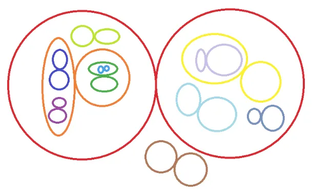
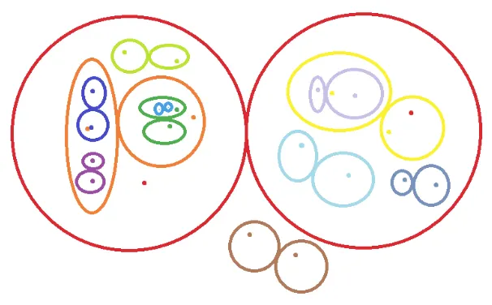
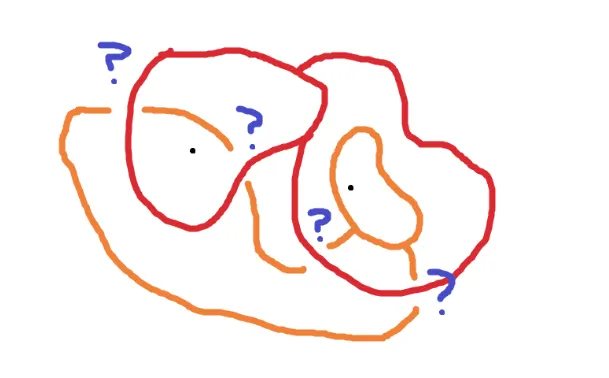
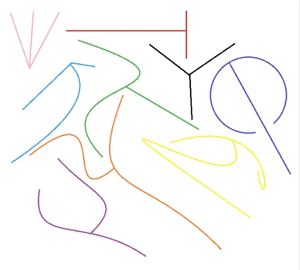
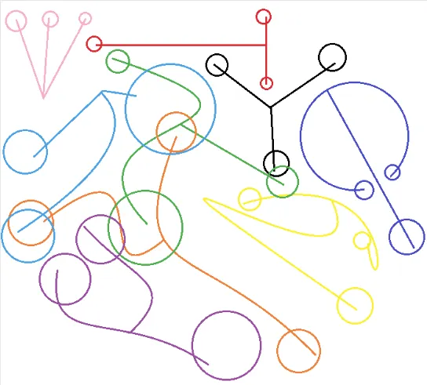
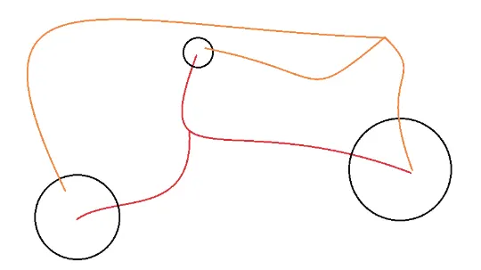
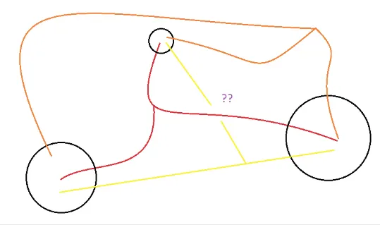
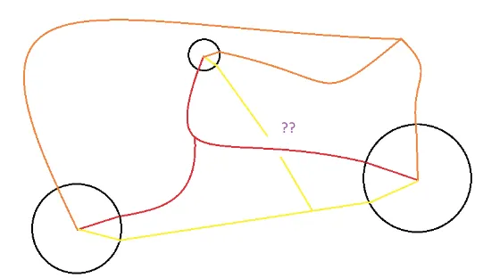
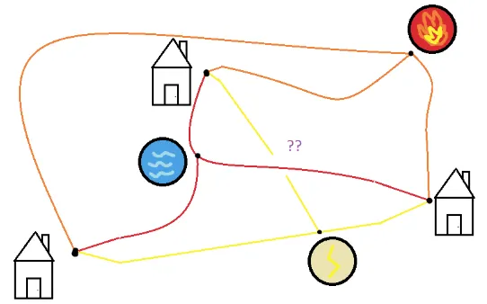

The motivation behind this blog post is due to a [beautiful answer I recently read on Math StackExchange](https://math.stackexchange.com/questions/263606/prove-that-the-number-of-jump-discontinuities-is-countable-for-any-function)! This then reminded me of another elegant problem in Peter Winkler's book of mathematical puzzles.

*Reading Prerequisites:*

- *Injective/Surjective/Bijective functions*
- *Know the difference between a countable infinite set and an uncountably infinite set*

## Background

Rational numbers are fractions between integers and natural numbers. Since both integers and naturals are countable, we know that the set of rational numbers is, perhaps surprisingly, countable.

(If you need a quick refresher, recall that a set is *countable* if, roughly speaking, you can "count them up" one-by-one, possibly forever, such that you're guaranteed to reach any particular element of the set eventually. More formally, a set $S$ is countable if there exists an injection

$$f : S \to \N$$

i.e. "$S$ is a set that is no bigger than the size of the natural numbers."

Why is this surprising? It's because the rationals are **dense**. Basically, a dense set is a set that is "close to everything". In the case of the rationals $\Q$, we say that this set is "dense in $\R$" because every real number can be approximated as closely as you want with a rational number. Some interesting consequences of this are:

- If you look at any non-empty set of $\R$, it certainly contains a rational.
- There is always a rational number between any two real numbers.
- If we look at the set $\Q^2$ of *rational points*, which is the set of all points $(x, y)$ both of whose coordinates are rational, then this set is also "dense in $\R^2$", which roughly means that if you draw any circle, it will always contain a rational point.

So, rational numbers are really, really everywhere...and yet, if you decide to color a number line red and blue, with rational numbers red and irrational numbers blue, you'd see that the number line is painted *overwhelmingly* blue, because there are uncountably many irrational numbers but "only" countably many rational numbers. That's a little unfortunate...

...or is it? In this post, we will see that the rational numbers being both **countable and dense at the same time is extremely powerful**.

Specifically, we will use this fact (called the "separability of $\R^N$") to prove that certain things are well-behaved or that certain sets are small (i.e. at most countable).

## Diving In

**Problem 1:** If a function $f : \R \to \R$ is *increasing* (not necessarily strictly; that is, if $x < y$ then $f(x) \le f(y)$), then the number of discontinuities of $f$ is at most countable.

::: proof
- Each discontinuity is a *jump discontinuity* (I'm going to take this for granted because I want to make this post accessible, but in university real analysis this is a fact that would demand proof).
- At every such discontinuity, $f$ jumps from $a$ to $b$ where $a < b$.
- But **there is a rational between $a$ and $b$**.
- Since the rationals are countable, the number of jumps is at most countable. Thus proved.

There's actually quite a bit going on in this proof, so let's dig into the logic a bit deeper.

1. First, I found a property that the things I'm trying to count have. In this case, this property is the "jump".
2. Then, I found a way to relate this property to the rationals. In this case, I use the fact that there is a rational number between any two distinct real numbers.
3. Finally, I use this relation to assign every object in the set to a **different** rational number. (*Formally, I'm using the Axiom of Choice to construct an injective function from the set of discontinuities to the set of rationals. This proves that the set of discontinuities is a countable set!*) It is essential that each jump gets assigned to a different rational number! Remember, the punchline we want to show is that there can't be *more* jumps than rational numbers. I'm chilling here because no two jumps can "cross" since $f$ is increasing, so indeed each jump will be assigned to a different rational.
:::

**Problem 2:** A set $S \subseteq \R$ is called "isolated" if for every number $x$ in $S$, we can find a small positive number $\eps_x$ such that $x$ is the only element of $S$ inside the interval $(x - \eps_x, x + \eps_x)$. Prove that every isolated set is at most countable.

::: proof
We want to pick a rational number inside each of those intervals, but they might overlap. The trick for preventing this is to shrink every interval's size in half! Is it possible for two intervals

$$(x - \eps_x/2, x + \eps_x/2), (y - \eps_y/2, y + \eps_y/2)$$

to overlap, where $x$ and $y$ are two different elements of $S$?

It turns out that indeed, they cannot overlap! To formally prove this, assume without loss of generality that $\eps_x \le \eps_y$. If the intervals overlap, there is a real number $z$ such that $|x - z| < \eps_x/2$ and $|y - z| < \eps_y/2$. By the triangle inequality, we may write

$$|x - y| \le |x - z| + |y - z| < \eps_x/2 + \eps_y/2 \le \eps_y/2 + \eps_y/2 = \eps_y$$

This means that $x$ is an element of $S$ that is within $\eps_y$ of $y$, hence contradiction!

Now we can freely pick a rational number inside every interval $(x - \eps_x/2, x + \eps_x/2)$ over all $x \in S$. No two intervals overlap, so we pick a different rational every time. So, the intervals are at most countable and thus, $S$ is at most countable.
:::

## Going Deeper

Remember how we mentioned in the introduction that $\Q^2$ is a dense subset of $\R^2$? This is amazing — $\Q^2$ is countable...and so is $\Q^3$...and $\Q^4$...you get the idea!

**Problem 3:** Consider a function $f : \R \to \R$. We say that $f$ has a *strict local minimum at some point $x \in \R$*, if for some small number $\eps > 0$, we have that $f(x) < f(y)$ for every $y$ that is within $\eps$ of $x$, i.e. for every $y$ such that $0 < |x - y| < \eps$.

- For example: $\cos(x)$ has a strict minimum at $x = \pi$. We have $\cos(\pi) = -1$, and if you look at a graph, you'll certainly notice that for every $y$ within $0.1$ of $\pi$, we have that $f(y) > f(\pi)$.
- The function $f(x) = 0$ does NOT have a strict local minimum at $x = 0$.

Prove that the number of strict local minima of $f$ is at most countable.

::: proof
This is a harder problem now, but we just stick to the protocol: start by finding some nice property of the thing we're counting, and then try and associate it with rationals...

So let's take some $x$ where $f$ has a strict local minimum. Then we can find $\eps > 0$ such that $f(y) > f(x)$ for all $y$ satisfying $0 < |x - y| < \eps$. Hmmm...could we just pick a rational in the interval $(x - \eps, x + \eps)$?

Unfortunately, no! This is because we're not guaranteed that the intervals won't overlap, so we might pick the same rational twice. For example, it could be the case that the function goes down and up again within the interval $(x - \eps, x + \eps)$. Darn!

We need a little more juice for this problem. ***What if we picked...two rationals instead?***

This actually works! Let's pick a rational $r$ inside $(x - \eps, x)$ and another rational $s$ inside $(x, x + \eps)$. So, for every $x$, we pick two rationals $r$ and $s$ such that:

- $f(y) > f(x)$ for all $y$ between $r$ and $x$
- $f(y) > f(x)$ for all $y$ between $x$ and $s$

There is probably one more question that might feel unanswered, so let's address that. Is it possible that we end up picking the SAME two rationals for two different $x$'s?

Let's take two different points $x$ and $x'$ where $f$ has a strict local minimum, with $x < x'$ and let us assume for sake of contradiction that we choose the same rational numbers $r$ and $s$ for them. Then we must have $r < x < x' < s$. What follows is:

- Since we chose $r$ for the point $x'$, we know that $f(y) > f(x')$ for all $y$ between $r$ and $x'$. Since $r < x < x'$, we can plug in $y = x$ to get $f(x) > f(x')$
- Since we chose $s$ for the point $x$, we know that $f(y) > f(x)$ for all $y$ between $x$ and $s$. Since $x < x' < s$, we can plug in $y = x'$ to get $f(x') > f(x)$

$f(x) > f(x')$ and $f(x') > f(x)$. Absurd!

Thus, we have successfully associated every strict local minimum with a different pair of rationals $(r, s) \in \Q^2$. Since $\Q^2$ is at most countable, so is the number of strict local minima!
:::

Here, let's work on an underrated skill (and one that I need to severely work on as well): **looking back on what we just did and reflecting on the process**.

Moral of the story: Pick more rationals to gain more info! We can pick as many rationals as we want (as long as its finite...) in order to uniquely characterize the thing we're looking at more and more.

**Problem 4:** Is it possible to draw uncountably many non-intersecting figure-8-shapes in the plane?

*(They don't have to look so round; they just need to be two loops attached to each other.)*

Answer: No.

::: proof
Last time, we injected into $\Q^2$. This time, we're going to inject into $\Q^4$! For each figure-8, pick two rational points: one rational point in one loop, and another rational point in the other. (Since each rational point consists of two rationals, we are indeed choosing a total of $2 * 2 = 4$ rational numbers!)

Is it possible to choose the same two rational points for two different figure-8's? The answer is no! Try it for yourself: It's pretty hard for two different 8's to share the same two points without intersecting each other...

...rigorously proving this is a job for a topologist though. And I am certainly no topologist.
:::

With that being said, if you have a nice proof to finish the above, please contact me as I would like to see it and learn :)

## The Almost Grand Finale (The Problem)

Do there exist uncountably many pairwise-disjoint subsets of a plane, each homeomorphic to the letter Y?

Now we have the tools to solve our original problem! But I won't quite reveal the solution just yet, since I think it's so good that I think the curious reader deserves a few hints before I spoil the fun.

### Hint 1

We're going to end up using that $\Q^9$ is countable.

...but, we aren't exactly going to inject into $\Q^9$. It's a little trickier than that!

### Hint 2

Before, we've been using that if $Y$ is countable and $f : X \to Y$ is a function that is injective, i.e. there do not exist distinct $a, b$ with $f(a) = f(b)$, then $X$ is countable.

For this problem, let's loosen things a little bit: if $Y$ is countable and $f : X \to Y$ is a function for which there do not exist THREE distinct $a, b, c$ with $f(a) = f(b) = f(c)$, then $X$ is countable.

### Hint 3

If you've been drawing diagrams and are still stuck, try to analyze how close the upper two arms of all the individual Y's can be. Are there any restrictions? Perhaps we can obtain a famous problem's result which will solve our problem...

## The Grand Finale (Solution)

Show solution

We define the *rational ball* to be a ball with rational radius and center with rational coordinates. We claim there can only exist countably many rational balls.

Looking at each individual Y that we have drawn, for each of its three branches, draw a rational ball containing the free endpoint such that each of the balls does not intersect either of the other two branches as such:

One reasonable idea of a mapping is to take $f$ sending each individual Y to the 3-tuple of rational balls around its endpoints. Is the number of such tuples countable? Yes! Because it is a subset of $\Q^9$!

Now it is indeed not necessarily true that $f$ is an injection even though that's sort of what the entire post seems to motivate, but there actually could exist distinct Y's $a, b$ for which $f(a) = f(b)$ as shown below:

But here's the thing: *we claim that we cannot do better*. That is, there do not exist individual Y's $a, b, c$ such that $f(a) = f(b) = f(c)$. That is, we cannot have three different individual Y's which have identical endpoint circles.

To see this, let us suppose that we have found three such individual Y's that offer such a configuration:

For the parts of the Y's which are inside the three balls, connect them to the center as such:

Perhaps you're smelling the incredible conclusion that I'm about to cook up here. The condition that each ball does not intersect any of the other two branches actually ensures that after this operation, the three sets are still homeomorphic to the letter Y.

And now for the **magical punchline**: let's plant a house on the center of each ball and a utility at the three-way crossing point of each individual Y.

By our assumption that none of the individual Y's cross each other (i.e. are disjoint), we have somehow constructed a solution to the three utilities problem, absurd.

## Further Problems for You

1. Is it possible to place uncountably many carpets (of positive length and width) in an infinite plane, without any of them overlapping? Why or why not?
2. We can define strict local minimums for 3D functions too! When $f : \R^2 \to \R$ is a function, we say that $f$ has a strict local minimum at $(x, y)$ if we can find a small positive $\eps$ such that for all points $(w, z)$ [distinct from $(x, y)$ within a distance $\eps$ of $(x, y)$], we have $f(w, z) > f(x, y)$.

    Prove that again, the number of strict local minimums of $f$ is at most countable.
3. (**Hard**) Let $f : \R \to \R$ be a function. Call a point $x \in \R$ *bad* if the left derivative $f'_-(x)$ and right derivative $f'_+(x)$ both exist, but they are not equal to each other. Prove that the number of bad points is at most countable.
