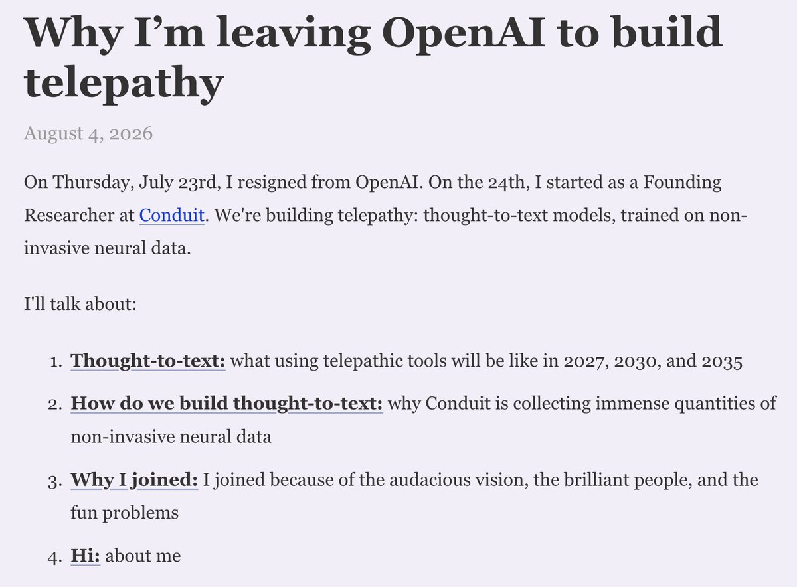

I doubt many would contest the following statement: **being primed in the right environment and having the right role models is paramount (but not necessarily) to having good values and morals**.

As an impressionable child, I would peruse the [Art of Problem Solving](https://artofproblemsolving.com/) community forums, and one such user at the time went by **wu2481632**. And in my opinion, this person was and has been consistently one of the more upstanding members of the competitive math community as he always sought to uplift others and extend empathy toward underrepresented groups. I never got to know him personally, but my friend and I would casually read his blog from time to time, as it is one of my great joys to read people's writing, especially *good* writing.

About a month ago, Naomi Bashkansky went viral for her blog post (see below) about leaving OpenAI to pursue as one of the opening founders for Conduit, which claims to be building "telepathy".

> **Naomi Bashkansky** (@NaomiBashkansky)
>
> Two weeks ago, I resigned from OpenAI to join Conduit as a founding researcher, where we're training models to non-invasively read the human mind.
>
> I've written some thoughts about what telepathy could look like by 2035 and how to get there:
>
> 
>
> 12:42 PM · Aug 5, 2026 · 3.02M Views
>
> 1.21K Replies · 944 Reposts · 8.92K Likes

I felt an inexplicable level of discomfort and disgust which I tried for two weeks to put into words (fascism-enabling, power dynamics, authoritarian), and judging by the online discourse, I was certainly far from alone. In particular, Bashkansky's tone and rhetoric seemed highly problematic and so I had been contemplating how to write an effective blog post essay to argue my central thesis — those developing new and innovative technology have the burden of carrying moral ethics and being readily responsible and Conduit appears to be utterly failing in that regard so far, and so my urgent hope is for them to cease any and all work.

And to my great pleasure, Andrew Wu expressed very similar sentiments on his blog this past week which he articulated so beautifully. I will just link his two posts here which I implore you to read.

- [Against telepathy—or, Conduit should engage with authoritarianism concerns](https://andrewwu.substack.com/p/against-telepathyor-conduit-should)
- [I really dislike Naomi Bashkansky's blog post "Why I'm leaving OpenAI to build telepathy." It made me feel very uncomfortable.](https://andrewwu.substack.com/p/i-really-dislike-naomi-bashkanskys)
