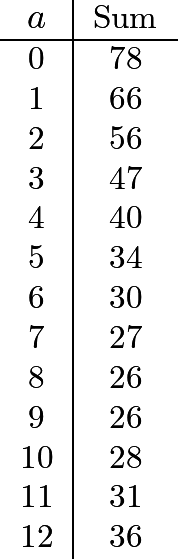
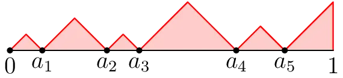
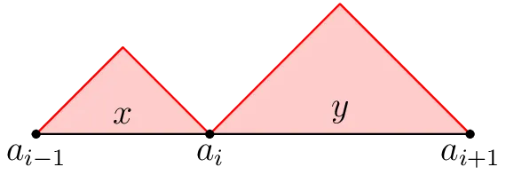
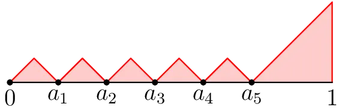
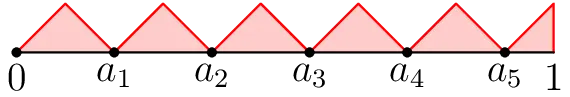

With the new year under way, I challenge you to solve a real-life math problem! I'd like to think that this is one of my more accessible math posts too :)

## The Scenario:

I went to an apartment in Kolkata the other day, where two of my relatives separately live on different floors. The apartment building has 13 floors: LL (Lower Level), UL (Upper Level), 1, 2, ..., 11. Since it's a tall building, there are two elevators. After going up to the first relative's room, I decided to go to the second relative's room which was on another floor of the building.

I called an elevator and stepped in but forgot to press a button to tell it to go to another floor. The elevator automatically headed towards the Lower Level, which was pretty spooky. Weird, but interesting. This elevator seems to have a default floor: LL, that it goes to whenever it thinks nobody is using the elevator.

Despite my imaginable shock, I reason that it makes sense for one elevator to default to the bottom-most floor. What about the other elevator? After stepping outside and messing around a bit, it was clear that the other elevator also had a default floor.

**What floor does the *other* elevator default to when nobody is using the elevators?**

*(It may seem like you have basically no information to work with, and that's <del>somewhat</del> true! In real life, we often have to make some reasonable assumptions before math can be done. Good luck!)*

If needed, some hints will be provided below.

*\*If you would rather skip the thinking, I have listed the complete problem statement below the three hints.*

## Hint 1

*Why does it make sense that the first elevator defaulted to the bottom-most floor?*

## Hint 2

*Someone clearly made a decision for where the default floors for the elevators should be. What do you think they were optimizing for?*

## Hint 3

*Assume that residents of the apartment complex keep to themselves. They pretty much only travel between the floor they live on and the lower level.*

## The Complete Problem Statement

Pick a resident at random: They are equally likely to live on any of the floors, and they are either leaving their apartment (going from their floor to LL) or going home (going from LL to their floor) with equal probability. Suppose they're the only one using the elevators at the moment. What floors should the elevators start at in order to minimize the expected time it would take for this resident to get to where they want to be? You can assume that the only non-negligible source of time consumption is from waiting for the elevator to go up and/or down, that the elevator travels at constant speed, and that the floors are equally spaced apart.

You are given for free that one of the default floors should be LL. The other elevator's default floor is somewhere else.

## The Math!

Show solution

Let's be boring and label the floors $0, 1, \ldots, 12$. The first elevator has default floor $0$ and now we are solving for the default floor of the second elevator, which we can call $a$, such that the travel time is optimized.

Choose a floor **X** from these 13 floors uniformly at random. Take a resident of floor **X** that wants to use the elevators at some random point in the day. There are two cases:

- There is a 50% chance that this resident is coming home, in which case they start at floor $0$ and use the first elevator to go up **X** floors.
- There is a 50% chance that this resident is leaving home, in which case they start at floor **X** and call the nearest elevator, which has to travel $\min\{|a - X|, |X - 0|\}$ floors to reach floor **X**, and then they use the elevator to go down **X** floors.

Thus, the expected travel time given a random resident at a random time of day (in terms of how many floors the elevator they use needs to travel) is

$$\E\left[\frac{1}{2} \cdot X + \frac{1}{2} \cdot \Big(\min(|a - X|, |X - 0|) + X\Big)\right]$$

The goal is to find the value of $a$ which will minimize this expression. Note that we can simplify our expression slightly.

$$\E\left[X + \frac{1}{2} \cdot \min(|a - X|, |X - 0|)\right]$$

This does make sense because for a resident of floor **X**, the elevator is guaranteed to travel at least **X** floors. So, all we need to do is minimize the expression:

$$\E \min(|a - X|, X)$$

Cool. This is something we know how to do by definition of expectation. We are looking to minimize the quantity

$$\sum_{k=0}^{12} \min(|a - k|, k)$$

At this point there's not much we can do besides listing out the values of this sum over all $a$.

So it looks like the sum is minimized when $a = 8$ or $a = 9$. In the original problem, this corresponds to floors 7 and 8. Either answer seems correct, right? Well, I would argue that there is objectively one correct answer between the two. But which is it?

## Abstract Continuous Extension - Too Many Floors!

Let's put that question aside and instead try to make some general assertions when there are more floors. If there were, say, one million floors, what would be a reasonable educated guess for where the second elevator should be?

Obviously, I don't want to list out one million different values. But one million is such a big number that we can effectively study the problem by making a sort of abstract "idealization": Let's just pretend that there are *uncountably infinite* many floors!

That is, let's model the building as the interval $[0, 1]$. We choose a "floor" uniformly at random,

$$X \in [0, 1]$$

and we now want to minimize the expected value of $\min\{|X - a|, X\}$, where $a$ is where the second elevator is. The expected value is given by the integral

$$\int_0^1 \min(|x - a|, x)\, dx$$

Integrals are *so much easier* to deal with than sums, especially when it comes to expectation which is why we're motivated to make this abstraction. To evaluate this, we split up into three intervals to get

$$
\begin{aligned}
\int_0^1 \min(|x - a|, x)\, dx &= \int_0^{a/2} \min(|x - a|, x)\, dx + \int_{a/2}^{a} \min(|x - a|, x)\, dx + \int_a^1 \min(|x - a|, x)\, dx \\
&= \int_0^{a/2} x\, dx + \int_{a/2}^{a} a - x\, dx + \int_a^1 x - a\, dx \\
&= \frac{a^2}{8} + \frac{a^2}{2} - \frac{3a^2}{8} + \frac{1}{2} - \frac{1}{2}a^2 - a(1 - a) \\
&= \frac{3}{4}a^2 - a + \frac{1}{2}
\end{aligned}
$$

There are many ways to find the value of $a$ which minimizes this expression, but I will just use the $x = -b/2a$ definition for positive leading coefficient quadratics which here will give us:

$$a = \frac{1}{2 \cdot \frac{3}{4}} = \boxed{\frac{2}{3}}$$

So, in a building with 13 floors, numbered 0 through 12, we should expect that the second elevator defaults to the floor 2/3 of the way up, which is 8. In the original problem, this corresponds to floor 7. Thus, 7 is the most reasonable answer.

## Further Extension - Too Many Elevators!

Now, what if instead of just two elevators, there were actually $n$ elevators? Again, just for the sake of heuristics, let's assume that the apartment building's floors are given by the interval $[0, 1]$.

I leave it as an exercise to show that one of the elevators has to be at floor $0$ (intuitively, this is because half the time, people are coming home, and placing one elevator at $0$ minimizes all their travel times). So it remains to place the other $n - 1$ elevators.

Let's say that the other elevators are at floors $a_1, \ldots, a_{n-1}$ with $a_1 < a_2 < \cdots < a_{n-1}$. We can draw a graph of how much time it takes for the nearest elevator to get to you.

We're trying to minimize the area under the graph. This area is comprised of $n$ triangular "mountains" and 1 more triangle at the very end.

Let's consider two adjacent mountains: The one between $a_{i-1}$ and $a_i$, and the one between $a_i$ and $a_{i+1}$, for some $i$.

The base of the first mountain is $x = a_i - a_{i-1}$, and the base of the second mountain is $y = a_{i+1} - a_i$.

The combined area of the mountains is then

$$\frac{x^2 + y^2}{4}$$

Where could we move $a_i$ so that this is minimized?

Aha! We are trying to minimize $(x^2 + y^2)/4$ subject to the constraint

$$x + y = a_{i+1} - a_{i-1}$$

By the QM-AM inequality, the minimum is obtained exactly when $x = y$, which should also intuitively make sense. **Therefore, in the minimum configuration, each pair of adjacent mountains must be of the same size!** Because otherwise, there must be two adjacent mountains with different sizes, and then we can move the point in between them so that their area goes down.

Here's an update for what the full graph looks like now.

With the above positions for the elevators, we can't move $a_1, a_2, \ldots, a_{n-2}$ to decrease the area. So we can only move the elevator at the end, $a_{n-1}$ (in the above picture, that is $a_5$).

Where do we move the final elevator to minimize the area of the two triangles next to it? We could do another QM-AM-type argument. But we actually don't have to do any work: we've done this before! This scenario just reduces to the case with two elevators (restricted to just the interval $[a_{n-2}, 1]$)! So, it is optimal to put $a_{n-1}$ exactly 2/3 of the way between $a_{n-2}$ and $1$.

Therefore, in the optimal configuration, we must have

$$a_1 = a_2 - a_1 = a_3 - a_2 = \cdots = a_{n-1} - a_{n-2}$$

and

$$a_{n-1} - a_{n-2} = \frac{2}{3}(1 - a_{n-2})$$

This is how our final graph looks like.

Some standard algebra reveals the final answer: **When there are $n$ elevators, it is optimal to place them at the following floors:**

$$0, \frac{2}{2n-1}, \frac{4}{2n-1}, \cdots, \frac{2(n-1)}{2n-1}$$

It's so fulfilling to discover compelling and intricate mathematics in the wild!

