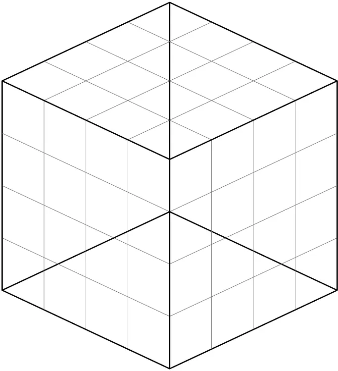
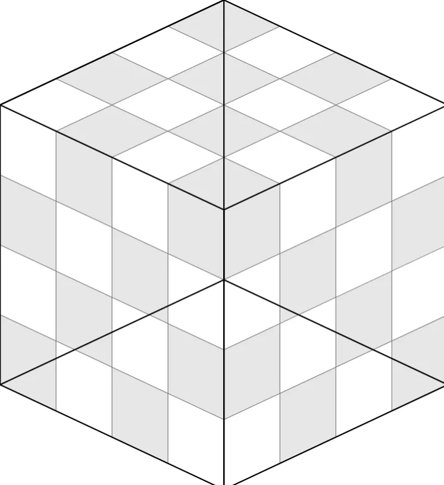
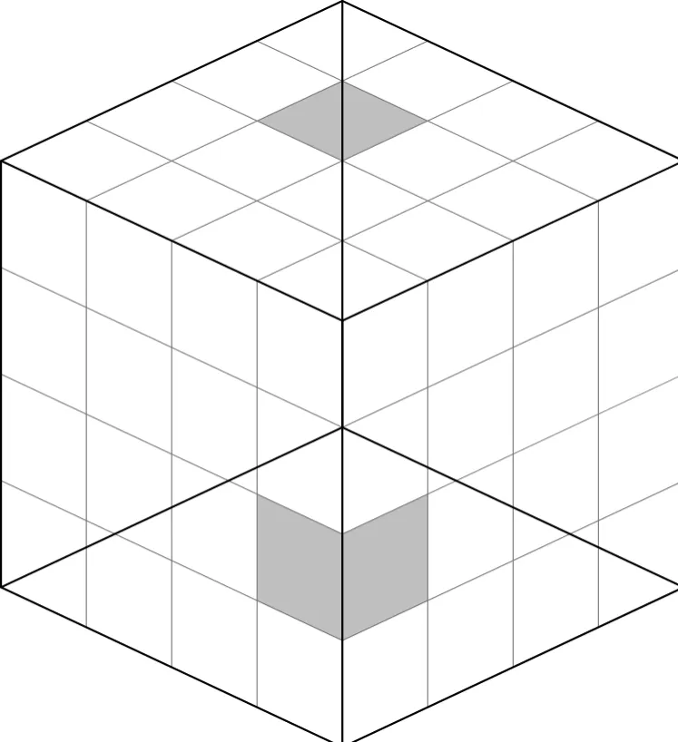
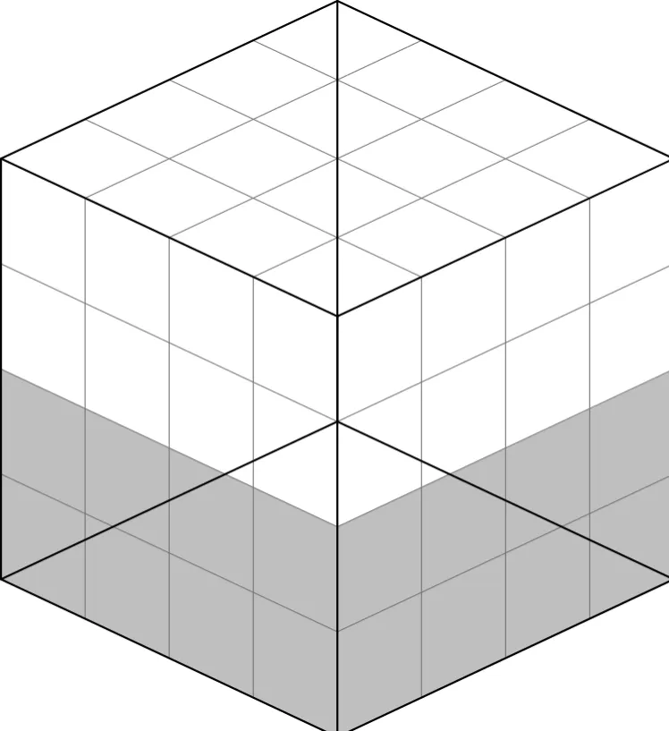
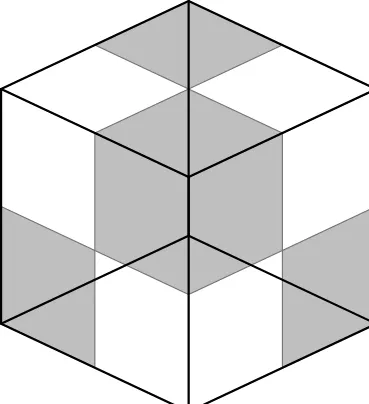
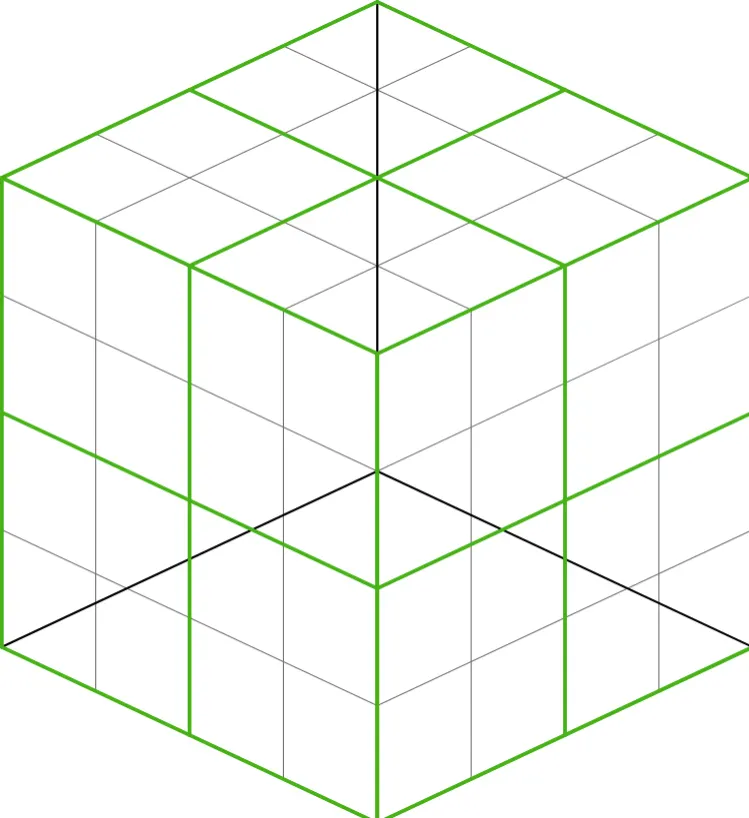

## Problem

Johnny has 64 sugar cubes, all of size $1 \times 1 \times 1$. Each sugar cube is either white, demerara, or muscovado in flavor. The sugar cubes are stacked into a neat $4 \times 4 \times 4$ cube.

Prove that there must be 12 sugar cubes of the same flavor which can be partitioned into 6 disjoint pairs such that the distance between the centers of the cubes in each pair is the same.

## Solution (Walkthrough)

Show solution

The actual solution I obtained is not long but can seem unintuitive as to how to even get to the crucial idea. So instead of just presenting the solution, in this post I will provide a glimpse into how I proceeded to tackle this problem in order to provide further intuition about the problem and my problem-solving approach.

So, what do we have to do in this problem? There are 64 smaller cubes which comprise the $4 \times 4 \times 4$ big cube, where we are looking for a structure within the smaller cubes. We're looking for pairs, specifically 6 of them, such that:

- all 12 cubes which make up the 6 pairs **must have the same flavor**
- the distance between the cubes in each pair **must be the same across these 6 pairs**

What do we have control over in this problem? Well, we might have some control to choose what the distance may be. The simplest idea to consider is that maybe the cubes have distance 1 from each other, thus they are neighbors and share a face within the big cube. Is this possible?

We may approach this via a gray-white checkerboard coloring, which is a familiar idea in two-dimensional combinatorics to color in an alternating pattern. As a consequence, there are no adjacent gray squares or white squares. The neat idea is that gray squares only border white squares and vice versa. You might say, we're in three dimensions, not two! But the analogous idea still holds for the cube; here is the checkerboard coloring below.

You could imagine these little gray cubes as our muscovado flavored sugar cubes and the uncolored cubes as our white sugar cubes.

What does this coloring show? This shows that there are no neighboring pairs of cubes that are both white and there are also no neighboring pairs of cubes which are both muscovado for this particular configuration. Thus, we definitely can't solve this problem just by looking at cubes which are distance 1 apart.

You might then counter: "But this is a totally extreme example! Most configurations for choosing the flavorings within the cube won't even look remotely close to this." The point is that the problem challenges us to tackle all possible configurations, so if we were to only look at the possibility of neighboring cubes, we fail that argument in this configuration and failing in even one configuration is very bad!

We have seen that only analyzing a distance of 1 is not very good. Instead, we can think about the other extreme. What if we thought about a relatively large distance, pairs of cubes relatively far apart? As a concrete example, let's look at the two selected cubes shaded in gray below.

These two cubes are a distance of 2 away from each other in each coordinate direction. Thus, the distance between the centers of these two cubes is given by the three-dimensional Pythagorean distance formula.

$$\sqrt{2^2 + 2^2 + 2^2} = \sqrt{12}$$

A brief sanity check ensures that the only way to achieve this specific distance of $\sqrt{12}$ is to be 2 apart in the x-direction, 2 apart in the y-direction, and 2 apart in the z-direction. (*You can try it yourself, convince yourself that you can't find another triplet of positive integers whose squares sum to 12 other than three 2's.*)

If you are thinking carefully, you might have already noticed that there are exactly 3 disjoint (*sharing no elements in common*) pairs which are this distance of $\sqrt{12}$ apart. One way to convince yourself of this fact is to divide the big cube into a top half and bottom half. For each pair, there must be one cube that lies in the top half and one cube that lies in the bottom half, and it is impossible for there to be any overlaps across pairs.

But how does this help us for our coloring? Motivated by the previous paragraph, we may assign the muscovado flavor to the bottom half and keep the top half white. This means that whenever we take a pair of cubes which is a distance of $\sqrt{12}$ apart, one of them is in the top half (must be white flavored) and the other is in the bottom half (must be muscovado flavored). This is bad, as we're not going to have even a single pair of similarly flavored/colored cubes which is that distance apart in this configuration.

Larger distances such as $\sqrt{12}$ seem to be unproductive. A distance of 1 was also fruitless.

The next smallest option for a distance to consider is $\sqrt{2}$. This corresponds to a pair of cubes which are 1 apart in in two directions but have the same coordinate for the third direction.

Here's where the solution *really* begins. Take a look at this little sub-diagram consisting of a $2 \times 2 \times 2$ smaller cube, where four of the small cubes are colored gray.

You might notice that all four of these gray sub-cubes are pairwise distance $\sqrt{2}$ away from each other. This means if you were to envision marking the centers of each of the gray cubes and connecting them, you would get a regular tetrahedron of side length $\sqrt{2}$.

Why is this more promising? Remember that each of the individual cubes is given a flavor that could be assigned to one of three possibilities (white, muscovado, demerara). This means that of the four gray cubes in this $2 \times 2 \times 2$ cube, **two of them must be the same flavor** (*Pigeonhole Principle*).

Thus, we are *guaranteed* to have the existence of a pair of two similarly flavored sugar cubes which are $\sqrt{2}$ apart in this $2 \times 2 \times 2$ cube.

But what about the non-shaded cubes? Indeed, we can apply the same argument to the four non-shaded cubes in this $2 \times 2 \times 2$ cube (as we can see three white cubes, but there's a fourth cube hiding in the back!), which are also pairwise equidistant $\sqrt{2}$ from one another.

The non-shaded cubes *also guarantee* the existence of *a second pair* of two similarly flavored sugar cubes which are $\sqrt{2}$ apart in this $2 \times 2 \times 2$ cube (but note that it doesn't have to be the same flavor as the pair obtained from the gray cubes!).

How do we apply this to the bigger $4 \times 4 \times 4$ cube? Well, we can split the bigger cube into 8 smaller $2 \times 2 \times 2$ cubes.

What have we done here? We know for a fact, we have **8 of these $2 \times 2 \times 2$ sub-cubes** and within each of these sub-cubes we are guaranteed to have two pairs of small cubes which are distance $\sqrt{2}$ apart and have the same flavor. **Thus, we have 16 pairs of cubes which are distance $\sqrt{2}$ apart and within each pair, have the same flavor.** The problem is some of those pairs will be white, some of them will be demerara and some of them will be muscovado.

But we have 16 pairs, and each pair represents one flavor. Even if we tried our best to not let there be too much of one flavor, we are guaranteed to have at least 6 pairs of one flavor (*Pigeonhole Principle, again!*).

This is exactly what we were looking for! We have guaranteed the existence of six pairs of cubes of the same flavor where within each pair they are the same distance apart ($\sqrt{2}$ apart).

