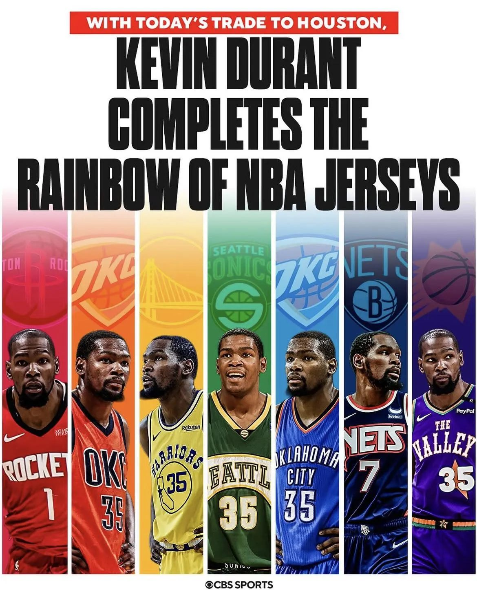
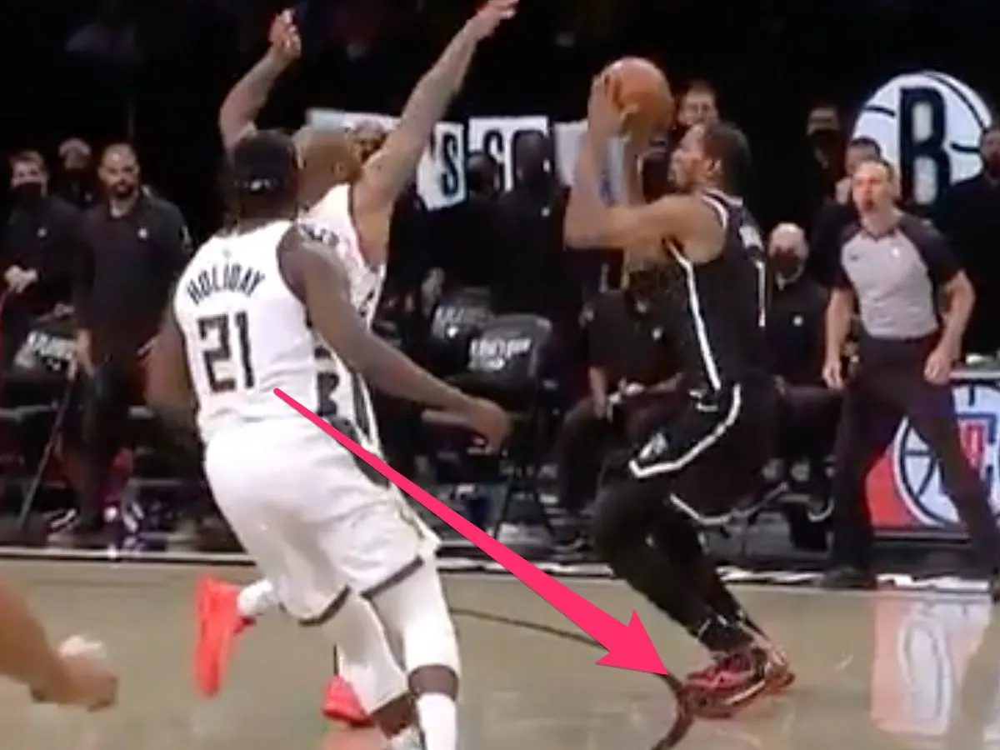

Perhaps you've heard of Kevin Durant, or KD, "The Slim Reaper" (my personal favorite), "Durantula", etc. He is one of the few greatest players to ever play in the NBA. He has nearly perfected so many different skills that it's impossible to deny his talent in basketball. He's basically a unicorn of sorts — he has the agility and quickness of a shorter player, but he does all these moves at basically 7 feet tall.

KD is one of the deadliest scorers on the court and he does it with unparalleled efficiency, even when compared to big centers who just stand under the rim for dunks and layups. He's known as a **three-level scorer** — someone who can score from in close with layups/dunks, from the **mid-range** (15 feet ish out, a jumpshot but closer than a three-pointer), and from beyond the 3-point line. Throughout his career, he's always been a prolific scorer, and he has led the league in scoring points per game four different seasons, which is third-most all time. As for his efficiency, he has achieved the rare **50-40-90** feat multiple times, where over the course of a season, a player makes 50% of all of his attempted shots, 40% of his attempted 3-pointers, and 90% of his free throws. He is probably the purest scorer of the basketball I have ever witnessed.

Similar to me, many others believed that with his skills and talent, he could surely be the best player on his own team and lead them to a championship. Others believed that he could be the best player in the league, or even the best player of his era. Unfortunately for KD, he came up second in pretty much every one of those instances throughout his career. As great as he's been, I do believe that fate has intertwined the legacy of KD with the number 2 (no he did not poop his pants, another NBA player is infamous for that, which might be fun to talk about later!).

Kevin Durant was the #2 draft pick for the Oklahoma City Thunder in 2007, behind Greg Oden. While it's true that in hindsight, KD is clearly the better player, at the time Oden was seen as a generational prospect, and injuries tragically cut his career short. Meanwhile, a healthy KD was becoming a superstar immediately, and by his third season, he led the NBA in scoring and brought his team to the playoffs. He finished 2nd in voting for the Most Valuable Player (MVP) that year to LeBron James. This would be a thorn in his side as he would be 2nd in voting for MVP for three seasons in a four year stretch (2010, 2012, 2013). Every single one of these years was second fiddle to a prime LeBron James.

If the MVP voting results weren't enough to reveal a trend, then the 2012 NBA Finals certainly showed it. Durant's Thunder and LeBron's Miami Heat faced off in the finals where the Heat comfortably beat the Thunder in 5 games, winning the series 4-1. This isn't to say that KD was at any fault, as he played to his usual superb level. Especially in the 5th game, KD scored 32 points on 13/24 shooting. Unfortunately, his starting teammates that game shot 4/20, 3/9, 1/4, and 0/2, so he definitely did not have the support that he needed.

There was still a bright spot however; the Thunder had a very young trio who looked promising to take over the league for the next three years — KD, Russell Westbrook, and James Harden. In fact, Durant was four years younger than LeBron, so the throne was his for the taking as LeBron would age. Everyone could feel that the Thunder's reign was soon to come, led by Kevin Durant: #1 in the league, winning the championship year after year, and perhaps even being #1 of his era.

In the 2013-2014 NBA season, Durant had his chance to shine, as one of his co-stars, Westbrook, was injured for a significant portion of the season. Taking the burden on his shoulders, Durant had a tremendous season, tallying 32 points per game, 7.4 rebounds per game, and 5.5 assists per game on a stellar 50.3% shooting from the field. His efforts led him to being recognized as the league's MVP, #1 in the entire league. Finally, he had risen to the top.

KD still had some critics who believed that he was a recipient of **voter fatigue** (*voters getting tired of voting for the same best player over and over again so they irrationally switch it up*) and got the award out of sympathy, rather than for his genuine performance. But for the most part, the optimism was in Durant's favor. This optimism was short-lived as Durant's Thunder were knocked out in the Western Conference Finals by the San Antonio Spurs, while LeBron was going back to the NBA Finals that year.

Durant was dealing with foot injuries, so he took off a large part of the 2014-2015 season for recovery. He returned back to the court for the following season in 2015-2016, but by now, a new juggernaut in the west had risen, the Golden State Warriors (who had won the championship the prior year) led by Stephen Curry. Curry was the reigning MVP and with the way he was playing this season, there was no stopping him from winning his second straight MVP. Curry led the Warriors to the greatest regular season record in NBA history, with a 73-9 record that season. Steph Curry was so dominant this season, that he was named the first unanimous MVP ever in NBA history. Fast forward to the playoffs, and we reach the Western Conference Finals, where the Thunder and Warriors match up. The winner of this series would advance to the NBA Finals. In the best-of-seven series, the OKC Thunder had taken a commanding 3-1 lead, shocking the legendary 2016 Warriors team. But instead of KD and the Thunder heading to the NBA Finals that year, the Warriors proceeded to win the next three straight games in cinematic fashion (including a legendary Klay Thompson 41-point game in game 6), snatching victory from the jaws of defeat, beating the Thunder 4-3 in the series. In those final three games, the lights might have been too bright for KD as he shot a putrid 39% from the field and 27% from 3-point territory. On the other hand, in that same stretch Steph scored more points with better efficiency.

No longer was KD second in the league to LeBron James. He was 2nd in the West to Steph Curry. The Warriors went on to the Finals and in a cruel twist of irony, they themselves found themselves up 3-1 over the LeBron James-led Cleveland Cavaliers until the greatest comeback in NBA history happened, where both LeBron James and Kyrie Irving played out of their minds, stealing the next three games (including the greatest block in NBA history from LeBron James) to shock the world and upset the Warriors, taking the series 4-3.

But then, KD did the unthinkable. He decided to join the very team that beat him last season, the greatest regular season team ever, and became a part of the 2016-2017 Golden State Warriors. Arguably, this might just have been the most cowardly move ever in sports history, joining a historically great team which had just beaten you to make the entire playing field unfair. Needless to say, it was a foregone conclusion that the Warriors were the favorites to win the championship that year. The Warriors had two of the three best players in the league. It was the first time in NBA history that betting odds favored one team over the entire field that year. To no one's surprise, the Warriors steamrolled through every team and won the championship the next two years, finally giving Durant his elusive championship.

In the Finals, there is a Finals MVP award for the best performer in the Finals, and in both years, KD won both of them over Steph Curry for his monstrous performances. The reception was mixed towards this. Some viewed Kevin Durant as finally proving that he was the better player compared to Stephen Curry, but others believed KD only won since Steph was the real leader of the team, and without Curry's presence, KD would not have been able to perform the way he did.

But in a matter of a few years, the vast majority of the perception would be set in stone. Eventually, KD and the Warriors parted ways. Since then, Curry and the Warriors won a championship *without* Durant in 2022, yet KD has yet to win a championship without Curry. By now, the consensus was clear: Steph had always been better than KD. KD has had multiple opportunities with exceptional supporting casts, such as Kyrie Irving and James Harden on the Brooklyn Nets (which was a little tragic since in the 2021 Eastern Conference Finals, Irving and Harden were injured and in Game 7, KD spun around to make what would have been the game-winning three but because of his gigantic feet, his toe was on the three-point arc so his basket counted as two points, which only tied the game; they went on to lose the game and series in overtime).

We will see how he does as he's now heading to a very young and defensively strong Houston Rockets team this upcoming season, maybe he will finally have the support he needs and lead them to the championship, but he isn't getting any younger. Durant is 36 years old and his window to win as a leader is about to fade.

Another thing Kevin Durant has going for him is that he is easily the greatest Olympic basketball performer in USA history, and possibly all time. At times aside from the 2024 "Levengers" Squad, the USA has not sent out their best players to face the world, which made games pretty close honestly. But Kevin Durant would perform unreal carry jobs to give USA the gold medal every time. However, the NBA does have far tougher competition than the Olympics, and that is the primary way a basketball star's legacy is measured. The USA team was still stacked compared to the rest of the world, similar to how KD's situation was on the Warriors, so yet again this reinforces a similar narrative about how the odds need to be remarkably in KD's favor for him to win as a clear best player on his team.

So to recap, KD was drafted #2 overall, was #2 to LeBron for several years, then #2 to Steph for the next several years, and even #2 to Steph during their championship years. Shocking as it is to say, maybe Durant was never a true #1 to begin with.

As a fun sidenote, KD purely lives, breathes, and sleeps basketball. There are multiple videos of him just at clubs and parties working on his game, practicing his moves in the air. He's also notorious for having burner accounts on Twitter/X to argue with fans directly and troll people all over the Internet, so you could also say Kevin Durant came up second in having a secret second Twitter account.
