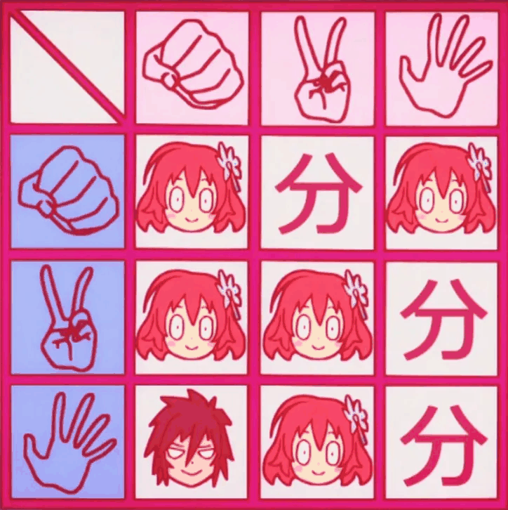
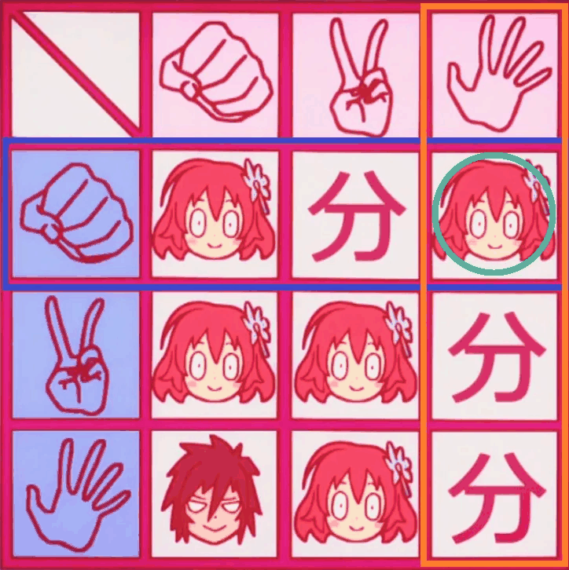
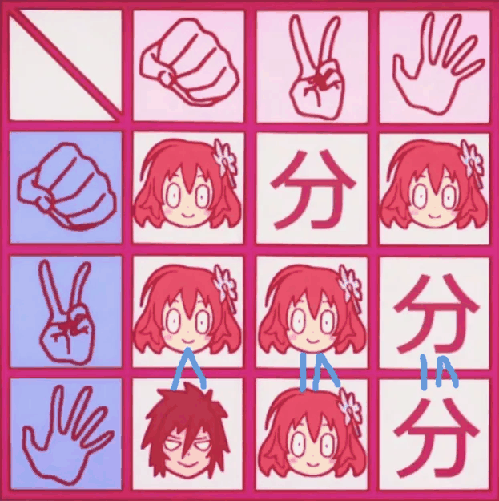
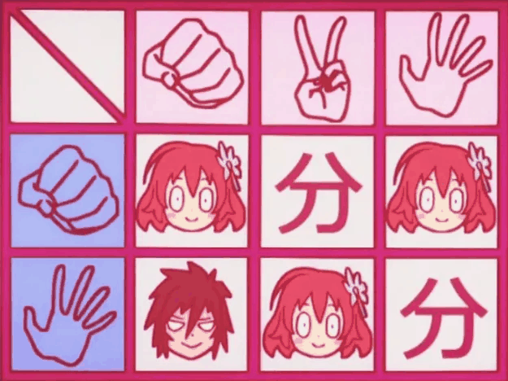
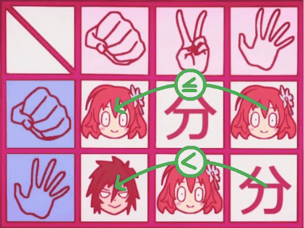
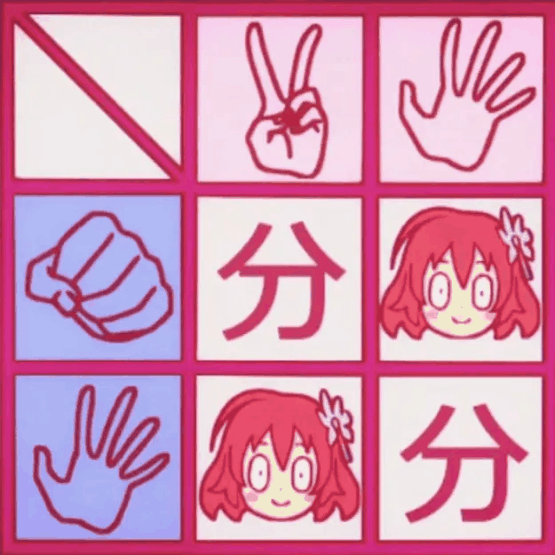

Here's a much lighter mathematical read today!

One of my cousins and I were watching some unsavory shows during the summer of 2019. As part of this marathon, we watched a few episodes of *No Game No Life*, which is not an anime you should watch. In my opinion, the premise actually has some promise, but the execution is *so unwatchable*. Anyways, let's roast Episode 2.

## Background

We start with the protagonist, a guy named Sora, and he apparently made this girl named Steph angry, so now they're playing Rock Paper Scissors of all things to settle their grievances. But here's the twist: Sora "guarantees" that he will play paper by adding the rule that **if he plays anything other than paper, he loses**.

For example, if Sora plays rock and Steph plays paper, then they both lose so it's a tie.

Here is the outcome table provided by the anime, which is accurate:

The blue icons on the left indicate Sora's choice, and this selects a row of the table. The pink icons on top indicate Steph's choice, and this selects a column of the table. The intersection is the outcome: Sora's face (the only masculine face in the table) is a win for Sora, Steph's face is a win for Steph, and the Japanese character is a draw.

> **If further clarification is needed for the *rules*:**
>
> This outcome table essentially spells out how the game works. All there is to explain is why its values make sense given the game's rules.
>
> Essentially there are two things that can happen:
>
> - Sora plays paper. If this happens, then the game proceeds as normal Rock Paper Scissors, and indeed the outcome table shows the normal RPS outcome.
> - Sora does not play paper. If this happens, then the extra rule applies, and Sora gets assigned a "loss". This is a major handicap, as indeed he can no longer win the game as a whole, but he can still draw if Steph also gets assigned a "loss". This will occur only if Sora wins against Steph as if it were a normal Rock Paper Scissors game. That is, if Sora plays Rock and Steph plays Scissors, or Sora plays Scissors and Steph plays Rock. In these scenarios, both players have received one "loss", and they "cancel out" to form a draw.
>
> In all other scenarios, Sora loses the game as a whole. For example, if they both play Rock, then although this is a draw as a normal Rock Paper Scissors game, Sora still has a "loss" from not playing Paper, so overall he loses.

> **If further clarification is needed for the *table*:**
>
> Example: If Sora plays Rock and Steph plays Paper, then Sora "loses twice", and overall this is a loss of the game as a whole. Indeed, the intersection of the "Rock" row and the "Paper" column is a picture of Steph, which indicates a win for Steph.
>
> 

Obviously, Sora has a disadvantage here (and this is how he lures Steph into playing in the first place). However, due to the ridiculously enigmatic nature that is anime, Sora actually *wants* a draw (or more). To make this mathematical, we can assign fake *payoffs* to the possible outcomes. The stakes can be roughly approximated as follows:

- Win for Sora = -1
- Draw = -0.5
- Win for Steph = 1

Positive values indicate benefits for Steph, whereas negative values indicate benefits for Sora. *(This is an oversimplification.)*

None of these values actually matter much for determining optimal play correctly, but it helps give context for...

## The Show's Thought Process and Outcome

*Steph's Thought Process*

- Sora wants a draw, and this has a 1/3 chance of happening. I won't let Sora get a draw; I want to win.
- If I play Rock or Scissors, then I have a 2/3 chance of winning, whereas if I play Paper, I only have a 1/3 chance of winning. So playing Paper is out of the question — My only options are Rock or Scissors.
- But Sora "guaranteed" that he will play Paper, so playing Rock would be quite risky. So I should play Scissors.
- ...but this is the obvious thought process, so Sora is just expecting me to play Scissors so that he can respond with Rock and obtain a draw. To curtail this, I can just win by playing Rock.
- ...but if I play Rock, there is actually a 1/3 chance that I will lose!
- In fact, Sora will likely play Paper. It is the only option where he can win. Moreover, his chances of losing are only 1/3 if he plays Paper, whereas he loses with 2/3 probability if he plays anything else.
- From these probabilities, it is obvious that Sora's only logical option is Paper, so I will play Scissors.

*Actual Result: Steph plays Scissors. Sora plays Rock. This results in a draw.*

*Sora smugly explains that he predicted all of Steph's thought process, which is why he knew she would play Scissors. Sora says that Steph's correct choice was Paper, and she would have chosen Paper if she was smart enough to figure out that Sora figured out what Steph was thinking.*

**Questions for you to think about:**

1. Both Steph and Sora are being egregiously stupid. What is the main error?
2. What should Steph have done?

Try to think about these before reading on!

## Reasoning with Game Theory

There are many heinous fallacies being made, but the overarching one is that **the probabilities just don't make sense**. For instance, while it is true that Steph wins in 2 out of 3 possible outcomes if she plays Scissors, that does not mean her actual "probability" of winning will be 2/3. This sort of "local" thinking misses the forest for the trees.

In fact, I write "probability" in quotes because it is not even clear that probability has any significant role whatsoever! Obviously, both players of this game have a brain — they're not going to just flip a three-sided coin to make their decision. So why should we be assigning probabilities at all? Sure, a logical player could still have a "personal probability" as to how likely they think certain events are, from their point of view. (This goes into a field called *epistemology* which is beyond the scope of this post.) But such "probabilities" are ultimately subjective and don't make for rigorous arguments.

Okay, so how do we rigorously reason about this game?

It turns out that all we need is a very elementary trick from Game Theory. Let's look at that outcome table again. Perhaps there are some simplifications we can make.

Observe that Sora, if he is playing optimally, has no reason to play Scissors (which I have outlined in the diagram below). **No matter what Steph plays, Sora would always be better off playing Paper than playing Scissors.** So, we say that for Sora, *Paper dominates Scissors*.

What this means is that we can completely ignore the possibility that Sora plays Scissors! It simply makes no logical sense, and we can literally delete that row from the chart. There is no need to consider it.

Now the game is simpler to reason about! Can you identify the next step before reading below?

And with this simplification, it is now Steph's turn to have a revelation: She has no reason to play Rock, because **no matter what Sora plays (either Rock or Paper), Steph would always be better off playing Paper than playing Rock**. For Steph, *Paper dominates Rock*.

So, we can completely ignore the possibility that Steph plays Rock. Thus we may delete that column from the table.

No more simplifications can be made, and we have reduced this to a game of [Matching Pennies](https://en.wikipedia.org/wiki/Matching_pennies). Due to the symmetry in choices, neither Sora nor Steph can theoretically reason further to simplify the game. At this point, they both ought to essentially flip a coin. Each player has a 50% chance of winning.

But in the context of the anime, this is a zero-sum game.
