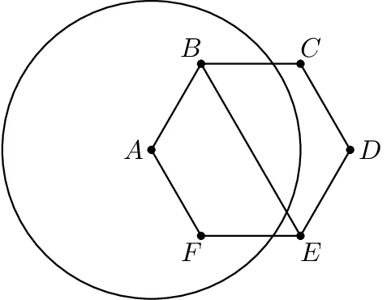
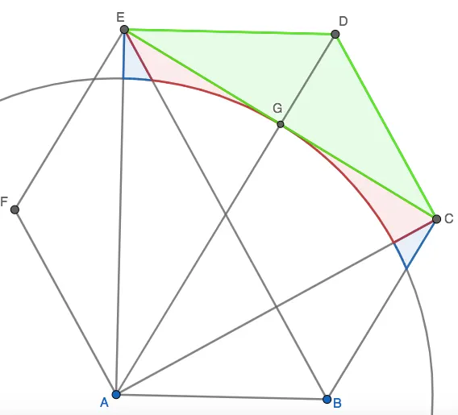
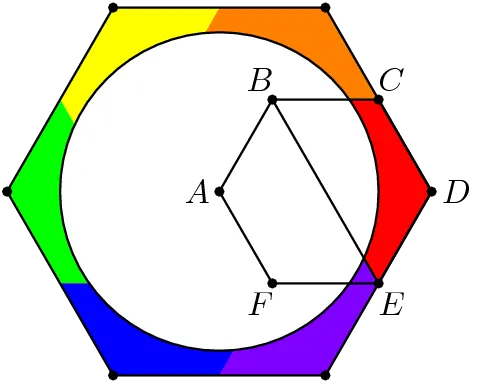

## Problem

Regular hexagon $ABCDEF$ has side length 2. A circle with radius 3 and center at $A$ is drawn. Find the area inside quadrilateral $BCDE$ but outside the circle.

## Solution

There are several ways to solve the problem; one is that if you call the points where the circle intersects the hexagon as $X$ and $Y$, then triangle $AXY$ is equilateral, and you could go on from there.

Another way is to break up the region by areas as below by drawing $EC$. You would first find the area of the green region, and then exactly the two red areas and one blue area. This can be done by first taking the area of triangle $AEC$ and then subtracting the 60 degree sector of the circle.

But my favorite way is as follows. Simply rotate the region 6 times around the point $A$ so that we now have an even bigger hexagon of side length 4 with the circle acting as a hole in the middle. By spiral symmetry, we just want 1/6 of this outer strip area (big hexagon - circle).

*Diagram Credit: a1267ab*

$$\frac{1}{6}\left(24\sqrt{3} - 9\pi\right) = 4\sqrt{3} - \frac{3}{2}\pi$$
