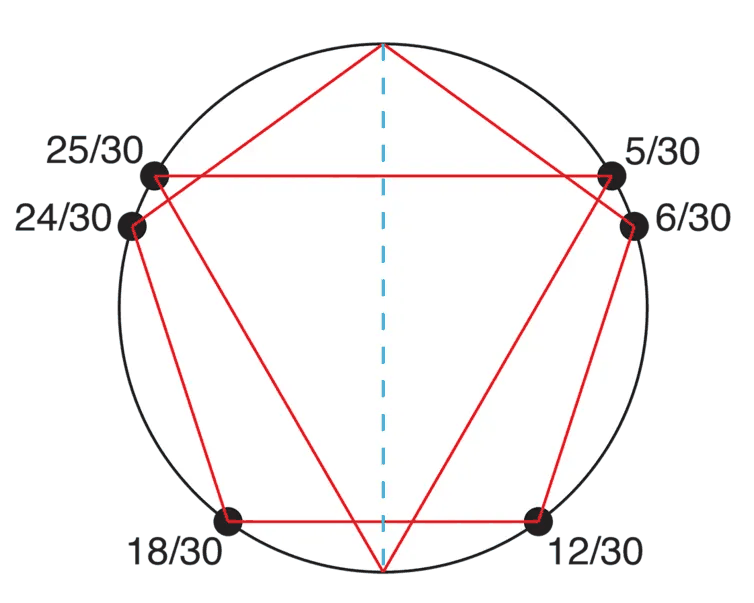

Have you ever heard the saying that "it takes 10,000 hours of work to become a master at something"? It may or may not be true, but regardless, it's the wrong way to think about learning a skill.

## Diligence

Picture this. You'd like to learn how to sing, but you know you don't sound very good. So you don't really make a big deal out of it.

Maybe one day, when you are feeling exceptionally brave or ambitious, you will sign up for lessons. You will feel really good about yourself when you go to your one or two hours of lessons every week — so good that you don't feel much of a compulsion to sing outside of it.

Sure, you'll have improved, and it's a lot better than nothing. But you will never be as good as the people who sing in the shower.

> *My parents were always out at work — surprisingly, I didn't really hang out with friends too much back then. My friends all lived quite far from me. My sister would be studying. I'd have nothing to do. I'd watch TV for three hours, and by the end I'd **be bored, so I'd start playing the piano**, until my parents literally said, "We need to sleep now! Can you be quiet?"*

(Source: [Rolling Stone Interview](https://www.rollingstone.com/music/music-features/blackpink-rose-new-music-solo-on-the-ground-1356345/) with Rosé)

In the various universities I have attended, the drama majors and theater kids have to practice for a long time, getting out late in the night. Every time I see them leave, they are always singing.

I highly doubt they are doing it for the extra ten or fifteen minutes of practice which will make them marginally better. Instead, they're singing because they just love singing that much. They can't imagine *not* singing. It's a good opportunity too: no one else is around anyways, so why not just go for it?

What happens as a result? They accumulate the practice that you don't. They are singing while taking a walk, waiting at the bus stop, or taking a shower. That probably adds up to hours every day. If you consciously had to take three hours out of every day to sing, you would get sick of it. The only reason they are able to sustain this is because it is almost subconscious. *It is just the natural thing to do*.

## Details

My sense of rhythm is not particularly good. For the longest time, I believed it was because I wasn't diligent enough to practice my rhythm. But one day, my friend showed me how he could tap out an eighth-note/triplet polyrhythm [^1], and the way he talked about it, he made it seem like the most entertaining thing in the world to try. Eventually it dawned on me: *he's passionate about rhythm itself*, not just broadly passionate about the instrument he plays.

And I realized the reason I couldn't do polyrhythms wasn't because I didn't have the discipline to drill them. It's because when I'm waiting for food at a restaurant, I am not tapping my legs with my hands while counting "1, 2, 3, 4, 5, 6, 7, ..." It's because I am not tapping my feet in that rhythm at the bus stop. It's because, whenever I'm bored and take out my phone to check my email, I don't feel the compulsion to find some rhythm exercises on YouTube instead.

Instead, I drift off into thinking about math problems during those instances. This is what I mean when I say that I love mathematics.

I enjoy singing every now and then, but for the longest time, I dismissed details as just that: things you need to diligently drill in order to become good, pain points you just have to get over. No. *You have to be passionate about the details to be any good at them*.

[^1]: For those of you less familiar with musical terminology, imagine tapping with your left hand every 1/3 of a second and with your right hand every 1/2 of a second. Then your left hand is tapping out "triplets", and your right hand is tapping out "eighth notes" at 60 beats per minute.
