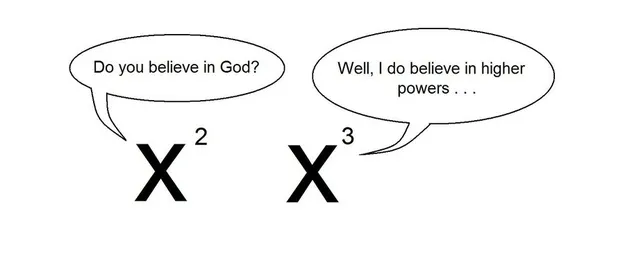

## Problem

Let $m$ be a positive integer and real numbers $a_1, a_2, \ldots, a_m$ satisfy

\begin{align}
\frac{1}{m}\sum_{i=1}^m a_i &= 1 \\
\frac{1}{m}\sum_{i=1}^m a_i^2 &= 11 \\
\frac{1}{m}\sum_{i=1}^m a_i^3 &= 1 \\
\frac{1}{m}\sum_{i=1}^m a_i^4 &= 131
\end{align}

Prove that $m$ is a multiple of 7.

## Solution 1 (Random Variables, Rigorous)

Show solution

Let $I$ (capital i) be a uniformly random index from $\{1, \ldots, m\}$. We consider the random variable

$$A := a_I$$

Hence, the left-hand sides of the given equations are

$$\E[A], \E[A^2], \E[A^3], \E[A^4]$$

respectively. We can compute for $t \in \R$,

$$\E[(A+t)^2] = \E[A^2] + 2t\E[A] + t^2 = 11 + 2t + t^2$$

and

$$\E[(A+t)^4] = \E[A^4] + 4t\E[A^3] + 6t^2\E[A^2] + 4t^3\E[A] + t^4 = 131 + 4t + 66t^2 + 4t^3 + t^4$$

Using the Shortcut Formula for Variance

\begin{align}
\Var[(A+t)^2] &= \E[(A+t)^4] - \E[(A+t)^2]^2 \\
&= 131 + 4t + 66t^2 + 4t^3 + t^4 - (11 + 2t + t^2)^2 \\
&= 131 + 4t + 66t^2 + 4t^3 + t^4 - (121 + 44t + 26t^2 + 4t^3 + t^4) \\
&= 10 - 40t + 40t^2 \\
&= 10(2t-1)^2
\end{align}

Therefore, we note that $\Var[(A + 1/2)^2]$ is 0 and thus deterministic. This implies there exists $u \in \R$ such that

$$a_i \in \left\{u - \tfrac{1}{2}, -u - \tfrac{1}{2}\right\}$$

for all $i \in \{1, \ldots, m\}$. Let $p$ be the number of $i \in \{1, \ldots, m\}$ such that $a_i = u - 1/2$ and $q$ be the number of $i \in \{1, \ldots, m\}$ such that $a_i = u - 1/2$ meaning $q = m - p$. We obtain

\begin{align}
1 = \E[A] &= \frac{p(u - \frac12) + (m-p)(-u - \frac12)}{m} = \frac{(2p-m)u}{m} - \frac12 \\
11 = \E[A^2] &= \frac{p(u - \frac12)^2 + (m-p)(-u - \frac12)^2}{m} = u^2 - \frac{(2p-m)u}{m} + \frac14
\end{align}

Adding both equations yields

\begin{align}
u^2 &= 1 + \frac12 + 1 - \frac14 = \frac{49}{4} \\
u &= \pm\frac{7}{2}
\end{align}

Thus we may claim that $a_i \in \{-4, 3\}$ for all $i \in \{1, \ldots, m\}$. We may take $u = 7/2$ in our equation for $\E[A]$

$$1 = \frac{2p-m}{m} \cdot \frac{7}{2} - \frac12$$

which rearranges to

$$5m = 7p$$

thus $m$ must be a multiple of 7.

## Solution 2 (Clever Substitution)

One of my friends in Taiwan came up with this slick substitution which was a classic trick he learned in Olympiad training, but I could not figure out how to motivate this without doing the work that I did in Solution 1.

The idea, as you probably suspected, is to perform the substitution

$$b_i = a_i + \tfrac{1}{2}$$

After some tedious yet simple calculation, our sums are now instead

\begin{align}
\sum_{i=1}^m b_i &= \frac{3m}{2} \\
\sum_{i=1}^m b_i^2 &= \frac{49m}{4} \\
\sum_{i=1}^m b_i^3 &= \frac{147m}{8} \\
\sum_{i=1}^m b_i^4 &= \frac{2401m}{16}
\end{align}

Note that the second and fourth sums provide a convenient equality

$$m\left(\sum b_i^4\right) = \left(\sum b_i^2\right)^2$$

By Cauchy-Schwarz, we see that the $b_i^2$ is constant in $i$, which is $49/4$. This means we have some $b_i = 7/2$ and some $b_i = -7/2$.

Let there be $p$ $b_i$ values equal to $7/2$ and $q$ $b_i$ values equal to $-7/2$ where $q = m - p$. Using our sum of $b_i$'s

\begin{align}
\sum_{i=1}^m b_i &= \frac{3m}{2} \\
\frac{7}{2}p + \frac{-7}{2}q &= \frac{3m}{2} \\
7(p-q) &= 3m
\end{align}

Thus $m$ is a multiple of 7.

Essentially this is the same solution, but ridiculously simpler once the substitution is made.
