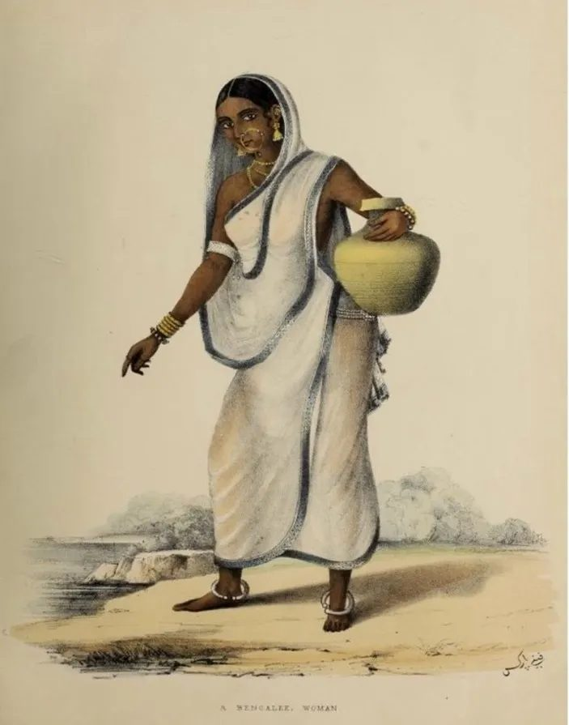
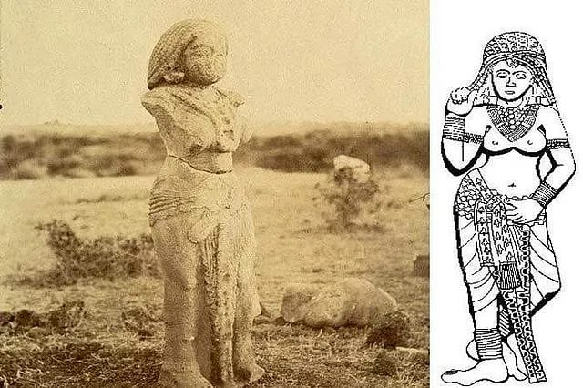
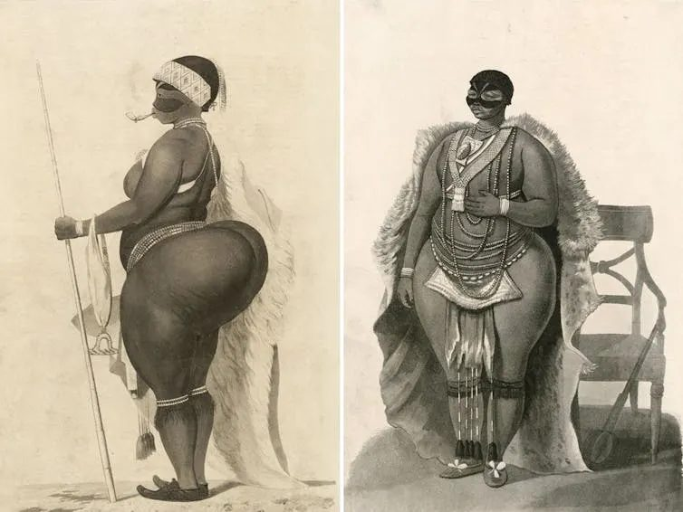
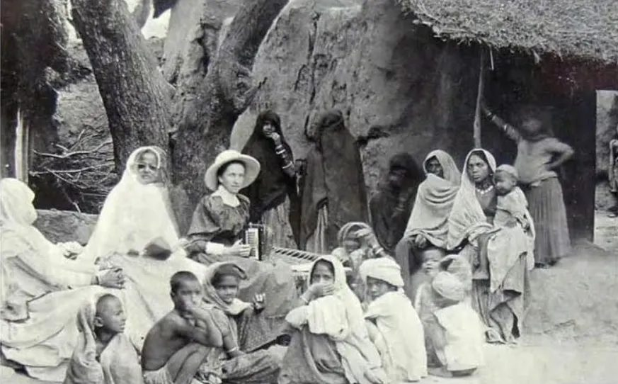

This is a part 2 of one of my earlier posts, [Why are Indians deemed to be one of the token unattractive races of society?](https://oofset.substack.com/p/why-are-indians-deemed-to-be-one)

Let's talk about the Indian sari and how European colonialism and purity culture identify and fetishize traditional Indian fashion as impure and immodest.

Indian women never wore blouses under their saris until they encountered the British. Because European ideas of sexuality, morality, and purity reshaped Indian society's perceptions of bodies, sexuality, and modesty. This connects directly to purity culture, which is basically an idea really seen in evangelical Christian communities, where sexuality is seen as a powerful and dangerous force that must be controlled. Therefore, when they see women who were often wearing nothing underneath their saris, this was deemed as something that was against their notion of purity.

In these ancient sculptures, you can see Indian men and women wearing minimum clothing because back then, having your upper body bare was not seen as something to be stigmatized. It wasn't about shame. In fact, these styles were widely accepted and symbolized freedom, identity, and tradition, rather than impurity.

But again, with British colonial rule in India, what was once seen as a part of identity and freedom was now seen as evidence of native promiscuity.

And this idea is seen in so many encounters and so many depictions in women of color across generations and regions. There's a hypersexualization of Latina women and Black women — it all comes down to the same idea of purity culture being imposed onto women of color because their ideas of sexuality were different from how Europeans viewed that.

Garments such as the blouse and petticoat, both English terms, were introduced during this Victorian era. And they were gradually enforced and seen as standard, reshaping the sari into a more concealing fashion that really reflected colonial ideas of decency.

But what's so important to realize is that *wearing blouses under the sari, is again, not traditional*, and it reveals how it has become less of modesty, but more of a virtue that has been ingrained into Indian society. This is because now women who will choose to wear more revealing outfits in India, or just worldwide in general, because of colonization, are often blamed for sexual violence based on how much they were covering their bodies, which is insane. Because how much you cover your body should not be a determinant of if you were sexually assaulted or not.

Wearing the sari was turned into something very political. Zia ul-Haq's military dictatorship in Pakistan in the 1980s promoted a more conservative dress code wherein he privileged garments like the shalwar kameez over the sari. It was deemed as immodest under Islamic propriety, but at the same time, it really links women's attire to a sense of morality and a sense of purity.

It's so important to reclaim clothing as a site of identity and freedom, especially for South Asian women who wear the sari because it allows us to challenge these inherited moral codes that were imposed by colonization. Purity is socially constructed and directly connects to colonization.

And the more we realize this, we can celebrate fashion in a way that does not suppress the female form.

## Sources

[Finding British and Indian Women's Encounters in the Colonial Archive - Bloomsbury Literary Studies Blog](https://bloomsburyliterarystudiesblog.com/2024/10/finding-british-and-indian-womens-encounters-in-the-colonial-archive.html)

[The Colonial History of Saree Blouse | Homegrown India](https://homegrown.co.in/homegrown-voices/the-colonial-history-of-indias-favourite-sari-blouse)

[How Sarah Baartman's hips went from a symbol of exploitation to a source of empowerment for Black women | FIU News - Florida International University](https://news.fiu.edu/2021/how-sarah-baartmans-hips-went-from-a-symbol-of-exploitation-to-a-source-of-empowerment-for-blackwomen)
