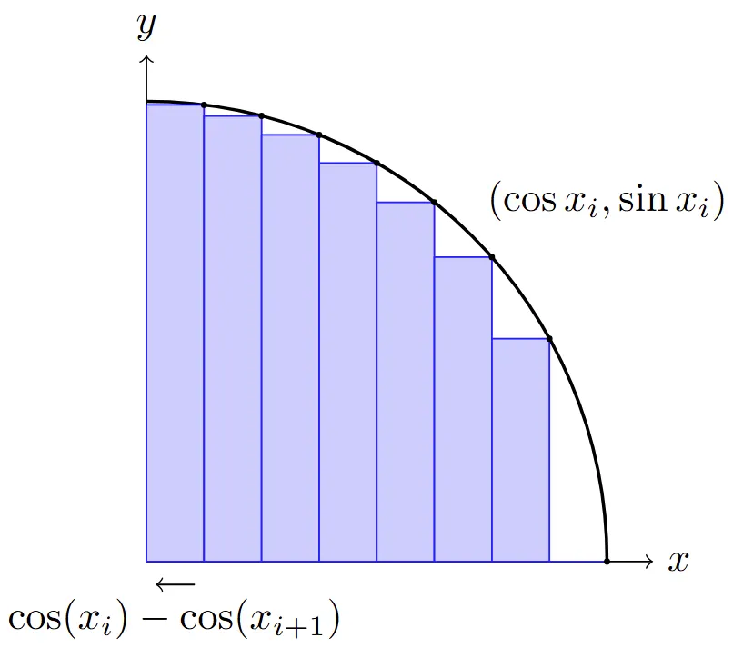

This was my favorite problem from the past week.

## Problem

Let

$$0 < x_1 < \cdots < x_n < \frac{\pi}{2} \in \R$$

Prove that

$$\sum_{i=1}^{n-1} \sin(2x_i) - \sum_{i=1}^{n-1} \sin(x_i - x_{i+1}) < \frac{\pi}{2} + \sum_{i=1}^{n-1} \sin(x_i + x_{i+1})$$

Show solution

## Solution

We start by isolating pi/2 on one side of the inequality, and then we can manipulate the LHS

\begin{align}
&\sum_{i=1}^{n-1} \sin(2x_i) - \sum_{i=1}^{n-1} \sin(x_i - x_{i+1}) - \sum_{i=1}^{n-1} \sin(x_i + x_{i+1}) < \frac{\pi}{2} \\
&\sum_{i=1}^{n-1} \left[ \sin(2x_i) - \sin(x_i - x_{i+1}) - \sin(x_i + x_{i+1}) \right] \\
&\sum_{i=1}^{n-1} \left[ \sin(2x_i) - \left( \sin(x_i - x_{i+1}) + \sin(x_i + x_{i+1}) \right) \right]
\end{align}

We can recognize that the parenthetical expression of sines is of the form sin(A - B) + sin(A + B), which is equal to 2sinAcosB through trig formulas. The leftmost term is also of the form sin(2A) which can be expressed by double sine formula as 2sinAcosA.

$$\sum_{i=1}^{n-1} \left[ 2\sin(x_i)\cos(x_i) - 2\sin(x_i)\cos(x_{i+1}) \right]$$

$$2 \cdot \underbrace{\sum_{i=1}^{n-1} \sin(x_i)\left( \cos(x_i) - \cos(x_{i+1}) \right)}_{S}$$

Let's ignore the 2 for now, and set the summation expression of S. What exactly is S? We turn to a geometrical representation of this sum S. Using the fact that all of the terms are strictly between 0 and pi/2 and increasing, we may notice that S looks like a Riemann sum of n-1 rectangles inside the top-right quadrant of the unit circle. Specifically, the height is represented by sine, and the width is represented by a difference of consecutive cosines of increasing terms (so cos(xi) - cos(xi+1) is a positive term!), meaning we are going from right to left, so this is a Right Riemann sum.

By the Right Riemann sum, we can see that S < pi/4, the area of the quarter circle, and thus we can conclude 2S < pi/2, as desired.

