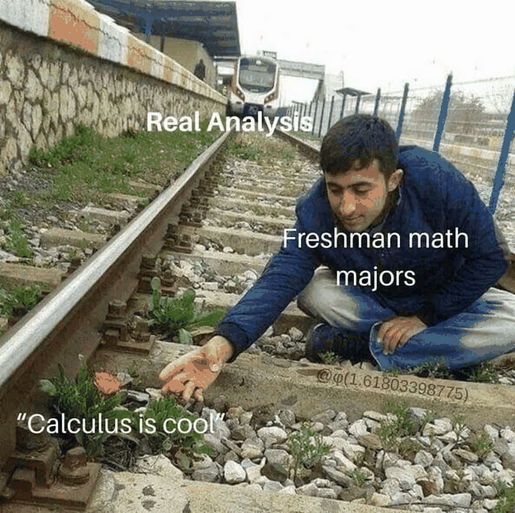

*Prerequisites: I suppose be comfortable with set notation and elementary set theory? For instance, if you can understand the two examples below, that should be good enough*

$$S = A \cap B$$

$$S = \{x \in \N : x/2 \in \N\}$$

## Introduction and Goals

The first goal of this fairly long post is to answer the questions: what the heck is a real number? How can we be sure that the real numbers even exist?

We actually have a pretty good intuition of the other types of numbers:

- We start with the numbers we learned to count with. These are the natural numbers, $\N$, which are not too hard to conceptualize. If we see a pile of candies but then a bigger pile of candies, we have this understanding of quantity to compare their respective amounts. We could use these to solve an equation such as $x+2=69$ (formal construction: [Peano Axioms](https://en.wikipedia.org/wiki/Peano_axioms), or something similar).
- The extension of $\N$ to the "negatives" is known as the set of integers, $\Z$. Perhaps the easiest example we learned for the "negative" numbers is in the sense of debt where we owe people money. These numbers allow us to solve an equation such as $x+69=2$ (formal construction: could be in the form of making a group, since the negative integers are the additive inverses of the natural numbers).
- The rational numbers, $\Q$, are an extension of $\Z$ to "fractions". Again, these are very easy to envision, as this is essentially what happens when you cut cake into slices. With these numbers, we now have the tools to solve an equation such as $70x+7=67$ (formal construction: *equivalence classes of ordered pairs*)
    - The idea here is to represent a number like 6/7 as (6, 7). Now we can "define addition" on these "fractions" as:

      $$(a, b) + (c, d) := (ad + bc, bd)$$

      and multiplication as:

      $$(a, b) \cdot (c, d) := (ac, bd)$$

      But wait! The astute reader will certainly catch an issue here: Wouldn't (60, 70) represent the same fraction as (6, 7)? We can't have this! The simple fix is to just interpret these as the same thing, even if they are not strictly equal. What we have done here is come up with a new sense of equality known as an *equivalence relation*. And with equivalence relations, we create something known as *equivalence classes*, which is really a fancy way of denoting a set of things which are all "the same under this new version of equality". For example, the equivalence class of (6, 7) is the set:

      $$\{(6, 7), (12, 14), (-6, -7), (-12, -14), \ldots\}$$

      Yes, this is certainly a little strange, but we have this nice convention where instead of using our ordered pairs as "fractions", we have these equivalence classes instead! So yes, 6/7 and 60/70 are indeed equal since the equivalence class of (6, 7) and (60, 70) are identical.

      (**For the curious reader: Google "field of fractions"**)
- And now the real numbers, $\R$, which we can define as the extension of $\Q$ to...uh... Where exactly do we go from here? How are we supposed to even believe that real numbers exist *in between* the rational numbers? Is there any evidence for this? How can we even represent these numbers? **What are these numbers?**

Right, so we you really think about it, the real numbers are honestly quite unintuitive. Many of us sort of have this "sense" that they do exist, through our understanding of continuums such as time and motion. But as of right now, without a formal method that really shows the real numbers exist...we are at an impasse.

## How To Define???

There are multiple ways to construct the real numbers where each method has the same central idea: "By hopping only on rational numbers, I should be able to leapfrog so many times such that I get *really close* to any 'real' number... whatever that is."

### Attempt 1: Real Numbers are Infinite Decimals?

I suppose we should consider base ten because why not. We often see real numbers expressed as an infinite decimal such as 3.14159265358979...so why don't we just take the infinite decimals as our real numbers? As we add more and more decimal points, we're really using rational numbers to get closer and closer to the "real numbers" to sort of fill in the "gap".

::: definition
A *real number* is a sequence of infinite decimal digits (i.e. 1, 4, 2, 7, 8, 5, 1, 2, 9, 4, 0, 1, ...) combined with the location of the decimal point as well as the sign of the infinite sequence. For instance, we can define $\pi$ as the infinite sequence (3, 1, 4, 1, 5, 9, 2, 6, 5, 3, 5, 8, 9, 7, 9, ...) with the decimal point after the first digit and taking the positive sign.
:::

Granted, this *could* work if we try pretty hard, but I'm fairly concerned with how messy it will be as there are a few issues to address...

*Issue 1:* We have multiple representations of the same number. For a few examples, 0.9999999... = 1.0000000 and 67.0000000 = 0067.0000000. But perhaps we could fix this through equivalence classes like we outlined for the rational numbers before.

*Issue 2:* How would we describe the sum of two infinite decimals? *Yikes*, you can probably see how messy this is going to be as we conventionally add from right to left and gosh the amount of carrying that would need to be done would be so tedious. And let's not even get started on multiplying...

So, this method sucks.

### Method 2: Cauchy Sequences are Real Numbers?

Instead of just giving the definition, I'll explain my problem with this construction.

*Issue:* The intended audience might be very sad when reading this and thus will judge me heavily.

And here's the definition:

::: definition
A *real number* is an equivalence class of Cauchy sequences. If we let $C$ be the set of all infinite sequences of rational numbers

$$\{x_n\}_{n=1}^\infty$$

for which:

$$\forall \epsilon \in \Q^+ \ \exists N_\epsilon \in \N \ \text{s.t.} \ \abs{x_n - x_m} < \epsilon \quad \forall m, n \ge N_\epsilon$$

We define the equivalence relation $\sim$ on $C$ as such:

$$\{x_n\}_{n=1}^\infty \sim \{y_n\}_{n=1}^\infty$$

iff.

$$\lim_{n \to \infty} \abs{x_n - y_n} = 0$$

Then $\R := C / \sim$ where we define addition and multiplication naturally in the pointwise sense.
:::

Okay, if I had to be honest, this construction is honestly *quite nice and easy*... But I can unfortunately think that there's just too much to unpack. Here are a couple notes for those not in my Real Analysis class (because we have been learning about this method!)

- The definition of a *Cauchy sequence* is much less scary than it looks. All it means is that it's a sequence that's "getting closer and closer to itself".
- **For the curious reader: Google "Construction of real numbers with Cauchy sequences"**

This brings me to the second goal of this post: one of my friends in Real Analysis knew of this method but was unaware of the other method I will state below, and so we joked that I should totally make a comprehensive blog post on it...

This brings us to the construction that we'll ultimately use...

### Method 3: Real Numbers are Dedekind Cuts!

In my opinion, this is an absolutely beautiful way to conceptualize and thereby convince yourself that real numbers exist.

Intuitively, think of a Dedekind cut as the set of rational numbers that are all *less than* something. That's not very precise, but here are some examples:

- If we were to take all of the rational numbers, and "cut" them off at 0, then we are left with only the negative rational numbers. That is, the set

    $$\{q \in \Q : q < 0\}$$

    So yes, the negative rational numbers is a Dedekind cut.
- The set of all rational numbers less than 2,

    $$\{q \in \Q : q < 2\}$$

    is a Dedekind cut. We essentially "stop" the rational numbers at 2.
- The set of all rational numbers less than -6/7 is also a Dedekind cut. You get the gist.

The main idea we're getting at is that we ideally want a Dedekind cut to represent its *top number*.

- By this, we mean a "least upper bound". For example, note that the set of negative rational numbers has no maximum. However, if it "had a maximum", we ideally would want it to be 0. So, we call 0 the **supremum** of the set of negative rational numbers, because it is the **least upper bound**. More on that later.

For example, we would want this particular cut

$$\{q \in \Q : q < 2\}$$

to represent the real number 2. Unfortunately, if we defined a Dedekind cut as just a set of the form

$$\{q \in \Q : q < r\}$$

for some $r \in \Q$, it's really not going to be of much help in extending the rational numbers because

- the top number of $\{q \in \Q : q < r\}$ is $r$ and well, $r$ must be rational. So we really just redefined rational numbers all over again...
- And if you instead try the definition $\{q \in \Q : q < r\}$ where $r \in \R$, then this is really just a circular definition...because what is $\R$?

Instead, we must be more subtle with our definition of the Dedekind cut:

::: definition
A non-empty subset $D \subset \Q$ is a *Dedekind cut* if the following property holds: Whenever $a \in D$, we have that every rational less than $a$ is also in $D$. Additionally, $D$ has no maximum element.
:::

Here's a few exercises to test your understanding:

::: exercise
Prove that $\{q \in \Q : q < 67\}$ is a Dedekind cut.
:::

::: exercise
Why is $\{q \in \Q : \abs{q} < 67\}$ NOT a Dedekind cut?
:::

::: exercise
Why is $\{q \in \Q : q \le 67\}$ NOT a Dedekind cut?
:::

::: example
The set

$$\{q \in \Q : q < 0\} \cup \{q \in \Q : q^2 < 67\}$$

is a Dedekind cut.
:::

Intuitively, we can see that the "top number" of this set is going to be $\sqrt{67}$, which is most certainly not rational! Surely, we can seal the "gaps"/"holes" among the real numbers.

::: exercise
Prove that the above set described is indeed a Dedekind cut and it does not take the form $\{q \in \Q : q < r\}$ for any rational $r$.
:::

*Sketch:* This boils down to casework. After assuming the contradiction that there exists a representation $\{q \in \Q : q < r\}$ for some rational $r$, we prove that we must have $r^2 = 67$ (either $r^2 < 67$ or $r^2 > 67$ imply the sets are not equal) and then prove that there is no rational satisfying $r^2 = 67$, contradiction.

Okay, so we should be convinced that we have a not too difficult definition of the real numbers.

::: definition
A real number is a Dedekind cut.
:::

Now, if we are going to claim that these Dedekind cuts can represent the real numbers, we should give ways to add them and similar operations.

*Addition:* Let $A, B \in \R$ (that is, $A$ and $B$ are Dedekind cuts). Then,

$$A + B := \{a + b : a \in A, b \in B\}$$

*Example:* Suppose $A$ represents 33 and $B$ represents 34. $A = \{q \in \Q : q < 33\}$ and $B = \{q \in \Q : q < 34\}$. Ideally, we would like $A + B$ to represent 67. Does it?

*Proof:*

- Our claim is:

    $$\{a + b : a \in A, b \in B\} = \{q \in \Q : q < 67\}$$

    That is,

    $$\{a + b : a, b \in \Q, a < 33, b < 34\} = \{q \in \Q : q < 67\}$$

    We prove by double containment.

    - If $x \in \{a + b : a, b \in \Q, a < 33, b < 34\}$, that means $x = a+b$ where $a < 33$ and $b < 34$ are rational numbers. Adding the inequalities gives us $a + b < 67$ and thus, $x < 67$. Since $a, b$ are rational numbers, so is $x$. Thus, $x$ is a rational less than 67, which matches what we want to show.
    - If $x \in \{q \in \Q : q < 67\}$, then $x$ is a rational less than 67.

        **Claim:** There is a rational $a < 33$ such that $x - a < 34$.

        *Proof.* Assume otherwise. Then $x - a \ge 34$ for all rational numbers $a < 34$. This means that $a + 34 \le x < 67$ for all rational numbers $a$. The idea here is that if we make $a$ arbitrarily close to 33, then $x$ will in a sense get "squeezed" out of the inequality $a + 34 \le x < 67$.

        For this, there is a quite elegant trick we could use! The intuition behind this is to consider expressing $a$ as being even closer to 33 than $x$ is to 67. That is, we could represent $a$ as $a = 33 - (67 - x)/2$. Clearly, we have $(67 - x) > 0$ and thus we have $a < 33$ with $a$ rational.

        We can simply to obtain $a = (x - 1)/2$. If we were to plug this into our inequality $a + 34 \le x < 67$ (which MUST be true for all $a < 33$), we get

        $$\frac{x + 67}{2} \le x < 67$$

        Can you see the contradiction? (Solve the left and right inequalities.)

        Now that the claim is proven, we are free to choose a rational $a < 33$ such that $x - a < 34$. Taking $b = x - a < 34$, we have $x = a + b$, and thus, our other construction holds.

*Subtraction:* We don't exactly have subtraction, but we do have adding negative inverses. This of course begs the very natural question of given a Dedekind cut $A \in \R$, how do we construct its "negation"?

::: exercise
Why don't either of these attempts at defining negation work? And what would work instead?

$$
\begin{aligned}
-A &:= \{-a : a \in A\} \\
-A &:= \{-a : a \notin A, a \in \Q\}
\end{aligned}
$$
:::

**Solution:**

- For the first one, simply letting $A$ represent 0 makes $\{-a : a \in A\}$ the positive rational numbers, which is certainly not a Dedekind cut.
- For the second one, it's actually quite close, but still not correct. If $A$ represents 1, then by definition, $-A = \{q \in \Q : q \le -1\}$. The reason this does not work is because $-A$ has a maximum, thus it cannot be a Dedekind cut.
- There's a really cheeky trick to skirt this issue, which is...to add 0.

    $$-A := \{(-q) + z : q \in \Q \setminus A, z < 0, z \in \Q\}$$

    Think about why this actually works!

*Multiplication, Division:* These admittedly do get quite cumbersome, but are far better than using **Attempt 1**...so I won't include them here, but if you wish to check out the construction (which in theory is really just a bunch of casework)...take a look [here](https://en.wikipedia.org/wiki/Construction_of_the_real_numbers).

## Building Further Structure

Our definition for real numbers certainly works, but now we could go one step further which really begins to demonstrate the beauty of the structure of the reals.

::: definition
The real numbers $\R$ is the unique ordered field, up to isomorphism, that satisfies the supremum property.
:::

This kind of covered a lot, so let's analyze this a bit more carefully.

- A *field* is a system of numbers in which we may comfortably add, subtract, multiply, and *even divide*! We also have the distributive property, with associativity and commutativity...essentially, it's nice and we like that. That's a good thing, not a bad thing.
- An *ordered field* means that we have the ability to compare any two numbers in the field using $\le$. The $\le$ symbol needs to satisfy a few important properties, such as $a \le b$ and $b \le c$ implies $a \le c$, and $x \le y$ and $y \le x$ implies $x = y$.
- The *supremum* of a set $S$ is its *least upper bound*. For example, the interval $[0, 3]$ has an upper bound of 4 since $4 \ge$ everything in $[0, 3]$. But, it most certainly is not the least upper bound, since 3 is an even smaller upper bound. And we certainly cannot get smaller than that, thus 3 is the supremum.

    Note that the idea of a supremum is a more generalized form of the maximum. If a set has a maximum, like $[0, 3]$ does, then that maximum automatically becomes the supremum. Otherwise, for sets such as $[0, 3)$ or $\{1/2, 2/3, 3/4, 4/5, \ldots\}$ then is no maximum...but there IS a supremum! Colloquially, this is what we would ideally "like" for the maximum to be! For the two example sets above, they are 3 and 1 respectively. We will denote the supremum of a set $S$ as **sup S**.
- The *supremum property* means that any set has an upper bound must have a *least* such upper bound, i.e. a supremum.

    **Exercise:** $\Q$ is an ordered field but does not have the supremum property. Why? (Hint: the supremums in the ordered field have to be in the field, meaning they have to be rational...)

    If you think about it, the supremum property is yet another way to formalize the notion of "filling in the gaps" between the rational numbers. The above exercise can demonstrate this as well.
- *Unique up to isomorphism* means that there is only ONE "real numbers" and ANY OTHER "real numbers" you could come up with will basically look the same, i.e. be isomorphic to the "real numbers".

This definition asserts some particularly bold claims: for one, it asserts the real numbers even exist in the first place. Luckily for us, we have achieved this via Dedekind cuts!

But even further, we're claiming something far grander. We're also saying that no matter what construction you use to define the real numbers, they will essentially look the same as these Dedekind cuts, known as isomorphism.

- Basically, two systems of numbers are isomorphic if each number in the first system corresponds to a number in the second system such that in this correspondence, operations on the numbers act in the same way.
- With this idea, we may formally define a *field isomorphism*. Let $F_1$ and $F_2$ be fields. $F_1$ has operations $+$ and $\bullet$, whereas $F_2$ has operations $\oplus$ and $\odot$. Then a field isomorphism is the bijective function $\psi$

    $$\psi : F_1 \to F_2 \text{ where}$$

    $$
    \begin{aligned}
    1.\ \psi(a + b) &= \psi(a) \oplus \psi(b) \\
    2.\ \psi(a \cdot b) &= \psi(a) \odot \psi(b)
    \end{aligned}
    $$

    And if you can find such a $\psi$, then we call $F_1$ and $F_2$ isomorphic.

Proving this is an amazing journey that beautifully encapsulates the hierarchy of systems of numbers. This is the main course of this post.

## Leveling Up

Let $\R$ and $\R'$ be two versions of "real numbers". I will now go on to show that they are isomorphic.

The addition and multiplication for $\R$ are $+$ and $\bullet$. For $\R'$, the operations are $\oplus$ and $\odot$.

### Level I: The Natural Numbers

Our first goal is to "find" the natural numbers.

Included in the definition of a field is the concept of a multiplicative identity, 1. $\R$ has a 1 and $\R'$ has a $1'$ as well. Then,

$$
\begin{aligned}
\N &= \{1, 1+1, 1+1+1, \ldots\} \\
\N' &= \{1', 1'+1', 1'+1'+1', \ldots\}
\end{aligned}
$$

We can now start to build our isomorphism. Clearly, we would want 1 to correspond to $1'$ and so we may define

$$\psi(1) := 1'$$

In general, if $n = 1 + 1 + \ldots + 1$ and $n' = 1' + 1' + \ldots + 1'$ where the same amount of "ones" are used, then we may take

$$\psi(n) := n'$$

We should check for isomorphic structure, meaning we claim:

$$
\begin{aligned}
\psi(m + n) &= \psi(m) \oplus \psi(n) \\
\psi(m \cdot n) &= \psi(m) \odot \psi(n)
\end{aligned}
$$

Which works, by induction (*try it!*)

### Level II: The Integers

We define

$$\Z = \N \cup \{0\} \cup (-\N = \{-n : n \in \N\})$$

$-n$ exists because in a field, every element has an additive inverse. We may define $\Z'$ similarly.

We seek to extend our isomorphism to the integers. We have a few obvious definitions:

$$
\begin{aligned}
\psi(-n) &:= -\psi(n) \\
\psi(0) &= 0'
\end{aligned}
$$

Again, we may check for isomorphic structure, claiming:

$$\psi(m + n) = \psi(m) \oplus \psi(n)$$

*Proof:* The only significantly problematic case is when $m > 0$ and $n < 0$. Or, we essentially need to show

$$\psi(m - n) = \psi(m) \oplus (-\psi(n))$$

for all naturals $m$ and $n$. We have two subcases:

- if $m > n$, then $m - n$ is natural. Since $n$ is natural too, we may use our previous result to obtain

    $$\psi(m - n) \oplus \psi(n) = \psi(m - n + n) = \psi(m)$$

    which indeed, rearranges to what we want!
- otherwise, if $m \le n$, then $m - n$ is zero or natural. The 0 case is trivial, so we suppose $n > m$. Then

    $$\psi(m - n) = -\psi(n - m)$$

    by definition of $\psi$ on the negative integers.

    Then, we have

    $$\psi(n - m) \oplus \psi(m) = \psi(n)$$

    and thus

    $$-\psi(m - n) \oplus \psi(m) = \psi(n)$$

    which rearranges to what we want!

(Keep in mind that we also need to show that $\psi$ maintains a bijection across these sets, but I'm choosing to skip it since this post has gotten quite tiring; that being said, it is not hard.)

And of course, we also need to show the claim

$$\psi(m \cdot n) = \psi(m) \odot \psi(n)$$

for all integers $m$ and $n$, which can be proved in similar fashion.

### Level III: The Rational Numbers

Since we have the ability to divide in fields, we don't have to get too fancy here. We define

$$\Q = \left\{\frac{z}{n} : z \in \Z, n \in \N\right\}$$

and $\Q'$ similarly.

To extend $\psi$ to rational numbers, we probably can see that we would like

$$\psi(z/n) = \psi(z)/\psi(n)$$

to be true...but is it safe to assume so?

We claim that $\psi$ is well-defined.

*Proof:* For this to be "well-defined", we need is that

$$\psi(z/n)$$

should not depend on the individual values of $z$ and $n$, but only the value of $z/n$ itself. Thus, we shouldn't get different values for $z = 1, n = 2$ and $z = 2, n = 4$.

So suppose that $z_1/n_1 = z_2/n_2$. Then $z_1 \bullet n_2 = z_2 \bullet n_1$. We must show that

$$\frac{\psi(z_1)}{\psi(n_1)} = \frac{\psi(z_2)}{\psi(n_2)}$$

We have that

$$\psi(m \cdot n) = \psi(m) \odot \psi(n)$$

from the integers, so we have:

$$\psi(z_1) \odot \psi(n_2) = \psi(z_1 \cdot n_2) = \psi(z_2 \cdot n_1) = \psi(z_2) \odot \psi(n_1)$$

and dividing yields what we need.

It also should be noted that we can prove the claim that this definition does not change our previous definition over the integers (plug in $n$ and 1, and note that $n/1$ will just give the value for $n$), so we certainly have a well-defined extension.

I leave checking for isomorphic structure as a standard exercise.

### Boss Level: The Real Numbers!

For the real numbers, the ultimate key is to use Dedekind cuts. We won't be using them to construct the real numbers, but rather to get *close* to them. But in *order* to Dedekind cuts, we need...a notion of *order*...

We define $\le$ to be the ordering on $\R$ and $\preceq$ be the ordering on $\R'$. The idea is that $\psi$ should preserve order, e.g. if $x \le y$, then $\psi(x) \preceq \psi(y)$.

We claim that $\psi$, restricted to natural numbers, preserves order.

*Proof:* Assume $a, b \in \N$ with $a \le b$. We show that $\psi(a) \preceq \psi(b)$ by induction on $b$. It is trivial for $b = 1$, so suppose for some $b$, we have $\psi(a) \preceq \psi(b)$ for every $a \preceq b$. We will aim to show the same for $b+1$. That is, we will choose some $a \preceq b+1$ and show that $\psi(a) \preceq \psi(b+1)$.

By the inductive hypothesis, we have

$$
\begin{aligned}
\psi(b+1) = \psi(b) + 1' &\succeq \psi(a) + 1' \\
\psi(a) + 1' &\succ \psi(a)
\end{aligned}
$$

hence we can indeed conclude by transitivity,

$$\psi(b+1) \succ \psi(a)$$

We may also claim that $\psi$, restricted to integers, preserves order.

*Proof:* Consider two integers $a, b$ with $a \le b$. We show that $T(a) \le T(b)$.

Note that $a \le b$ implies that $1 \le b-a+1$. Since $b-a \ge 0$, $b-a+1 \in \N$, hence by the previous claim,

$$1' \preceq \psi(b - a + 1) = \psi(b) \oplus -\psi(a) \oplus 1'$$

thus what we wished to show.

We may even further claim that $\psi$, restricted to rational numbers, preserves order.

*Proof:* For $a, c \in \Z$ and $b, c \in \N$, suppose that we have $a/b \le c/d$. Then $ad \le bc$ and by the previous claim, $\psi(ad) \le \psi(bc)$ and $\psi(a)\psi(d) \le \psi(b)\psi(c)$. Thus,

$$\frac{\psi(a)}{\psi(b)} \preceq \frac{\psi(c)}{\psi(d)}$$

Great! We have all these sensible things, but there's another issue: Dedekind cuts won't be that useful for "getting close" to a real number unless I know that I can "get close" at all! How can I really be so sure that for any number in $\R$, I can get close to it using numbers in $\Q$? And, likewise for $\R'$ and $\Q'$?

The key insight is a concept known as *density*.

::: theorem Key Insight (Density)
For all real numbers $x, y \in \R$ with $x < y$, there exists a rational number $q \in \Q$ such that $x < q < y$.
:::

I'll give the curious reader a second to try to go ahead and prove this!

*Proof:* The trick is that $1/n$ can be a very small number, where $n \in \N$. If I divide the real line into segments of $1/n$, and $n$ is super large, then one of the points I mark will probably lie in between $x$ and $y$...which is the point we need!

To wit, our first claim lies in that there exists $n \in \N$ so large that $1/n < (y-x)$. That means all we need to do is find $n$ such that $n > 1/(y-x)$. Is this possible?

If we could not find such an $n$, then that means $n \le 1/(y-x)$ for all $n \in \N$. But...there is a subtle issue here, right? *What would this imply about the set $\N$?*

We invoke the supremum property! There exists a supremum $M = \sup \N$. $M$ might be natural, or it may not be. To really mess this up, we will need to do a little manipulation:

$M$ is also the least upper bound of $\N$

Thus, $M-1$ cannot be an upper bound of $\N$. If it were, then surely $M$ would not be the *least* upper bound.

Since $M-1$ cannot be an upper bound, it cannot be bigger than everything in $\N$. So there must be a natural number $m \in \N$ such that $M - 1 < m$.

But hold on, $m+1$ is natural as well! Also, $m+1 > M$. This means that clearly, $M$ was not even an upper bound in the first place, let alone the supremum. Absurd!

So we certainly have some $n$ such that $1/n < y-x$. What now? Let's consider the set

$$\{m/n : m \in \Z, m/n < y\}$$

Since this set has an upper bound of $y$, it has a supremum of $M$ by the supremum property.

**Exercise:** Prove that $M$ is actually the maximum of the set (meaning it is actually in the set as well).

*Sketch:*

$$M - \frac{1}{2n}$$

cannot be an upper bound, because $M$ has to be the least upper bound. Therefore, there exists $m_0$ such that

$$M - \frac{1}{2n} \le \frac{m_0}{n} \le M$$

Can you show that $m_0/n$ is the maximum of the set? If so, then it must be $M$.

Naturally, now I claim that $M = m_0/n$ satisfies $x < m_0/n < y$. If not, then we would have to have $m_0/n \le x < y$. This puts $m_0/n$ a bit too far away from $y$. In fact,

$$y - \frac{m_0}{n} \ge y - x > \frac{1}{n}$$

**Exercise:** Where is the contradiction?

Answer: We now have

$$\frac{m_0 + 1}{n} < y$$

This is bad because $m_0/n$ was supposed to be the biggest fraction of the form $m/n$ which was less than $y$, absurd!

And so, we are done!

Here's the extension of our bijection to the reals:

$$\psi(x) := \sup \{\psi(q) : q \in \Q, q < x\}$$

Colloquially, this would sound as:

> **"Represent the real number as a Dedekind cut with that real number as the top number. Then, if you $\psi$ everything, then the top number of the new set should be the $\psi$ of the original real number."**

We claim that this is well-defined.

*Proof:* By preservation of order, $\psi(r)$ is an upper bound on the set

$$\{\psi(q) : q \in \Q, q < x\}$$

where $r$ is an element of $\Q$ that is larger than $x$. Thus by the Supremum Property, the sup exists, hence $\psi$ is well-defined.

We also claim that this is consistent with the previous definition of $\psi$ over the rational numbers.

*Proof:* We need to show that $\psi(q)$ is the sup of

$$\{\psi(r) : r < q, r \in \Q\}$$

for all $q \in \Q$. By preservation of order, it is an upper bound. To confirm that it is the least upper bound, we want to show that $\psi(q) \le \psi(p)$ for any upper bound $p \in \R'$. We suppose otherwise. Then, using density find rational $q_1$ such that

$$\psi(q) \succ \psi(q_1) \succ \psi(p)$$

As $q_1 < q$, we must have that

$$\psi(p) \succeq \psi(q_1)$$

because it is an upper bound, absurd!

And at last, we just need to check for preservation of structure.

We claim:

$$\psi(x) \oplus \psi(y) = \psi(x + y)$$

for all real numbers $x$ and $y$.

I leave this proof as another exercise, but I think this will be all for now as the post has gotten ridiculously long and I am tired.

## What is Left to Do?

We have a couple of loose ends to tie up, as hinted by above.

- Show that $\psi$ preserves order on real numbers
- Show that $\psi(xy) = \psi(x)\psi(y)$
- Show that $\psi$ is a bijection (which is pretty non-trivial considering what we have built up so far)

## Final Takeaways

Uh, real numbers are really nontrivial to get to...but the trick is that we can get really, really close to them by using rational numbers alone. An easy way to do this is via the Dedekind cut, which admittedly does not transfer well to metric spaces (as alluded to by Cauchy sequences in Method 2), but is still one of the cleanest ways to believe that real numbers truly exist. And yes, we have proved the miraculous theorem that there is, up to isomorphism, one and only one truly possible "real numbers"!!

This is an introduction to real analysis. I hope my classmates who have spent the last few weeks learning Cauchy sequences can find the beauty that I see with Dedekind cuts :)
