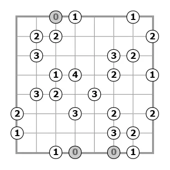
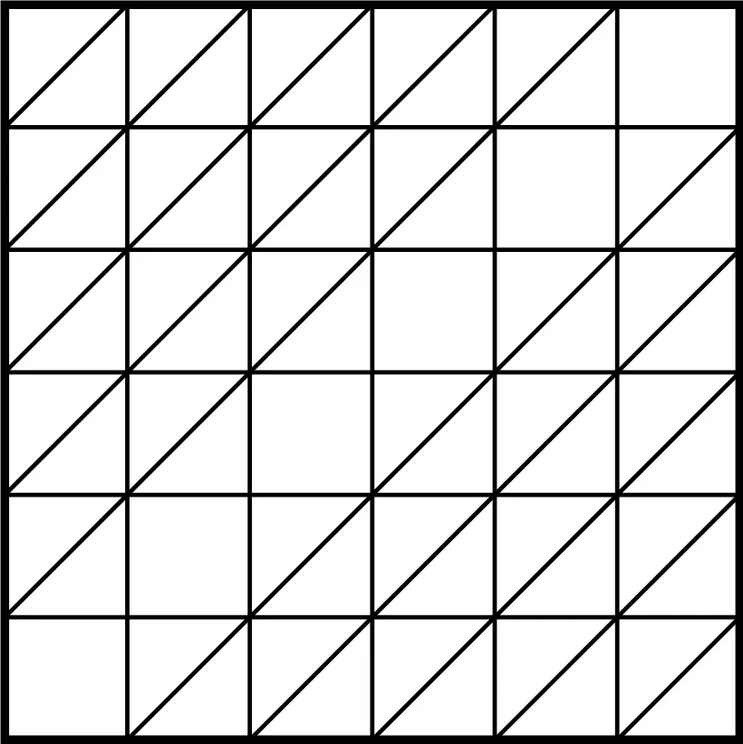

## Background

My girlfriend likes to play this game called [Slant (also known as Gokigen Naname)](https://www.puzzle-slant.com/) on this site of puzzle-like games and she's really fast at it; this problem somewhat reminded me of that game. Here is an example of what a board looks like, with the following rules: every unit square must contain one and exactly one diagonal (these will be our edges), there may be no cycles, and all given numbers represent initial conditions of degrees at each node (intersection between two grid lines).

I am also really bad at this game.

## Problem

Find all pairs of positive integers $(m, n)$, such that in a $m \times n$ table (with $m+1$ horizontal lines and $n+1$ vertical lines), a diagonal can be drawn in some unit squares (some unit squares may have no diagonals drawn, but two diagonals cannot be both drawn in a unit square), so that the obtained graph (where vertices are comprised of the intersection lattice and edges include the diagonals drawn and horizontal/vertical lines of the table) has an Eulerian cycle.

## Solution

Show solution

I would highly recommend drawing this out if you so wish. This problem took me clusters of thought over several days.

A graph has an Eulerian cycle if and only if all vertices have even degree. Let $G$ be the graph consisting of only diagonal edges, and call a vertex *froggy* if it is on a side of the grid but is not a corner. Then, all froggy vertices have degree 1 in $G$, and all other vertices have even degree.

::: lemma Lemma 1
The set of all froggy vertices can be partitioned into pairs $(u_1, v_1), (u_2, v_2), \ldots, (u_k, v_k)$ such that there exists a path from $u_i$ to $v_i$ for all $(1 \le i \le k)$ and these $k$ paths are disjoint.
:::

::: proof
Fix a froggy vertex $u$, and walk along the edges of $G$ until we get "stuck" (i.e. reach a vertex $v$ such that all edges incident to $v$ have already been walked upon). This means $v$ must be froggy as well, so we remove the $u$-$v$ path from $G$ and repeat this process $k-1$ times.

Define $P_i$ as the path between $u_i$ and $v_i$. For any $i$, $P_i$ divides the remaining froggy vertices into two sets — let $f(i)$ be the magnitude of the smaller of these two sets.

We now color the vertices of the grid black and white in checkerboard pattern. Then for all $1 \le i \le k$, $u_i$ and $v_i$ are the same color. The condition on diagonals implies that no path between two black vertices can cross a path between two white vertices.
:::

::: lemma Lemma 2
For all $1 \le i \le k$, $u_i$ and $v_i$ lie on different sides of the grid.
:::

::: proof
Assume to the contrary, and choose the $i$ with minimal $f(i)$ such that $u_i$ and $v_i$ lie on the same side of the grid. Let $S$ be the set of vertices between $u_i$ and $v_i$ on that side of the grid. WLOG let $u_i$ and $v_i$ be black. Then by the minimality of $i$, any white vertex in $S$ is paired with a white vertex not in $S$ — absurd! And thus the claim.
:::

::: lemma Lemma 3
Either $m = n$ or for all $1 \le i \le k$, $u_i$ and $v_i$ do not lie on opposite sides of the grid.
:::

::: proof
Once again we assume to the contrary that $m \ne n$, and so there exists some $i$ such that $u_i$ and $v_i$ lie on opposite sides of the grid. Let $S_1$ and $S_2$ be the sets of froggy vertices on either side of $P_i$. Note that $|S_1|$ and $|S_2|$ are both odd. WLOG let $u_i$ and $v_i$ be black and lie on the top and bottom sides of the grid, respectively. This leads us to two cases.

*Case 1:* There are an odd number of white vertices in $S_1$. Then at least one of these vertices must be paired with a white vertex in $S_2$, which gives us a contradiction.

*Case 2:* There are an odd number of black vertices in $S_1$. Then at least one black vertex $u$ in $S_1$ must be paired with a black vertex $v$ in $S_2$. If either $u$ or $v$ lies on a vertical side of the grid, then $P_i$ and the path between $u$ and $v$ will "box in" at least one froggy vertex, forcing a contradiction to Lemma 2. Hence, $u$ and $v$ lie on the left and right sides of the grid (in some order). Now consider the four quadrants into which $P_i$ and the path between $u$ and $v$ divide the grid. In any one of these quadrants, the number of the white froggy vertices on the vertical side must equal the number of white froggy vertices on the horizontal side. In particular, the total number of white froggy vertices on the top and bottom sides of the grid equals the total number of white froggy vertices on the left and right sides of the grid.

From here, casework on the parities of $m$ and $n$ can help us conclude $m = n$, so we have a contradiction and thus the claim.
:::

Lemma 3 implies that the total number of froggy vertices on the top and bottom sides of the grid equals the total number of froggy vertices on the left and right sides of the grid. This immediately implies $m = n$, as desired.

Finally, here is the construction for $m = n = 6$, which generalizes for all $m = n$.

