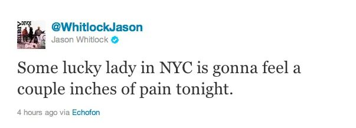
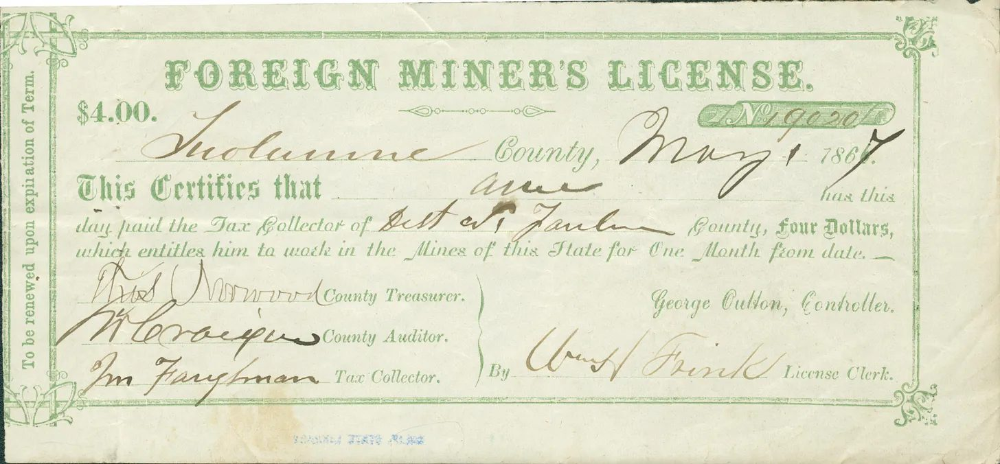
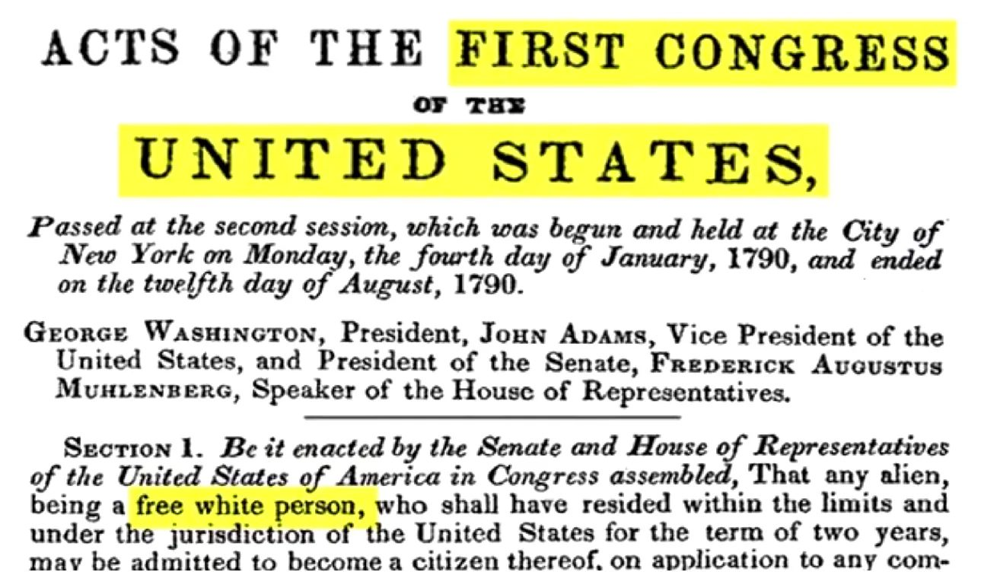
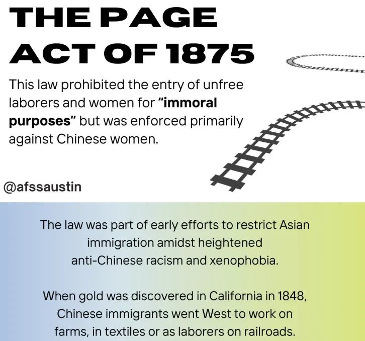
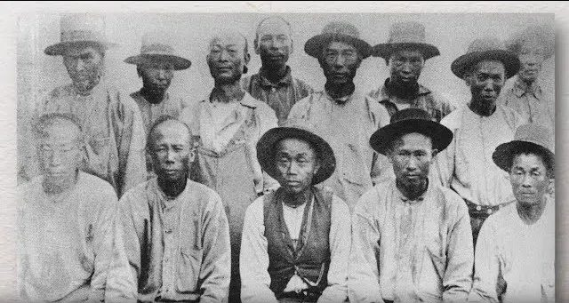
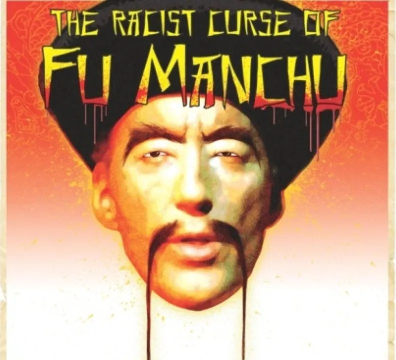
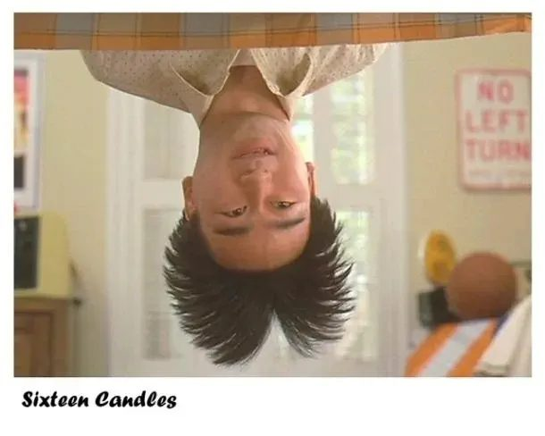

Have you ever noticed how Asian men are often seen as less masculine, especially in Western media? This is not accidental and it's not cultural. It is politically and socially engineered by American society.

After Jeremy Lin's outstanding 38-point performance where he outplayed Kobe Bryant against the Los Angeles Lakers, national columnist Jason Whitlock tweeted a particular post which unnecessarily reinforced a particular stereotype about Asian men.

But where does this idea of Asian men's perceived lack of masculinity come from?

## U.S. Immigration Policy / Chinese Labor & Economic Hardship

Let's get into the history of why Asian American men are seen as less masculine. The feminization of Asian men really began with labor exploitation in the mid-1800s when Chinese immigrants were recruited as cheap unskilled labor during the Gold Rush and for projects such as the Central Pacific Railroad. While American capitalists depend on Chinese labor, white workers were increasingly viewing Chinese men as economic threats, fueling racial resentment and violence.

This is called the **"yellow peril"** mentality, which is a racist metaphor and trope that depicts people of the East Asian and Southeast Asian countries as less human and a danger to the western world. Laws like California's mining taxes and Chinese head taxes institutionalized this hostility and as exclusion intensified, Chinese men were systematically pushed out of higher paying or industrial-paid jobs.

*Foreign Miner's Tax document, see [Foreign Miners' Tax Act of 1850](https://en.wikipedia.org/wiki/Foreign_Miners%27_Tax_Act_of_1850)*

They were confined to service or domestic jobs that were already devalued and associated with being feminine. This included laundry work, cooking, cleaning, and waiting tables. White society used this forced labor segregation as evidence that Asian men were naturally passive, servile, and feminine. By defining Asian men as weak and domestic, white masculinity could be framed as dominant, industrial, and powerful. This is contrasted to the hyper-sexualized and sexually threatening stereotypes imposed on black men.

Now this binary of putting a gender stereotype on black men and Asian men really serves white supremacy by creating a racialized hierarchy of masculinity where white men's masculinities are seen as the ideal standard, black men's masculinity is seen as the demonized form of masculinity, and Asian men's masculinity is a more feminine and desexualized version of masculinity.

## U.S. Citizenship Law Impacting Perceived Masculinity

Now U.S. law also played a central role in emasculating Asian men by denying them full citizenship, family information, and social belonging.

Immigration policy deliberately excluded Chinese immigrants from naturalization, which is really emphasized in the [Chinese Exclusion Act](https://en.wikipedia.org/wiki/Chinese_Exclusion_Act) and the [Immigration Act of 1924](https://en.wikipedia.org/wiki/Immigration_Act_of_1924), which barred most Asians from entry altogether. These laws did more than just restrict immigration. They indirectly stripped Asian men of manhood by preventing them from forming families in American society and reproducing. This is important: [Page Act of 1875](https://en.wikipedia.org/wiki/Page_Act_of_1875) barred Chinese women from immigrating to the U.S. on the terms of the idea that they were sexually dangerous and immoral.

*Taken from the Instagram account [@afssaustin](https://www.instagram.com/p/C4D9F8HBw7U/?img_index=2)*

As a result, this created bachelor societies for Asian men who were actually able to come to the U.S. where Chinatowns were predominantly male.

This significantly changed social structures and family structures for Asian men and thus they were excluded from the normative idea of masculinity, which is tied to marriage, fatherhood, and domestic stability.

## Hollywood Influence

Now fast forward to early Hollywood depictions of East Asian men: we can really say that they were almost always into emasculated roles like laundry workers, house servants, or the common and actively harmful "Fu Manchu" stereotype.

We can see that these stereotypes were built not only on the legal history of China's exclusion, but also on the labor positions they were forced into because of the "Yellow Peril" trope. While Asian women were fetishized as "exotic" and "submissive", Asian men were desexualized and denied romantic agency. We can really see this in the character Long Duk Dong in *Sixteen Candles*, who is often cited as a central example for the fact that he is treated as bizarre, socially awkward, the butt of jokes, and thus sexually ridiculous.

Over time, these types of film depictions have profound effects: they really teach young audiences, especially impressionable teens growing up with this content, that Asian men are not the main guy, not the main interest, and not the standard for masculinity or attractiveness. Therefore, [studies](https://pmc.ncbi.nlm.nih.gov/articles/PMC4631383/) have consistently shown how Asian men are rated as less desirable and less masculine in Western dating contexts. Thankfully, there are changing dynamics in today's media that really redefine what masculinity looks like for Asian men in Hollywood, and even in the tangentially related K-pop! It really shows that Asian men *can be romantic leads*, which really breaks decades of Western media ridiculing Asian bodies.

We must continuously practice seeing people of color as full complex human beings and not just racialize them to a few hateful and hurtful stereotypes. Because in reality there is no such thing as a morally superior form of masculinity. Masculinity looks very different for so many different types of people.

## Sources

[Asian American Masculinity Eclipsed: A Legal and Historical Perspective of Emasculation Through U.S. Immigration Practices](https://digitalcommons.wcl.american.edu/cgi/viewcontent.cgi?article=1164&context=tma) **(Motivation for this post!)**

[Foreign Miners Tax documents, 1850-1867. Santa Clara University Digital Exhibits](https://dh.scu.edu/exhibits/exhibits/show/immigration/item/5536#?c=0&m=0&s=0&cv=0&xywh=-136%2C0%2C4931%2C2163)

[Immigration Policy and Racism | Jeff's Jottings](https://jeffsjottings.wordpress.com/2017/03/19/immigration-policy-and-racism/)

[Relationship Involvement Among Young Adults: Are Asian American Men an Exceptional Case? - PMC](https://pmc.ncbi.nlm.nih.gov/articles/PMC4631383/)
