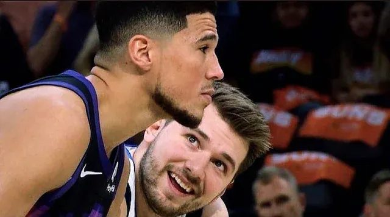
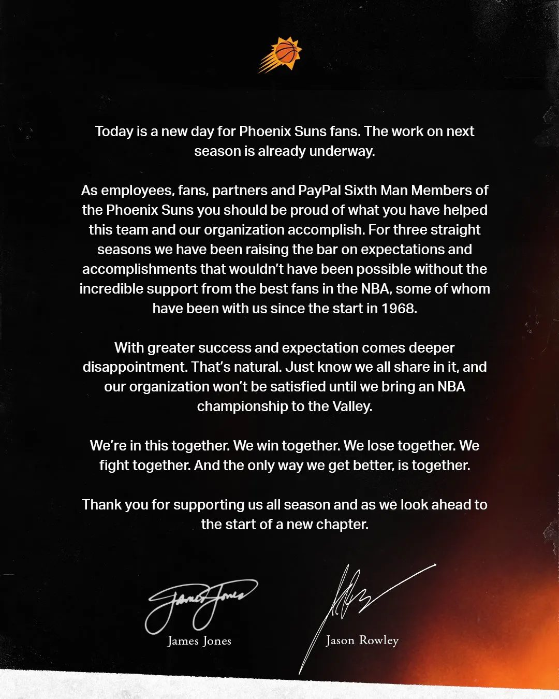

In the 2022 playoffs, the Phoenix Suns and the Dallas Mavericks were facing off against each other. The Phoenix Suns had an outstanding regular season record of 64-18 which had earned them the #1 seed, whereas the #4 seed Dallas Mavericks were a one-headed monster led by offensive superstar phenom Luka Doncic (right in the picture above). The Suns were led by stars Devin Booker (left in the picture above) and the veteran Chris Paul. In the best-of-seven series, the Suns had a 2-0 lead to start, they were heavy favorites to win the series.

During game 5, Devin Booker of the Suns drove hard to the basketball hoop but fell down on the ground for a few moments, before popping back up with a smile, calling this move “The Luka Special”. What he’s insinuating here is that Luka Doncic is a **flopper** (*a player who intentionally embellishes physical contact in hopes of the referee calling a foul in their favor*), which honestly has some validity, but definitely is along the lines of uncalled for trash talk.

<iframe src="https://www.youtube-nocookie.com/embed/LhG0uxTni1A" title="'The Luka special' Devin Booker has jokes after stumble (NBA on ESPN)" loading="lazy" allow="accelerometer; autoplay; clipboard-write; encrypted-media; gyroscope; picture-in-picture; web-share" allowfullscreen></iframe>

The Suns went on to win game 5, taking a commanding 3-2 lead, and Luka was not very happy about this and Booker’s comment as they left through the tunnel after the game.

> “***Everybody acting tough when they up.***”

The Mavericks went on to win game 6, setting up an epic winner-take-all game 7 at Phoenix to decide the winner of the series between the two teams. The Phoenix Suns were fully healthy and ready to go, but so were the Dallas Mavericks. Now for context, it’s certainly a choice to anger Luka Doncic in the playoffs. In the entire history of the NBA, Luka Doncic is **2nd** in points per game in the playoffs, only to Michael Jordan. Luka is one of the scariest players and he’s been known to fully take over games offensively, but the issue before was that his teams were never good enough to support him, but this year his team had improved slightly. He had role players who were stepping up in big moments, so less was on his shoulders alone.

I remember I was super excited for this game, so I made sure to leave early from my internship just to watch the game with my dad. My dad did his PhD in Dallas, so he was a huge Dallas fan (yes, that sadly does include the Cowboys) and we were both rooting for Luka and the Mavericks, hoping that they would win this epic game.

The score at the first half was 57-27 in favor of the Mavericks. My dad and I had gone from excitement and shouting due to the Mavericks initially winning to awe and shock at how bad Luka was thrashing the entire Suns team. Luka had 27 points in the first half and the **entire Suns team** had 27 points at the half as well. A role player for the Mavericks, Spencer Dinwiddie, was also on fire as he had 21 points himself in the first half. While Dinwiddie is definitely underrecognized for his amazing performance in this game, Luka’s output is definitely far more impressive because he started the avalanche which opened up opportunities for Dinwiddie. The two Suns stars I had alluded to before, Devin Booker and Chris Paul, had a measly 3 points, without making a single shot and only making free throws. The rest of the game was the same story, as the Suns lost 123-90. After all that trash talk, how does the #1 seed with their season on the line collapse so badly?

This is probably the only time I have ever seen a vital NBA playoff game over by the middle of the second quarter. Luka Doncic ended up with 35 points, and he would have easily had 50 had he not rested for the entire fourth quarter, knowing the game was a done deal and preparing himself for the next round. Over the series, Luka had more points than the Suns’ leading scorer Devin Booker, more assists than the Suns’ league-leading assister Chris Paul, more rebounds than the Suns’ leading rebounder Deandre Ayton, and more steals than the league’s Defensive Player of the Year runner up, Mikaal Bridges.

You may remember that the game was taking place in Phoenix. The crowd started out very loud and energetic for the first few minutes, but that was all they would get. Luka kept silencing them, one dagger after the other, groans coming from every impossible shot he was making. To finish the first half, Luka first dribbles the ball up the floor, does a ridiculous twirl with the basketball on the left wing, steps back, and hits a deep three over Suns’ player Cameron Johnson which even the announcer Kevin Harlan is raving about the difficulty of this shot. He follows this up with picking on Cam Johnson again on the next possession and crosses him up so badly that he makes Johnson fall down on the seat of his pants while sliding backwards and makes the three pointer from near half court which sent both me and my dad screaming with how badass that was.

There was one point in the third quarter where Luka steps back to hit a deep three-pointer over Deandre Ayton to make the score 65-27, and at that moment Luka outscored the Suns on his own (30 points to their 27), with the camera cutting to two fans with deadpan hollow looks on their faces.

The Mavericks were up by 45 at one point, and Chris Paul of the Suns hit a three pointer which gave birth to a new generational meme.

<iframe src="https://www.youtube-nocookie.com/embed/ceOYZibzwu4" title="Chris Paul hits a huge three to cut the lead down to 42 (Sport and Things)" loading="lazy" allow="accelerometer; autoplay; clipboard-write; encrypted-media; gyroscope; picture-in-picture; web-share" allowfullscreen></iframe>

Luka Doncic is definitely talented and skilled out of this world, but what separates him from other players, is his will to win and his killer instinct. Throughout the game, Luka was smiling at the Suns players and fans, not out of happiness, but out of superiority, disdain, and his sheer will to demolish them. Luka Doncic would rather die trying on the court to win rather than lose a game 7 (which he had shown the previous year when he had 46 points and gave it his all as he scored or assisted on 77 of his team’s 111 points in a loss to the Clippers, a game 7 NBA record). I have never seen him back down to anyone and he plays better under pressure and when he’s angry, which is rare even for superstars in the league. He was just that confident when he loudly shouted his quote after game 5, knowing he was going to give it his all to win this series. There is no end to what he will do to win; it’s almost psychotic at times.

Luka reminds me a lot of Michael Jordan. In the 1990s, players were scared to trash talk MJ because they already knew there was a high chance he would utterly dismantle them, so if they kept quiet, maybe there was a chance he would spare them from embarrassment in front of their home crowd, friends, and family. Luka is cut from the same cloth. He takes it personal and plays even better, seeking to embarrass anyone who bothers him, which he has done as recently as the 2024 playoffs!

Luka had embarrassed the Suns so badly, that their front office released a statement **apologizing to their fanbase**. This is the only time I have ever seen a team apologizing to their fans in the NBA.

This game is a masterpiece which I watch every month. Here’s the highlights of Luka Doncic and Spencer Dinwiddie taking turns to spank the Suns left and right.

<iframe src="https://www.youtube-nocookie.com/embed/c5Iz0Mm1jjI" title="Luka Doncic (35 PTS) & Spencer Dinwiddie (30 PTS) HISTORIC Game (NBA)" loading="lazy" allow="accelerometer; autoplay; clipboard-write; encrypted-media; gyroscope; picture-in-picture; web-share" allowfullscreen></iframe>

