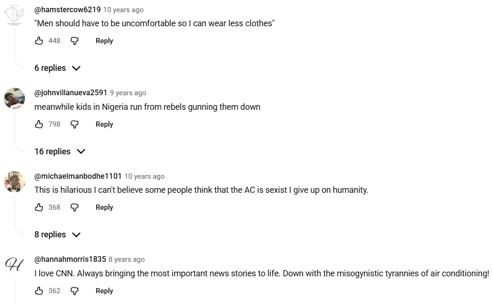
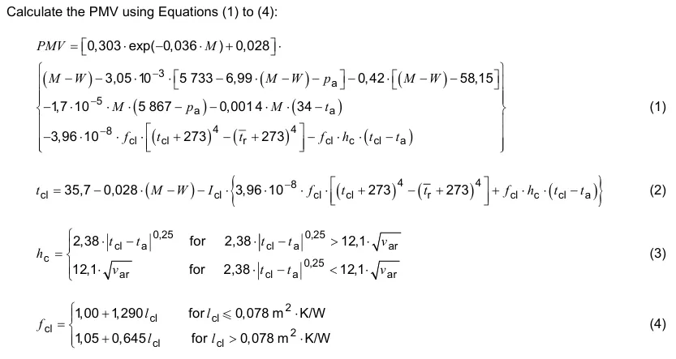

This was quite an intriguing and unexpected source of sexism for me, so I thought it would be cool to share, especially because **the science supports this**. I'll start by showing some screenshots of the top YouTube comment sections in response to the Sky News video ["Why Office Air Conditioning Is Sexist"](https://www.youtube.com/watch?v=MNH0bmYT7os) and CNN's ["Is the air conditioning 'sexist' at your office?"](https://www.youtube.com/watch?v=7svV9VXdlAQ) which moronically attempt to invalidate this issue.

The formula for a standard office temperature was set back in the 1960s by Professor Povl Ole Fanger, whose work specialized in optimizing thermal comfort. In his thesis, Fanger derived and proposed the following model for a metric he designated as Predictive Mean Vote (PMV), which combines six key variables (***metabolic rate***, *clothing index*, air velocity, mean radiant temperature, dry-bulb temperature, water vapor pressure) to help engineers design comfortable spaces. The formula predicts a 7-point scale from -3 (cold) to +3 (hot), with 0 being neutral, the mean value of the subjective ratings of a group of people in a given environment.

*Screenshot taken from [ISO 7730](https://cdn.standards.iteh.ai/samples/39155/9632a0563ca742209edb45856ff69296/ISO-7730-2005.pdf), though ASHRAE 55 is similar*

You may notice that some of these variables can be measured or obtained such as the temperatures and air velocity, but two variables (italicized in the above list) must be estimated or assumed. In Fanger's model, one of them, the **metabolic rate**, is based on a 40-year-old man weighing 70 kilograms, or 154 pounds. This led to the result of an optimal comfortable office temperature of 21°C, or 69.8°F, which I would say seems to match the typical office temperature I have experienced.

However, a [2005 study](https://journals.physiology.org/doi/full/10.1152/japplphysiol.00023.2004) showed that women's metabolic rates are significantly lower, *up to 35% lower*. Two doctors (both male by the way, kings!) noticed this in 2015 and questioned the absurdity of setting a default one-fits-all temperature which ignores over half the population. Dr. Boris Kingma and Dr. Wouter van Marken Lichtenbelt, in their paper [Energy consumption in buildings and female thermal demand](https://www.nature.com/articles/nclimate2741), assert that for the same given conditions, if the thermoneutral mean skin-temperature zone (basically the "sweet spot" where the body's metabolic heat production matches heat loss to the environment, keeping the body warm or cool enough without extra effort) is assumed, then the biophysical thermal comfort zone for females ranges from 23.2 - 26.1°C, or 73.76°F - 78.98°F.

This means that most offices are **on average 3.6°C (6.5°F) too cold for women, which should be alarming**. It's partially why you so often see women wrapped in scarves/shawls, or bundled up in cozy winterwear such as sweaters, jackets, hoodies, etc. while men are just comfortable in their summer clothes in the same environment. Thus, the scientists of the article strongly urge for either an enhanced or preferably, completely recalibrated model based on their biophysical findings which appropriately acknowledges women. To put the cherry on top, by catering towards women in this specific instance, we not only allow for a more productive workspace, but we also actually *save* energy.

To these claims, the at best willingly inexorable individual might respond that clothing index is another factor, and perhaps the clothes women wear is the difference. Worse, a misogynistic individual may comment in similar fashion as the aforementioned YouTube comments, along the lines of how women could simply dress more instead of "wearing less clothes". After all, there's only so many clothes men can take off compared to how simply women can just throw on a warm layer, right?

You're probably seeing the issue here, which is the remarkably clear lack of equity (and awareness), because why should we expect women to spend extra money and effort to adjust to standards set for most men? Surprise, men are the ones who have predatorily created the structure of the *pink tax*, pocket discrepancies, sizing issues, inequitable costs, etc. and that could be an entirely separate post of why victim-blaming women about clothing is inane. The clickbait title sounds ludicrous at first glance, but *that's sort of the point here*. All of those YouTube comments fell for the bait.

So, what are possible solutions? One possibility that aligns with the aforementioned two scientists is **to create a new formula/model** to more accurately present the findings. One alteration we most likely need for this new model is to introduce more variables into this model, such as body fat tissue and age to name a few. Another option is to scrap the notion of seeking the generalized ideal temperature formula for everyone and instead lean towards the [Personal Environmental Module (PEM)](https://escholarship.org/uc/item/717760bz) system where each individual can control their local temperature, which had been tried before in the 1990s, but was determined to be too costly at the time.

The overarching point here is *it isn't just about feeling cold*. This societal structure is a perfect metaphor for a world that was designed by and for men by default. It shows how women's discomfort is often dismissed as personal problems while it's actually a design flaw in the system itself.

## Sources

[Metabolic equivalent: one size does not fit all](https://journals.physiology.org/doi/abs/10.1152/japplphysiol.00023.2004)\
Nuala M. Byrne, Andrew P. Hills, Gary R. Hunter, Roland L. Weinsier, and Yves Schutz\
Journal of Applied Physiology 99:3,1112-1119 (2005).

[Energy consumption in buildings and female thermal demand](https://doi.org/10.1038/nclimate2741)\
Boris Kingma, Wouter van Marken Lichtenbelt\
*Nature Clim Change* **5**, 1054–1056 (2015).

[A Field Study of PEM (Personal Environmental Module) Performance in Bank of America's San Francisco Office Buildings](https://escholarship.org/uc/item/717760bz)\
Fred Bauman, Graham Carter, Anne Baughman, Edward A. Arens\
eScholarship *Open Access Publications from the University of California* (1997).
