Here is my first attempt at a longform post that seeks to be highly instructive as well as fun.

## Introduction

In the event that the culture of today is lost to time, I shall provide context for why this problem is worth looking at. The Internet has unfortunately been plagued with inane clickbait “emoji math problems” that look something like this piece of hot garbage:

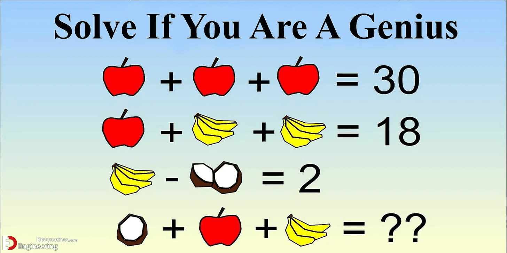

They’re more or less constructed so that it’s easy to mess up (look carefully at the bananas), so that people get different answers sparking arguments and discussion and viralness, etc...

Naturally, actual passionate math people are sick of this. In early 2017, a [Reddit thread](https://www.reddit.com/r/math/comments/5mm6sm/requestfun_im_really_sick_of_all_the_facebook/dc5dwrc/) titled “**I’m really sick of all the Facebook fruit math bull that’s going on lately. Does anyone want to create a truly difficult math problem with pictures of fruit to counter this?**” appeared on r/math. One user there created this:

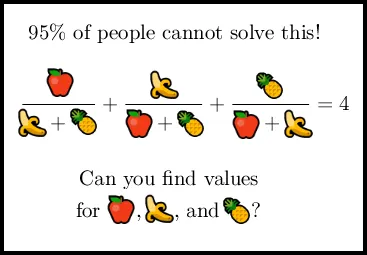

This isn’t *too* hard. Some patience or a brute force search can reasonably solve this over the integers (potential solutions exist such as (11, 9, -5) and (11, 4, -1)). But here’s where the fun begins.

A mathematician by the name of Sridhar Ramesh saw the above image and decided to make a small tweak before popularizing it.

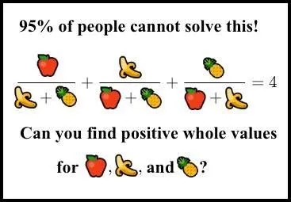

And just like that, the problem became notoriously difficult. The smallest solution is more than 80 digits long. This problem is widely believed to require a “massive level of knowledge about elliptic curves”.

But we are not silly Facebook posters arguing over viral math problems. We have the tools to solve this problem together. Here’s how I finally solved it.

*Prerequisites: Basic polynomial theory, e.g. Vieta’s Formulas (knowledge about the sum and products of roots), should be enough*

## Warmup - Tackling an Easier Problem

**Problem:** Find all Pythagorean Triples

*Solution:* We are solving the Diophantine Equation $x^2 + y^2 = z^2$ in nonnegative integers, which isn’t really that great. Instead, we could be working with one less variable by solving $(x/z)^2 + (y/z)^2 = 1$. Letting $x_1 = x/z$, and $y_1 = y/z$, we can essentially say we are solving the same problem of $x_1^2 + y_1^2 = 1$ in the nonnegative rationals.

> *Caveat:* It’s not exactly the same because although every $(x, y, z)$ will correspond to a $(x_1, y_1)$ in this way, we can’t go the opposite direction. For instance, $(3, 4, 5)$ and $(6, 8, 10)$ both correspond to $(3/5, 4/5)$. The fix is easy: whatever solutions we get for $(x_1, y_1)$, when we recover the $(x, y, z)$ from $(x_1, y_1)$, we can just remember that we can get any multiples as well. This issue will more or less fix itself, see if you can spot why.

You might be asking why are we really so much happier to work with rationals? The problem is now “find all *rational points* on the unit circle”, where a rational point is just a point with rational coordinates. Is this really any easier?

Here’s a trick that kills this problem.

1. Start by finding *some* point $P = (x_1, y_1)$ that works. Let’s take $(0, 1)$ for example.
2. Draw any line with *rational slope* going through $P$. This can be something like

    $$y = \frac{m}{n}x + 1$$

    where $m/n$ is rational.

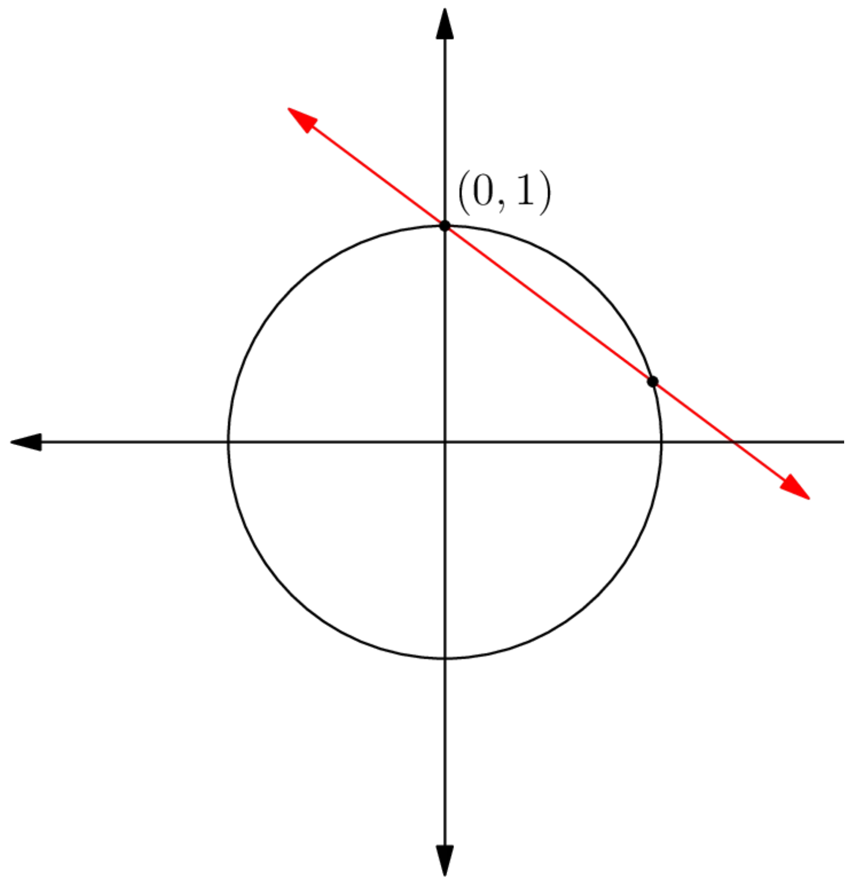

3. This will (almost surely) always intersect the circle at a second point $Q$.
4. $Q$ **must always** be another rational point!

Why is 4 true? To find the coordinates of this second point, we are solving the system of equations

$$\begin{cases} x_1^2 + y_1^2 = 1 \\ y_1 = \frac{m}{n}x + 1 \end{cases}$$

We already know one solution, which is $(x_1, y_1) = (0, 1)$. So, when we eliminate $y_1$ to the quadratic

$$x_1^2 + \left(\frac{m}{n}x_1 + 1\right)^2 = 1 \qquad (*)$$

we can make the following logical arguments:

- The coefficients of the quadratic are rational.
- Therefore, by Vieta, the sum of the roots is rational.
- We know that one root is rational, since we drew the line through a rational point. Therefore, the other root must be rational.
- If $x_1$ is rational, then $\frac{m}{n}x_1 + 1$ is rational, hence $y_1$ is rational.
- Therefore, the second point of intersection of this line with the circle is a rational point.

We conclude that **drawing any line of rational slope through $P$ will give us another rational point on the circle**. But it’s actually even better than that! Note that if $(x_1', y_1')$ is another rational point, then the line connecting $P$ and $(x_1', y_1')$ must have rational slope. So, **if we draw every line of rational point through $P$, we hit EVERY possible rational point on the circle**.

So now, let’s find the second point for all possible slopes $m/n$. By expanding out the equation $(*)$,

$$\frac{m^2+n^2}{n^2}x_1^2 + \frac{2m}{n}x_1 = 0$$

We already knew $x_1$ was a root, so we can factor it out to get our other root.

$$\begin{align}
x_1\left(\frac{m^2+n^2}{n^2}x_1 + \frac{2m}{n}\right) &= 0 \\
x_1 &= 0, \frac{-2mn}{m^2+n^2}
\end{align}$$

So, the $x$-coordinate we are looking for is our other root, $-2mn/(m^2 + n^2)$. Some algebra can give us the value for $y_1$.

$$y_1 = \frac{n^2-m^2}{m^2+n^2}$$

By clearing up some of our denominators and cleaning some of our signs, we have the following parameterization that all Pythagorean triples may be characterized as

$$(x, y, z) = (2mn, n^2 - m^2, n^2 + m^2)$$

for positive integers $m$ and $n$, up to some integer multiple. This is a very nice fact in Olympiad number theory that you may have heard before.

What was the point of this problem? What did we learn? The important takeaway is that *drawing lines can get you more points*. Here, we just drew one line through a point to get another point. Although this won’t quite work for the original problem, the idea is very similar.

## Starting Off

Getting rid of the ludicrous fruit mumbo jumbo, we start with the following equation:

$$\frac{x}{y+z} + \frac{y}{x+z} + \frac{z}{x+y} = 4$$

An experienced number theorist might immediately notice that this equation is homogenous, but we can work this out.

By clearing out all denominators and some algebra, we can eventually get

$$x^3 + y^3 + z^3 = 3\left(x^2(y+z) + y^2(x+z) + z^2(x+y)\right) + 8xyz$$

Rather than trying to solve this in positive integers, we’re going to write this in terms of $x_1$ and $y_1$ to try and find rational points, positive or negative. Hopefully, this will make things easier.

Dividing the equation by $z^3$, we have

$$\left(\frac{x}{z}\right)^3 + \left(\frac{y}{z}\right)^3 + 1 = 3\left[\left(\frac{x}{z}\right)^2\left(\frac{y}{z}+1\right) + \left(\frac{y}{z}\right)^2\left(\frac{x}{z}+1\right) + \frac{x}{z} + \frac{y}{z}\right] + 8\left(\frac{x}{z}\right)\left(\frac{y}{z}\right)$$

$$x_1^3 + y_1^3 + 1 = 3\left[x_1^2(y_1+1) + y_1^2(x_1+1) + x_1 + y_1\right] + 8x_1y_1$$

If we graph this equation, it looks like this:

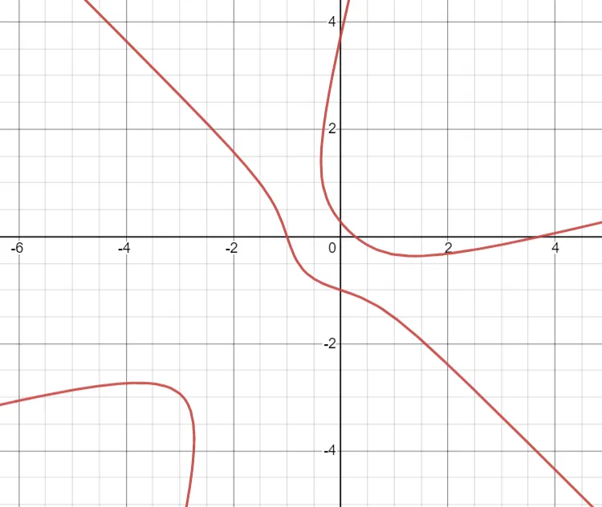

One observation you might have is that this graph is sort of “tilted” by $45^\circ$. This is quite intuitive as switching $x_1$ and $y_1$ should not affect anything in the above equation, hence the reflection over the $y = x$ line.

One thing that we can do (but is totally unnecessary) is to rotate the graph such that it has symmetry across the $x$-axis. We can perform the substitution $x_2 - y_2 = x_1$ and $x_2 + y_2 = y_1$ to get a new equation involving variables $x_2$ and $y_2$.

$$1 - 6x_2 - 11x_2^2 - 4x_2^3 - y_2^2 + 12x_2y_2^2 = 0$$

Cool, here’s how the graph looks.

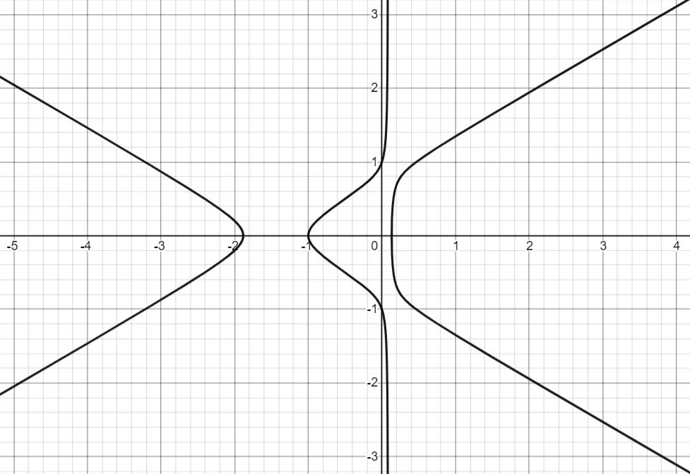

This is nice and symmetrical. We will call this curve an *elliptic curve*.

Just by looking at the graph, there are some pretty easy rational points that we can spot: $(0, 1)$, $(-1, 0)$, and $(0, -1)$, which I will call **P**, **3P**, and **5P**. (There is a reason for these weird labels, we will see why later).

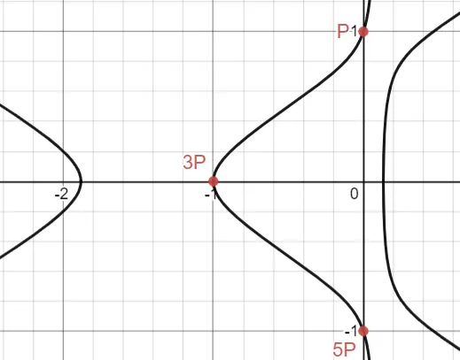

Unfortunately, finding these points does not at all mean we are done. These points correspond to invalid solutions to the original problem. However, can we use these “easy points” to find even more points?

## Bringing Back the Line Trick

This process will let us obtain more points.

1. Start with two rational points $P$ and $Q$ that lie on the elliptic curve.
2. Draw the line $PQ$. Note that this has rational slope because $P$ and $Q$ are rational points.
3. $PQ$ will always intersect the elliptic curve a third time (including multiplicity), at point $R$.
4. Moreover, $R$ will always be another rational point!

There are some things to explain here: Why must the line intersect a third time, and why must the third intersection be a rational point? We may reason analogously to the warm-up:

- The third point $R = (x_2, y_2)$ satisfies the system of equations
  $$\begin{cases} 1 - 6x_2 - 11x_2^2 - 4x_2^3 - y_2^2 + 12x_2y_2^2 = 0 \\ ax_2 + by_2 = 1 \end{cases}$$
  where $ax_2 + by_2 = 1$ is the equation of the line passing through the points $P$ and $Q$.
- If we solve for $y_2$ in the second equation and substitute it into the first equation to eliminate the variable, then we are left with a cubic equation in $x_2$.
- This cubic has rational coefficients. This is because the coefficients $a$ and $b$ have to be rational, since the line has rational slope and passes through rational points.
- Therefore, by Vieta, the sum of the roots of the cubic is a rational number.
- But two of the roots are given by the $x_2$-coordinates of $P$ and $Q$, both of which are rational.
- Therefore, the third root is rational. This means that the $x_2$-coordinate of $R$ is rational.
- Using $ax_2 + by_2 = 0$, we conclude that the $y_2$-coordinate is rational as well. Thus $R$ is a rational point.

Cool! But we should not forgo an important remark: Intersections are counted *including multiplicity*. It’s possible, for example, to take $P$ and $Q$ to be the same point. Then the “line” is actually the tangent to the curve at $P$, and this still works. (can you see why?)

Anyways, we now know that **if we connect two rational points on the elliptic curve, then we can get another rational point on the curve**. Let’s try it out.

By connecting $(0, 1)$ and $(-1, 0)$, with a line, we find that there is a third intersection at $(-1/2, 1/2)$.

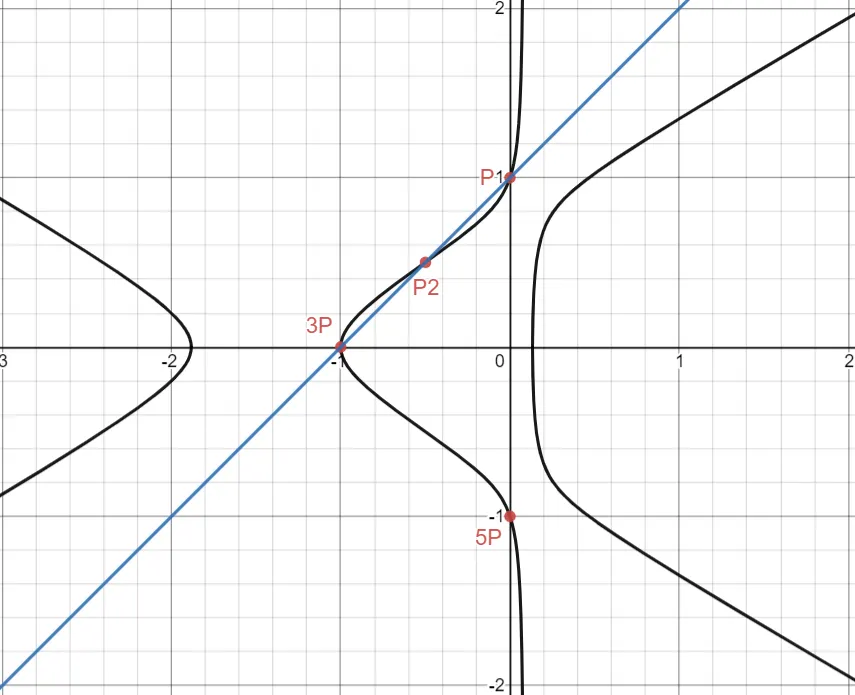

And indeed, if we plug it in, it works! What else can we get?

By “connecting $(0, 1)$ and $(0, 1)$ with a line”, or taking the tangent line to $(0, 1)$, we can find yet another third intersection with the curve.

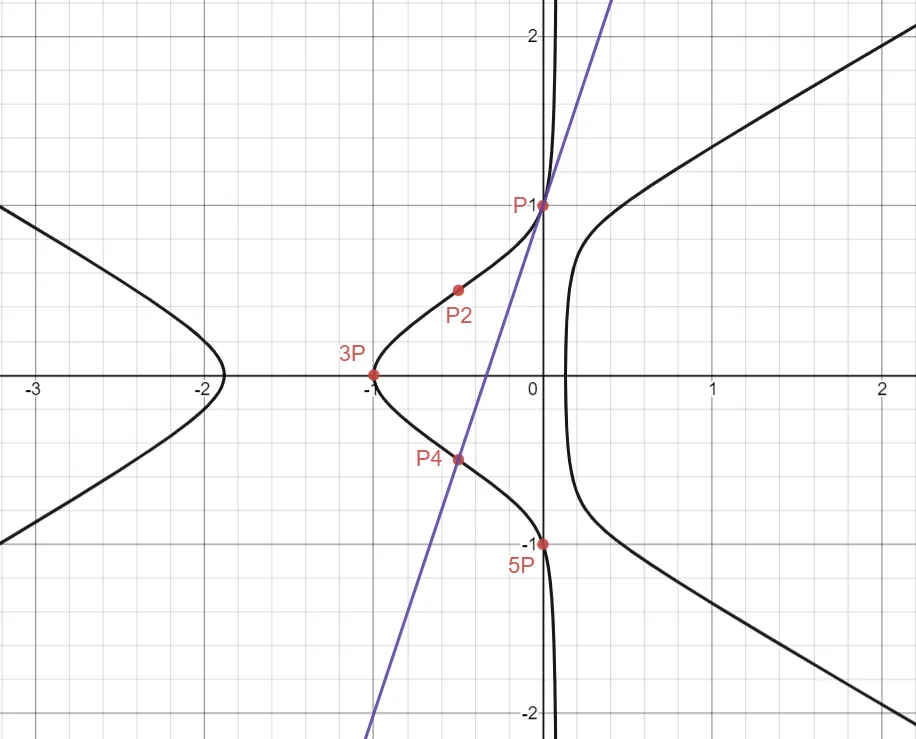

This time it’s at $(-1/2, -1/2)$. That’s pretty lame: We could have figured that out by taking the previous point we got and flipping it over the $x$-axis. Is there anything else we can get easily?

The answer is no. This is because these 5 points (and another hidden “point” that I won’t describe) are *points of torsion*. No matter how many more times we use the line trick, we won’t get any more new points.

Darn. How can we get points that can “escape” these 5 points?

## Finding More Points of Infinite Order

Because I am a little lazy and stupid, I wrote some Mathematica code to try and find some less trivial points on the curve.

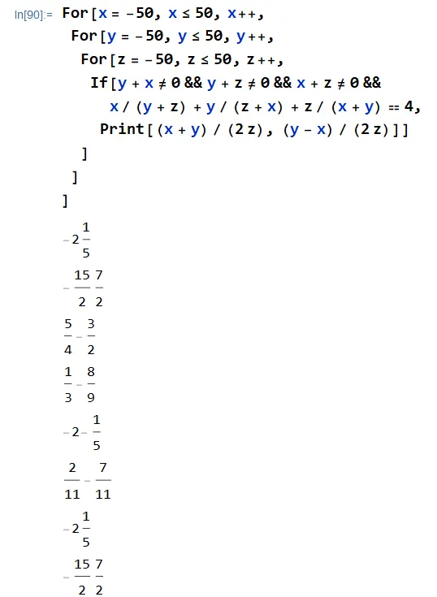

This found some nice points! I experimented a lot with all the points, but the one that gave me the key insight was this first point, $(-2, 1/5)$. I’ll call this point **A**.

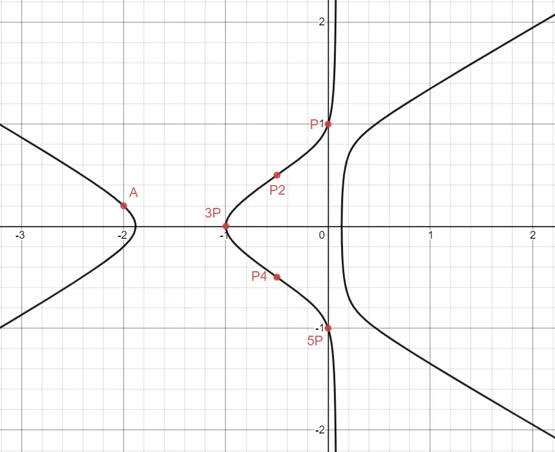

Before we proceed to find more rational points, we need to address a couple of things.

First, **what rational point am I even trying to find?** If we test A out, we find that it doesn’t work because some of the resulting variables $x$, $y$, $z$ may end up being negative. So, we’re trying to find rational points $(x_2, y_2)$ such that they correspond to a completely positive triple $(x, y, z)$.

When does that happen? Let’s reason it out by backtracking a bit.

- We can assume that some variable (WLOG $z$) is positive, because if all the variables $x$, $y$, and $z$ are negative, then we get an all-positive situation by flipping all of their signs
- $x, y > 0$ when $x/z, y/z > 0$, i.e. $x_1, y_1 > 0$
- This means that we want $x_2 + y_2 > 0$ and $x_2 - y_2 > 0$. In other words, $x_2 > |y_2|$

We can visualize these conditions by the green region below

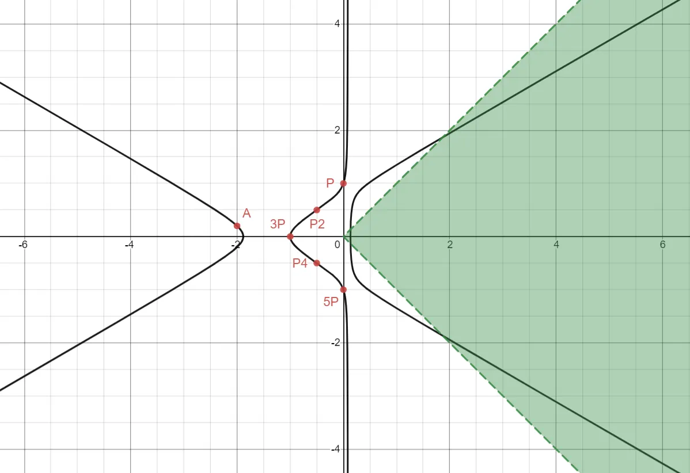

To reiterate, **our goal is to find a rational point on the curve that lies in this region**. Hence, this turns into a fun little game of “math football”: We need to use the line trick to generate more and more points until we reach the “goal” that is the green region.

This is a pain to do by hand that even Gauss could not have cleverly gotten out of. Fortunately, I have something he did not which is called Mathematica! This brings me to the second thing I want to address: **How can we streamline the line trick?**

Using Mathematica to do expansions for me, I found that the cubic equation resulting from finding the third intersection of the line passing through points $(a, b)$ and $(c, d)$ has sum of roots given by:

$$\frac{-\left(11a^2-22ac+11c^2+b^2(1+24c)+d^2+24ad(-b+d)-2b(d+12cd)\right)}{\left(4(a^2-3b^2-2ac+c^2+6bd-3d^2)\right)}$$

Thus, by Vieta we may write a formula for the $x_2$-coordinate of the third intersection:

$$L(a,b,c,d) := \frac{-\left(11a^2-22ac+11c^2+b^2(1+24c)+d^2+24ad(-b+d)-2b(d+12cd)\right)}{\left(4(a^2-3b^2-2ac+c^2+6bd-3d^2)\right)} - a - c$$

Similarly, I obtained a formula for the third intersection, given a tangent line at a point $(a, b)$:

$$T(a,b) := \frac{-\left(-9-282a-1741a^2-3900a^3-3204a^4-864a^5-47b^2+1860ab^2+4680a^2b^2+3456a^3b^2+108b^4-2592ab^4\right)}{108+792a+1884a^2+1584a^3+432a^4-436b^2-1488ab^2-1440a^2b^2+432b^4} - 2a$$

Would it shock you if I were to say that our numbers will get *really big*?

Keep in mind that these formulas only give us the $x$-coordinates. We now need to find the (positive) $y$-coordinate via one last formula which is not hard to derive (just solve for $y_2$):

$$Y(x) := \sqrt{\frac{1-6x-11x^2-4x^3}{1-12x}}$$

Now we can proceed to our finish.

## The Finish

From **A**, I will draw a tangent line and find a third intersection at a new point **-2A** (worry not about the labels!)

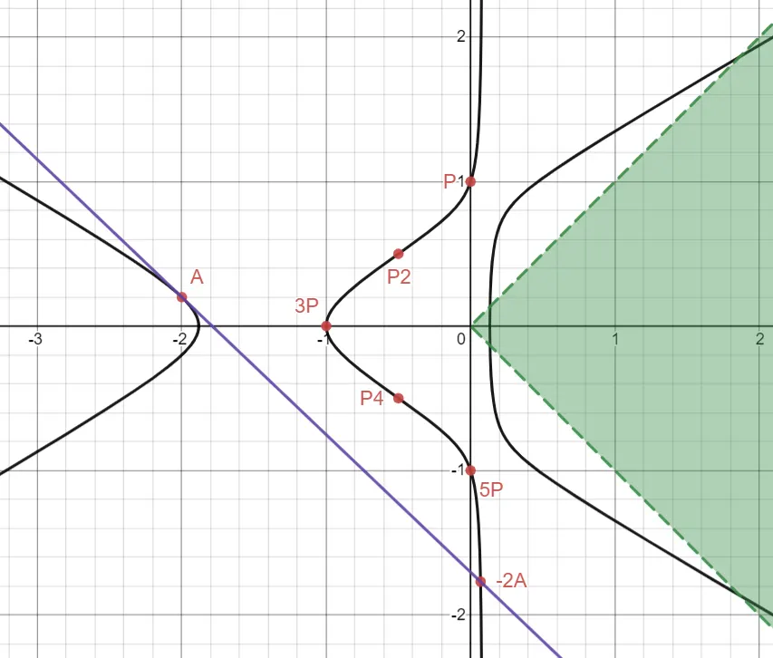

Our formulas give the coordinates for **-2A**:

![Mathematica output: T1[-2, 1/5] = 143/2066, and Y of that equals 18283/10330](fig14.png)

From **-2A**, I will draw yet another tangent line and find a third intersection at a new point **4A**.

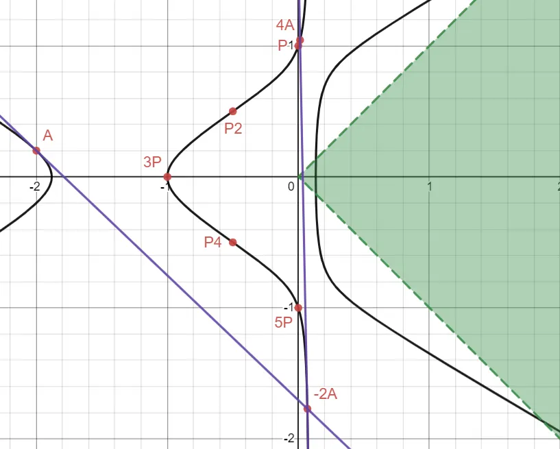

We can zoom in on the graph to see this better since **P1** and **4A** are quite close.

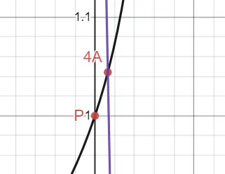

Thanks to Mathematica again for telling us the coordinates of **4A** via the formulas.

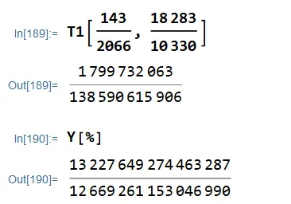

We’re not able to get within the green region yet, so we need to keep going. Comically (or hideously, depending on your perspective on the matter), I will draw yet another tangent line at **4A** to obtain the point **-8A**:

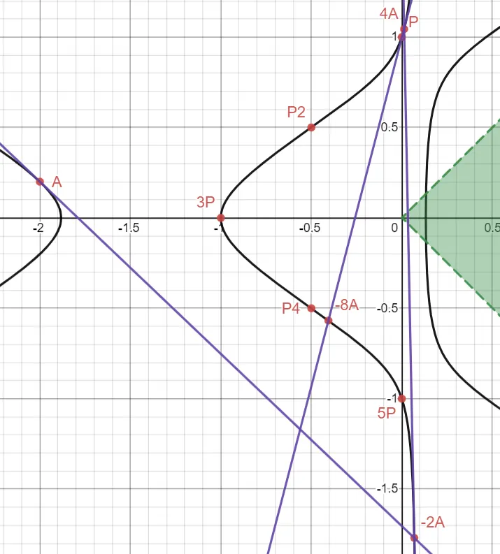

As usual, here are our coordinates:

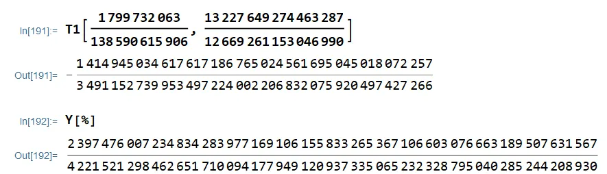

We’re done with tangents now! For convenience’s sake, I also plotted down the point **8A**, which is just **-8A** with negated $y_2$-coordinate, and I connected **4P** and **8A** with a line to get the point **-8A - 4P**:

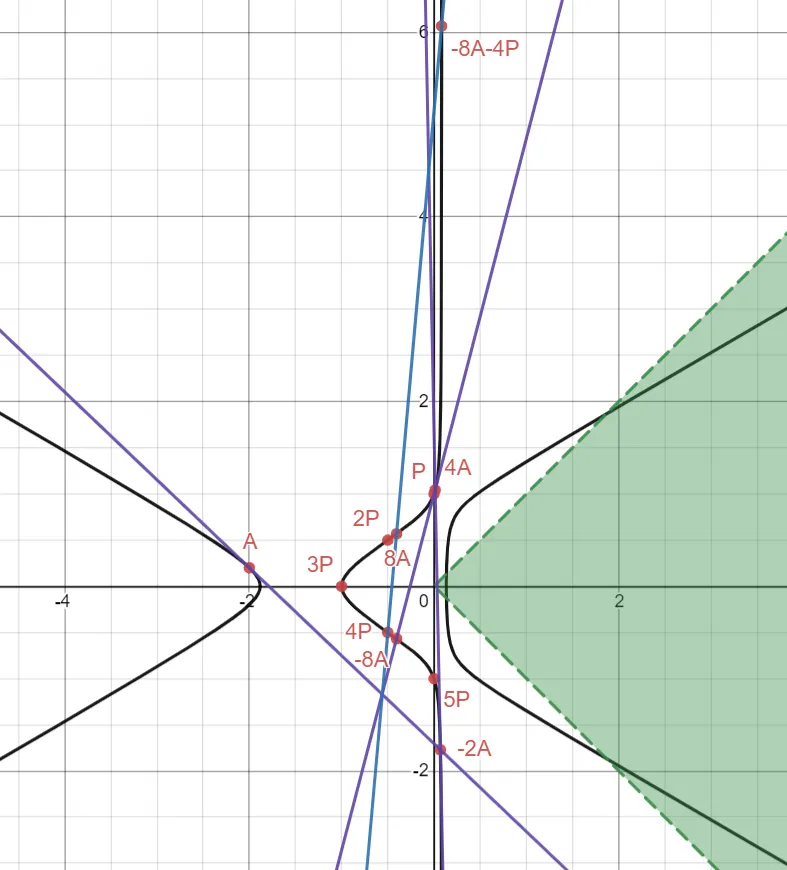

And here are our lovely coordinates:

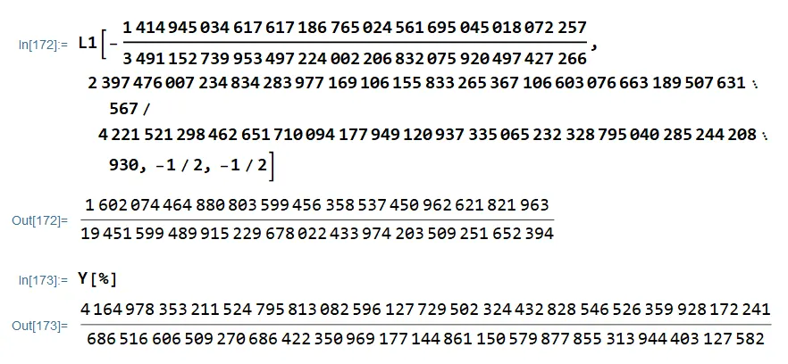

This was my plan! You might be confused as to why I am so happy about getting this point. The idea is that I needed a point quite high up there somehow in order to finally get into the green region with one more line. What is that line you ask? I’m glad you asked! All this time, I had been saving this one last “nice” rational point I was saving until the very end: **B** = $(-15/2, 7/2)$ which you might remember was the second less trivial rational point that we obtained from Mathematica. By drawing the line between **B** and **-8A - 4P**, we finally end up with a point in the green region:

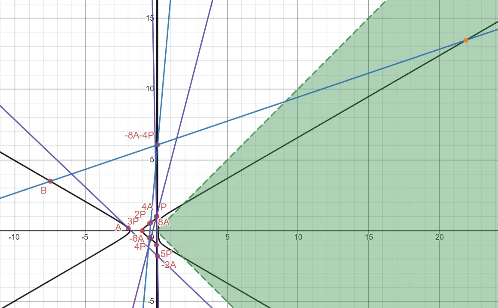

And of course, our coordinates:

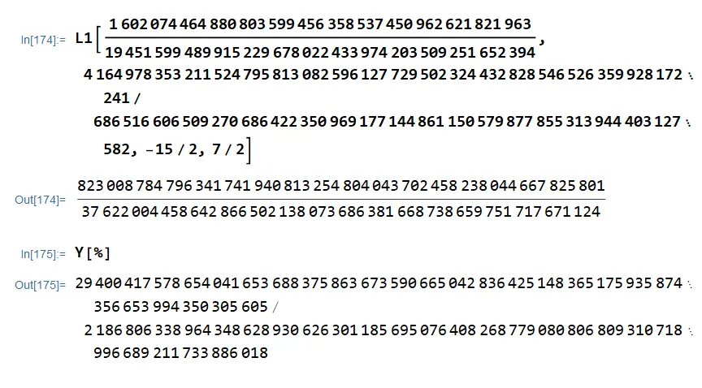

I understand it’s hard to believe, but we are almost there! Letting this final point be $(x_2, y_2)$, we compute $x_2 + y_2$ and $x_2 - y_2$ to get $x_1$ and $y_1$.

$$x_1 = \frac{36875131794129999827197811565225474825492979968971970996283137471637224634055579}{4373612677928697257861252602371390152816537558161613618621437993378423467772036}$$

$$y_1 = \frac{154476802108746166441951315019919837485664325669565431700026634898253202035277999}{4373612677928697257861252602371390152816537558161613618621437993378423467772036}$$

Recalling that these are equal to $x/z$ and $x/z$ respectively, we let $z$ be the LCM of the denominators and $x$, $y$ be the resulting numerators when we find a common denominator. This gives us the following humungous solution... *in positive integers!*

$$x = 36875131794129999827197811565225474825492979968971970996283137471637224634055579$$

$$y = 154476802108746166441951315019919837485664325669565431700026634898253202035277999$$

$$z = 4373612677928697257861252602371390152816537558161613618621437993378423467772036$$

To top it all off, we can plug in this beautiful monstrosity to confirm that indeed, we have obtained our solution.

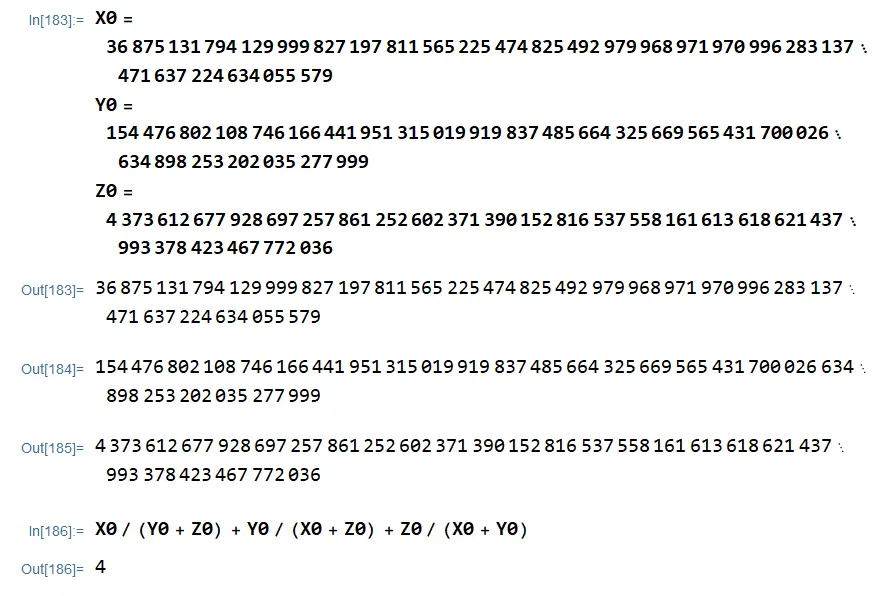

> *The meme is a clever, or wicked, joke.*
>
> *- Dr. Alon Amit*
