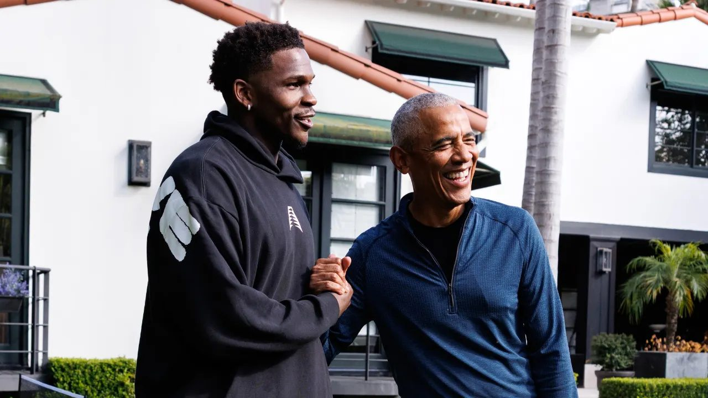
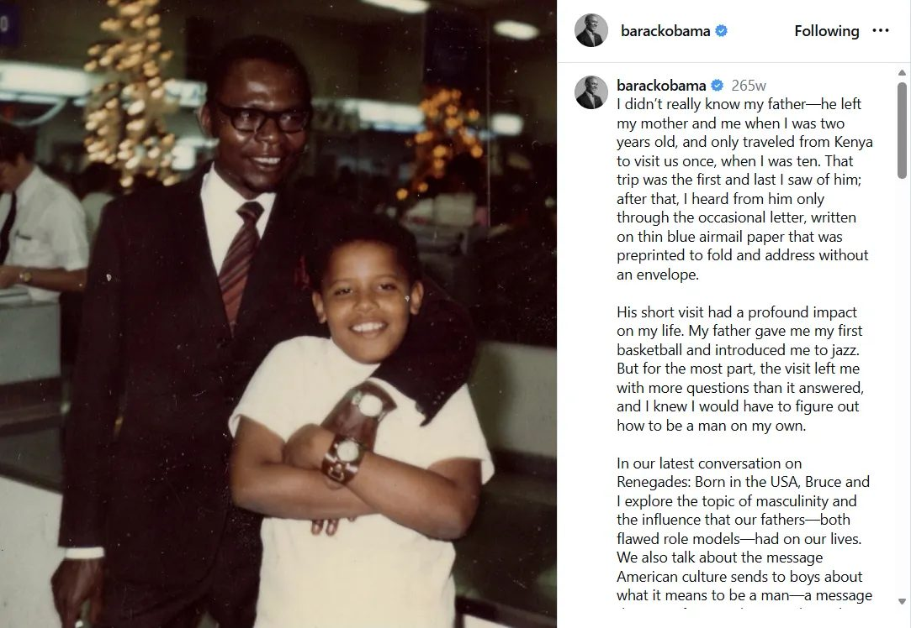
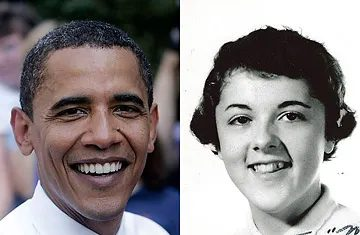

Recently, 44th President Barack Obama invited NBA superstar Anthony Edwards to his home to play games and mess around, and I wanted to unpack it!

Anthony “Ant” Edwards is currently a 24-year-old basketball player who has rapidly ascended to superstardom in the NBA. He is one of the most exciting athletes in the game today, and has a very outspoken personality that he isn’t shy to share. On the other hand, 44th President Barack Obama is seen more so as an easygoing, mellow person with charisma.

If you have been watching this relationship growing between Ant and Obama, it might appear like opposites attracting, but I don’t really think so. I personally believe that it has been brewing for some time. Maybe some of you know the iconic clip from the Summer Olympics of their exchange, but I’ll get to that later.

Instead, we need to look well before that moment, concerning what Anthony Edwards has been through. He’s navigating life in a way that would make many fathers proud, but *neither him nor Obama grew up with theirs*.

If you look at Obama now (without knowing much of his backstory) and assume his mannerisms are a product of him growing up in an “ideal” household, you’d be wrong. Obama didn’t really know his father because his father left him when he was 2.

Obama has said that he grew up hearing more about his father than seeing him, which is exactly how Ant also described his father’s presence.

> ***EDWARDS GOT HIS nickname, Ant Man, from his father. But he grew up hearing about his dad more than he saw him. The old heads around town swore the original Ant Man could’ve been the next [Michael Jordan](https://www.espn.com/nba/player/_/id/1035/michael-jordan). “You can ask folks in the street,” Edwards says. “They would tell you, ‘If he kept his head on right ...’”***

Ant’s dad was around the neighborhood for sure, but never really around him and just like Obama, their relationships with their fathers had more to do with myth than any memorable experience. One worth noting though, is his nickname when he was 3 and got his nickname “Ant-Man” from his dad.

**But his mom is the one who gave him superpowers.**

She was the one whose voice could get his attention at games and when he couldn’t beat his brothers at home, she was the one who pushed him to figure it out. And eventually, he did!

Most people also don’t realize that Barack Obama is a junior, meaning he got his name from his dad too, but he has his mom’s face, and more importantly, *her heart*.

Obama grew up in a house with a mother who had to figure it out. When his dad left his mom when he was two, his mom never lost hope or a step and still eventually earned the PhD and piled in work to uplift communities around the globe. She never let her circumstances define her ceiling and you don’t have to wonder too much where Obama gets his resilience from.

What’s heartbreaking though is that Obama lost his mother to ovarian cancer in 1995, *the exact same disease Ant lost his own mother to*, exactly 20 years later — both diagnosed and gone within a year. If grief is a language, Obama and Ant speak the same dialect. But it’s not just that! Obama was born August 4, 1961, almost 40 years to the exact day Ant was born: August 5, 2001. Kinda wild, right?

So when Obama celebrates his birthday, who else do we think he has in mind now? Not to mention, it’s the same year just two months prior that his younger daughter Sasha was born. And as Michelle Obama puts it, Sasha was the one with the fiery independent personality that we’ve all come to know from Ant.

Here is a clip from 2024 Summer Olympics Netflix documentary *Court of Gold* which gained significant attention since Edwards appears to be boldly talking about his basketball game, and Obama calls upon the veteran players (semi-jokingly) to humble Ant.

<iframe src="https://www.youtube-nocookie.com/embed/1I_WlVTp-x8" title="Anthony Edwards Tells Obama and Lebron that he’s the truth (Court of Gold)" loading="lazy" allow="accelerometer; autoplay; clipboard-write; encrypted-media; gyroscope; picture-in-picture; web-share" allowfullscreen></iframe>

So when Ant had this specific interaction with Obama at the Olympics, people from the outside thought he was talking a game that was a bit much. But Obama’s perspective was that it felt a bit like home, so it’s not too surprising to me that he eventually invited Ant to his.

<iframe src="https://www.youtube-nocookie.com/embed/mH589LHDj8Q" title="Beef Squashed: Barack Obama x Anthony Edwards" loading="lazy" allow="accelerometer; autoplay; clipboard-write; encrypted-media; gyroscope; picture-in-picture; web-share" allowfullscreen></iframe>

<iframe src="https://www.youtube-nocookie.com/embed/9nKOmSAWDh8" title="I Went 1 on 1 With President Obama | Anthony Edwards" loading="lazy" allow="accelerometer; autoplay; clipboard-write; encrypted-media; gyroscope; picture-in-picture; web-share" allowfullscreen></iframe>

Seeing the two of them playing together feels like the moment where the younger star is rubbing shoulders with the living legend, but to me it feels like more than that. When Ant lost both his mother and his grandmother in the same year, he shelled up and said no one else would “get in” (to his vulnerable side), but when I see him and Obama interact, it feels like Obama was able to reach him.

And how can you not love that?

## Sources

Rogal, J. (Director). (2025). *Court of Gold* [Documentary]. Netflix; Words + Pictures and Higher Ground Productions.

[Barack Obama’s Instagram](https://www.instagram.com/barackobama/?hl=en)

[The pain and promise of top NBA draft prospect Anthony Edwards - ESPN](https://www.espn.com/nba/story/_/id/30321844/the-pain-promise-top-nba-draft-prospect-anthony-edwards)
