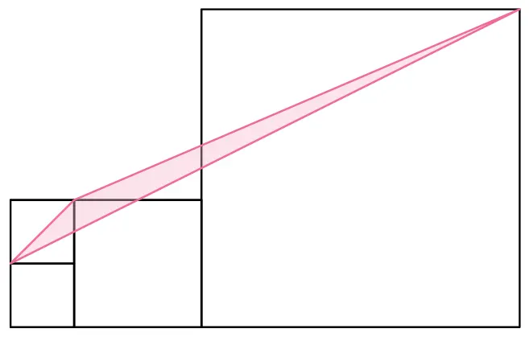
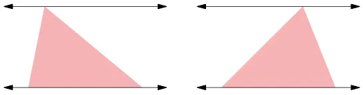
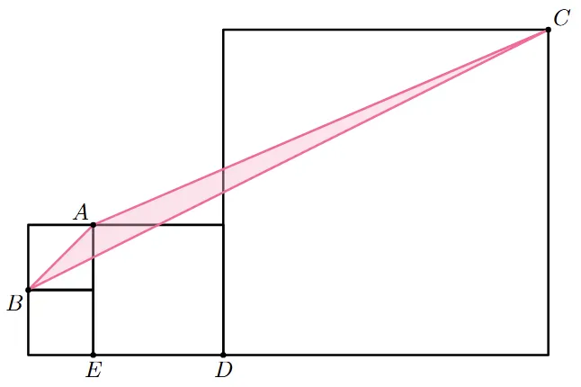
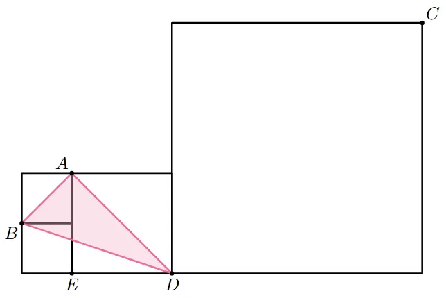
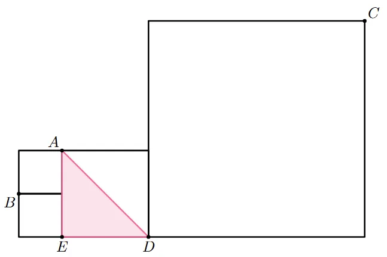

## Problem

Four square diagram.

Area of triangle?

Small squares: side length 1.

**If you do use the hint, please try to solve without looking at the Solution!**

Show solution

## Hint

If you were to "slide" one of the vertices along a line parallel to its opposite side, how does this affect the area of the triangle?

(*yes, you have all the information you need to solve this, no information is missing*).

## Solution

The hint does destroy the problem as indeed, the aforementioned transformation keeps the area of the triangle the same. Let's start off with some labels.

Using the hint, we notice that vertex C is directly opposite side AB, which is a square diagonal, so it has slope 1. Therefore, we may slide the triangle vertex at C via the big square diagonal to send it down to D.

Again, by the hint, we may analogously proceed as B is directly opposite side AD (which is now a square diagonal with slope -1), so we may slide the vertex at B down the 1x1 square diagonal to point E.

We have successfully shown that the area of triangle ADE must be the same as triangle ABC with our area-invariant transformations. The area is half of the 2x2 square.

**Answer:** 2

