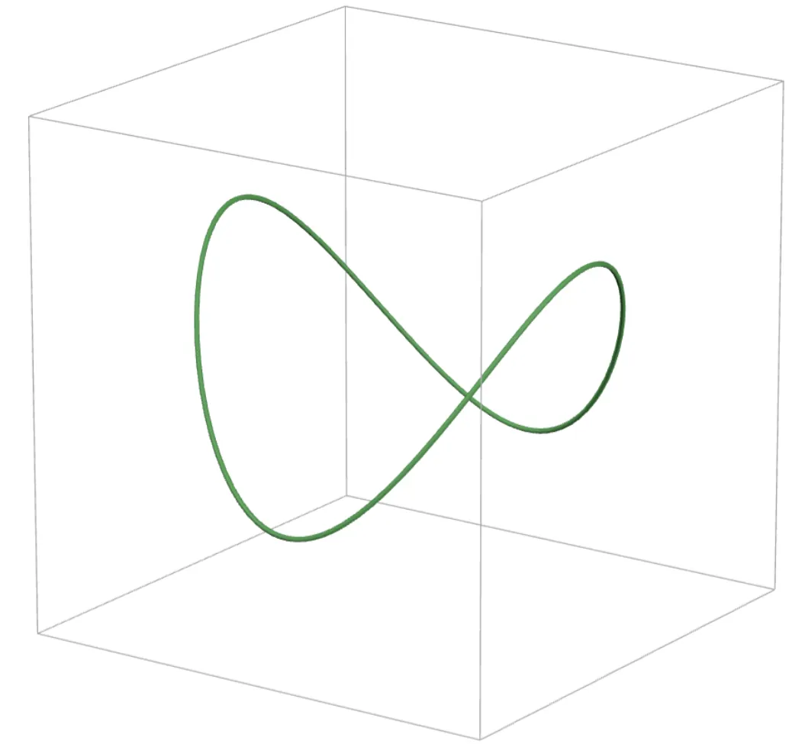
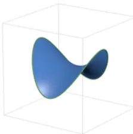
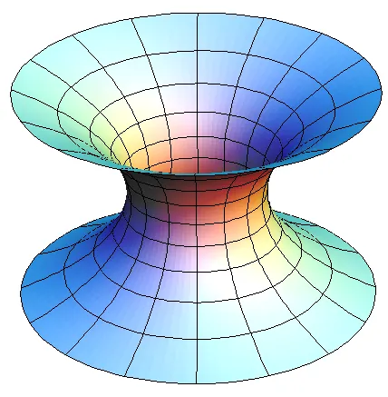
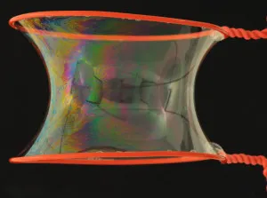
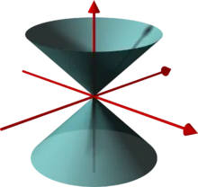

8.

Specifically, we will be looking at the 8th dimension today!

*Reading Prerequisite: Some Understanding of Calculus*

Here's the key term of this post: *smooth*. It is important for us to all understand what this term means.

To the layman reader, an object is "smooth" if it is perfectly round. Shapes such as spheres and ovals are smooth, whereas triangles and squares are not, since they have sharp corners! We can also think of some nice functions such as $f(x) = x^2$ and $f(x) = \sin(x)$ as being smooth.

As the more knowledgeable reader may recognize, we say can describe functions as smooth if we are able to differentiate it as many times as we wish. This should be intuitive to understand why a function like $\sin(x)$ would be smooth, but a function with a sharp corner such as $|x|$ is not, since you are unable to take the derivative at $x = 0$. And of course, for multivariable functions, such as $f(x, y) = x^2 + y^2$, we would be using partial derivatives to evaluate smoothness.

What I will choose to not precisely define is how we assess smoothness of things that can't really be modeled as the graph of a function, such as 2D surfaces in 3D space or wacky 1D curves in 2D space, but you can take my word for it that the intuition for what it means to be "smooth" does indeed carry over.

## Minimal Surfaces

Here's a question I'm somewhat sure all of us have thought of before, regardless of mathematical background:

::: question
Let $A$ and $B$ be two distinct points in a plane. What is the shortest curve whose endpoints are $A$ and $B$?
:::

And, of course, the answer is the line segment between $A$ and $B$. This segment is an example of a *minimal surface*. As you probably expect from this terminology, we usually speak of minimal surfaces when we are in higher dimensions. The definition of a minimal surface in 3D space follows the same idea: If you fix a 1D "boundary" or "edge", such as this closed loop...

...then what is the surface with smallest *surface area* that has that boundary?

The **minimal surface** is the exact answer to this question.

Before we move on, I want to now provide by far the most illustrative example I have seen of a minimal surface in 3D, the catenoid:

The catenoid is the 2D surface of the *smallest area* whose boundary is given by two fixed circles. This explains why a bubble will curve inwards when we place it between two loops, as such:

Now let's pose the question: **are minimal surfaces in 3D always smooth?** The answer is yes! This should not be too surprising. After all, have you ever seen a bubble with sharp corners?

## Extrapolating to Higher Dimensions

Let's recap what a minimal surface in 3D is:

::: definition
A minimal surface in $\R^3$ is a 2D surface of minimum (two-dimensional) area given prescribed (one-dimensional) boundary.
:::

But we can also try to think in higher dimensions, such as $\R^6$! Although, of course, this is pretty hard to visualize. The definition of a minimal surface in higher dimensions is essentially the same: For any positive integer $n \ge 2$:

::: definition
A minimal surface in $\R^n$ is an $(n-1)$-dimensional surface of minimum ( $(n-1)$-dimensional ) area given a prescribed ( $(n-2)$-dimensional ) boundary.
:::

And again, no worries if you are unable to picture what exactly this looks like (you can't, I can't, no one can). Anyways, let's ask the same question as before!

**Are minimal surfaces in $n$-dimensional spaces always smooth?**

In 4D space, it turns out that every (3D) minimal surface is smooth.  
In 5D space, it turns out that every (4D) minimal surface is smooth.  
In 6D space, it turns out that every (5D) minimal surface is smooth.  
In 7D space, it turns out that every (6D) minimal surface is smooth.

Nice! Surely, this pattern must continue. Obviously, any minimal surface has to be smooth...like how could we fathom an $(n-1)$-dimensional bubble that has corners? This can't be poss-

## The 8th Dimension

Darn.

Somehow, there indeed exists a 7-dimensional minimal surface embedded in 8-dimensional space that has a corner...

In 1968, mathematician Jim Simons invented the *Simons Cone*, which is defined as the set of all points $(x_1, x_2, x_3, x_4, x_5, x_6, x_7, x_8) \in \R^8$ which satisfy:

$$x_1^2 + x_2^2 + x_3^2 + x_4^2 = x_5^2 + x_6^2 + x_7^2 + x_8^2$$

I would love to draw a picture of this, but drawing 7-dimensional objects is pretty hard. Here is a horribly inaccurate diagram:

To make this more accurate, you need to mentally replace the $xy$-plane with a 4-dimensional space, and then you need to replace the $z$-axis with another 4-dimensional space. As the inaccurate picture suggests, this is not a smooth surface because there is a sharp corner at the origin!

Simons figured out that if you change this surface slightly, then the surface area changes very little, so he conjectured that the Simons Cone is a minimal surface. In 1969, Bombieri, De Giorgi, and Giusti proved his claim, hence demonstrating for the first time that there exists a non-smooth minimal surface. In 2009, Guido De Philippis and Emanuele Paolini came up with [a simpler proof](https://www.numdam.org/item/RSMUP_2009__121__233_0.pdf).

For the advanced reader, it turns out that any $(n-1)$-dimensional minimal surface in $\R^n$ is smooth when $2 \le n \le 7$, and for $n \ge 8$, it can be shown that the singularities of a minimal surface have Hausdorff dimension at most $n-8$.

## Why 8? Where does it come from?

The exact reason is well above my paygrade, but I decided to do some digging. A proof that minimal surfaces are always smooth in $\R^7$ and lower dimensions is in *Minimal Varieties in Riemannian Manifolds (1968)* and it's quite an intense read. From what I understand, here is why counterexamples like the Simons Cone seem to fail in dimensions 7 and below:

- By considering the base of the cone, we lose a dimension, thus we now lie in dimension 6 and below.
- We lose another dimension because in 6-dimensional space, (codimension 1) surfaces are 5-dimensional.
- Thus, the dimension of a certain thing must be $p$ with $p \le 5$. The key quantity is, for some reason,

  $$\left(\frac{p-1}{2}\right)^2 - p$$

  and this happens to be negative at exactly $1 \le p \le 5$. When the quantity is negative, it can be shown that it is impossible for the cones to be minimal surfaces. But when $p = 6$, this quantity is positive, so the argument breaks.

If indeed my understanding is correct, we can use the prior result about cones to argue that minimal surfaces in $\R^7$ are always smooth. The argument goes something like this:

- It suffices to consider "locally minimizing", i.e. we just need to look at the part of the surface near a given point.
- From a theorem by De Giorgi, if the surface is minimizing, then it should look like a plane if you zoom in far enough into the point.
- Due to this "blow-up argument", you can instead think about "globally minimizing" surfaces, since you can blow up a surface to fill the entirety of space or something. It is likely that Herbert Federer was involved at some point here.
- Finally, when you're in $\R^7$, you can prove that the type of minimal surface in question needs to be a plane, and to get the desired contradiction here, it turns out that using the idea of cones is very useful.

I hope you are now even more disturbed about the mathematical world!
