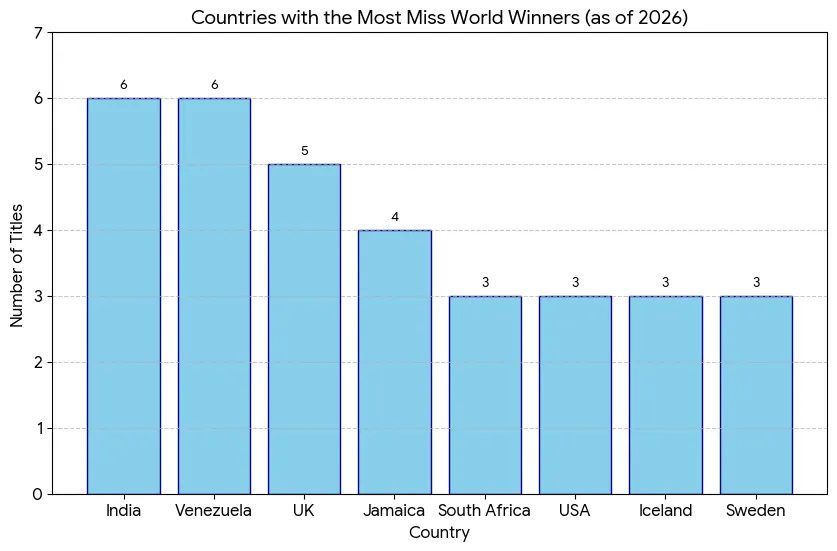
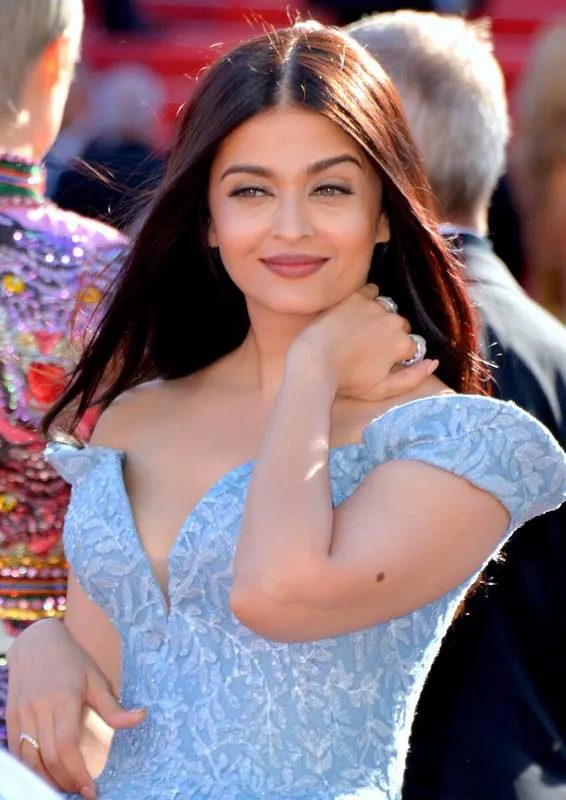
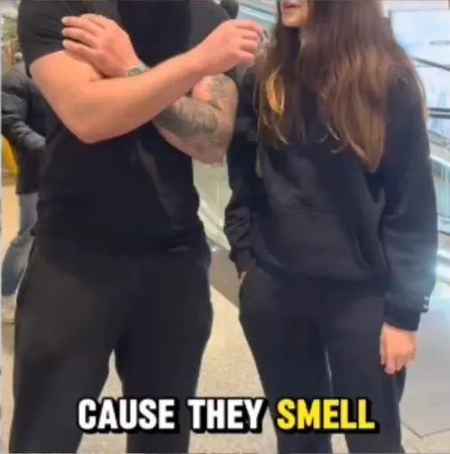

The sentiment and discourse surrounding South Asian women really frustrates me to the point that this is almost certainly going to be a multi-part series.

Today I wish to write about the political and cultural roots of Indians being regarded as the most "unattractive race". Where does the hate and often the dating bias against Indian women come from? Turns out it's deeply political and colorist (are we even shocked).

## Nixon's and Kissinger's Anti-Indian Racism

Let's start off with the politics. White House tapes from 1971 revealed that Richard Nixon described Indian women as "undoubtedly the most unattractive women in the world," going on to say that they were "sexless, nothing and repulsive." This sexual (and racial) disgust may have almost certainly influenced foreign policy during the Cold War where the U.S. supported Pakistan while India backed the Soviet Union.

### Historical context

When Nixon and Nehru (first Prime Minister of India) had met in December 1953, Nehru simply was not as interested in listening to Nixon talk, and Nixon could feel this. A handful of accounts state Nehru had rushed their meeting whereas he had allocated more time to more verbose U.S. Senators, which infuriated Nixon. Nixon also had the intention of convincing India to side with the U.S., but Nehru stated multiple times that he preferred to keep India in a state of non-alignment, which Nixon interpreted as India having already aligned with the Soviet Union. In fact, India genuinely had not aligned with any country at that point and only decades later would show favor to the Soviet Union...

A similar sentiment occurred between Indira Gandhi (fourth Prime Minister of India, also Nehru's daughter) and Nixon when...

> *Back in 1967, while Nixon was out of power and planning his way back, he had met again with Gandhi on a visit to Delhi. But when he called on her at her house, she had seemed conspicuously bored, despite the short duration of their talk. After about 20 minutes of strained chat, she asked one of her aides, in Hindi, how much longer this was going to take. Nixon had not gotten the precise meaning, but he sure caught the tone.*

On the other hand, Nixon received a much friendlier welcome in Pakistan from President Yahya Khan and thus the two were on more cordial terms. Nixon resented the praiseworthy sentiments India had received for its democracy, as his view of a successful nation was not through how a country bettered the lives of its people within, but rather through strong foreign relations. Nixon was then dead set on engaging with a communist government of the highest level (Pakistan's newest ally was China due to the 1962 India-China Border War) in order to end decades of isolation.

And to be perfectly clear, this did not stop Kissinger and Nixon from their own bout of racism regarding the people of Pakistan, as Kissinger described them as "primitive in their mental structure."

Nixon even questioned how Indians reproduced and contrasted them by describing Black Africans as having an "animalistic charm." Beyond this disgusting view of Indian people in a political perspective, South Asians are often seen as unattractive in modern trends because of colorism.

## Colorism and U.S. Film

Colorism has existed for centuries in India before it even had a name. In India, external influences created preference for lighter skin. Ordinary people were ruled by "white skin" masters, first by Mughals, then by European rulers.

> *Invaders into the Indian continent, even before British colonization, introduced further stratification of skin color. Historically, most of the people who conquered India had lighter skin than the locals. The Aryans, who stayed and established the noble class, had lighter skin than the Dasyus and Dasas. Mughals, who ruled part of India, including the Delhi Sultanate, for a long period of time, also had, on average, lighter skin than the locals they ruled over.*

The British, who ruled for almost 100 years, claimed superiority over black and colored Indians, segregated them, and barred them from institutions. The race-based hierarchies entrench colorism, shaping what is considered beautiful today in India.

As a result of this political and social influence, representation in media is often exaggerated, whitewashed, or inaccurate, privileging South Asian people to conform to Eurocentric standards.

*Apu from* The Simpsons *played by a white actor with exaggerated character*

A perfect example of this is Aishwarya Rai Bachchan (and of course many others, such as Kareena Kapoor, Katrina Kaif, Deepika Padukone, etc.).

*Aishwarya Rai*

She was a L'Oreal ambassador and a Bollywood actress, but she had more "Westernized features" — having lighter skin and blue eyes, which really is far from relatable to or representative of the everyday South Asian woman who has darker skin and varied facial features. And despite Indians holding the **tied-most Miss World Titles** (see opening graphic), South Asians are still not widely considered beautiful in mainstream Western media.

Now what's really interesting is that Oriental art really sexualized Indian women[^1] but to this day, Indian women are constantly ridiculed. This creates a sort of paradox where both Indian women are sexualized yet also seen as repulsive monsters. I also believe that American media, which has created such exaggerated depictions of Indian people (from Ravi in *Jessie* to Baljeet in *Phineas and Ferb*), continues to make fun of Indian existence.

But today, trends on various social media platforms seem to sensationalize ranking most unattractive race or AI imagery such as those depicted below that ridicule Indian people.

And of course, what about people who go on to say "Wow! You're so pretty for an Indian girl"? This is not helping Indian women feel more beautiful and is actually contributing to more racial erasure. Such discourse underscores a major need for better representation on social media as a whole, but also on TV and film.

I would say we are making progress because of the show *Never Have I Ever*, having a protagonist character Devi being a nerdy and darker-skin Indian woman as a lead was a perfect example of how it is possible to break free from these horrible stereotypes that continuously dehumanize Indian women!

We must understand that **there is no such thing as an unattractive race.** And that really comes down to learning to *decolonize* our views of beauty and promote a more inclusive, authentic representation of South Asians.

**To everyone, but especially the target audience: you are beautiful and worthy of love no matter what society may say!**

## Sources

[Opinion | The Terrible Cost of Presidential Racism - The New York Times](https://www.nytimes.com/2020/09/03/opinion/nixon-racism-india.html)

[Conversation 525-001 | Richard Nixon Museum and Library](https://www.nixonlibrary.gov/white-house-tapes/525/conversation-525-001)

[Conversation 559-003 | Richard Nixon Museum and Library](https://www.nixonlibrary.gov/white-house-tapes/559/conversation-559-003)

['Chacha Kahani', - The story of Nehru](https://myvoice.opindia.com/2021/11/chacha-kahani-the-story-of-nehru/)

[Snubbed by Indira, Nixon never forgave India](https://www.deccanherald.com/content/364304/snubbed-indira-nixon-never-forgave.html)

[Nixon's Frown | Los Angeles Review of Books](https://lareviewofbooks.org/article/nixons-frown/)

[Facing India's Legacy of Colourism – MIR](https://www.mironline.ca/facing-indias-legacy-of-colourism/)

[The Soft Racism of Apu from "The Simpsons" | The New Yorker](https://www.newyorker.com/culture/cultural-comment/the-soft-racism-of-apu-from-the-simpsons)

[^1]: Not only sexualized, but exoticized them as submissive sensual objects — referencing European fantasies about the mysterious East
