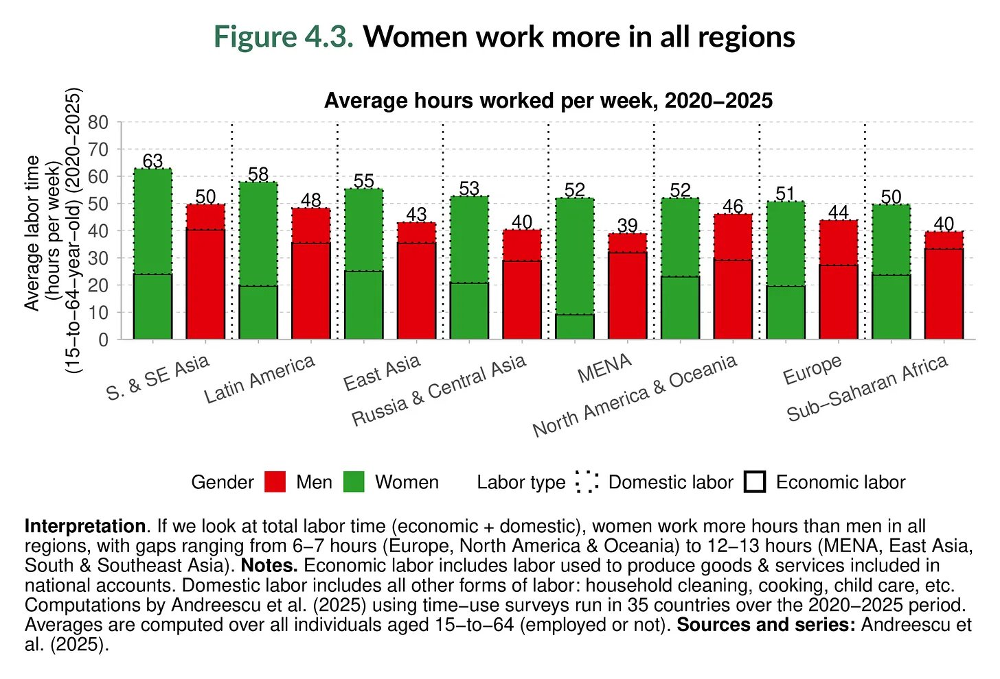
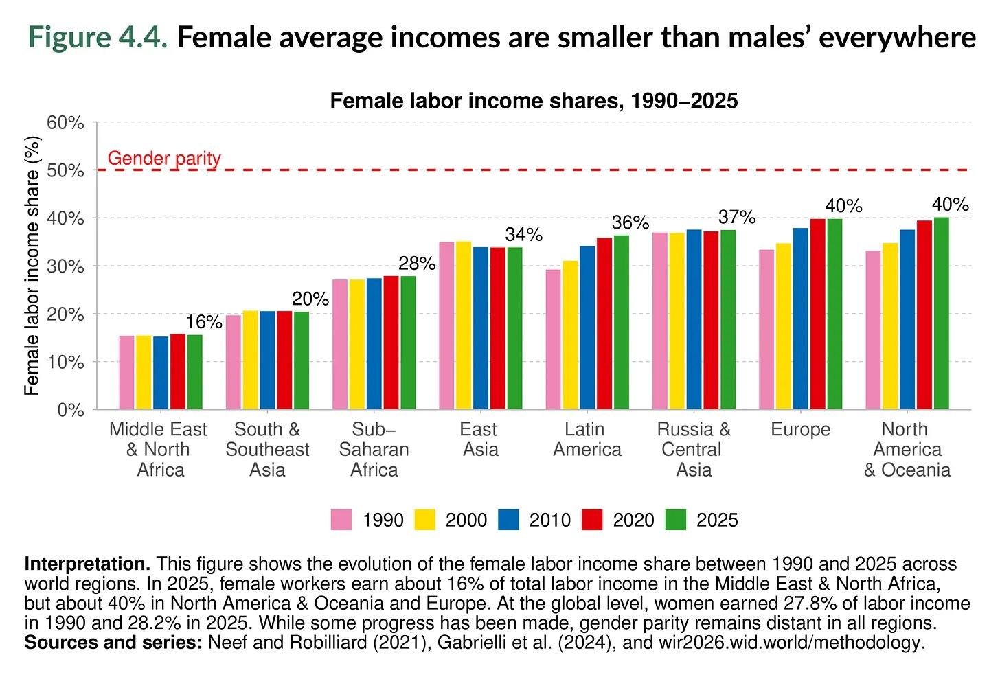

The [World Inequality Report 2026](https://wir2026.wid.world/) just came out. Please give it a read!

This post is merely a brief observation. Before reading the full report or the executive summary, I first navigated to the Insights tab and clicked on **Chapter 4 Gender Inequality**. In this chapter, there are two charts which are definitely worth seeing.

The first chart, Figure 4.3, is about how much women work and how little of that work actually counts. When you add up all the hours (paid jobs, cooking, cleaning, childcare, taking care of the elderly parent), women do work more than men. This is a fact not particular to one region — Europe, South Asia, Latin America, but everywhere.

But here's the part that really sticks with you, from Figure 4.4. Despite working more, women only earn about 28% of the total labor income globally because half of the work is unpaid. It doesn't show up in a salary, it doesn't build a pension, and it's most certainly not a long-term investment which can eventually pay off; it's just…taken for granted. And when economists account for all the work that women do, their hourly income works out to about one third of what men earn.

This has not really changed. In 1990, women earn 27.8% of the global labor income. Fast forward to 2025, and they now earn 28.2%. **After 35 years, a mere half percent of progress: at this rate, we would (linearly) reach equality in about 1500 years.**

The point here isn't to really argue whether women work. It is instead to notice and make you think *what we count as work and what we quietly don't*.
